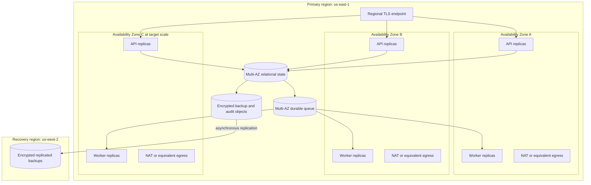

# ADR 0001: Alpha operational bounds

- Status: proposed
- Date: 2026-08-31
- Decision owners: ArdurAI maintainers
- Scope: first operable alpha
- Tracking issue: [#11](https://github.com/ArdurAI/veer/issues/11)

## Decision

Veer's first operable alpha uses a single regional control plane. Production
profiles span multiple Availability Zones inside that region; a second region
holds encrypted recovery data but no continuously running control-plane
compute. The initial reference region is AWS `us-east-1` (US East, N.
Virginia), with `us-west-2` (US West, Oregon) as the recovery region.

The implementation stack selected by issue
[#12](https://github.com/ArdurAI/veer/issues/12) must satisfy the measurable
bounds in this decision. Product runtime, relational store, queue, and migration
tool choices remain deliberately undecided here. Named AWS services in the cost
worksheet are reference price proxies, not an early selection of those
technologies.

This decision applies to the Veer control plane. It does not set availability,
scale, retention, or cost promises for workloads that Veer manages through
provider adapters.

## Why this boundary

The alpha must prove durable intent, reconciliation, recovery, isolation, and
day-two operation before taking on distributed ownership across regions. A
single-region, multi-AZ topology contains the synchronous consistency boundary,
keeps provider operation ownership unambiguous, and limits baseline cost.
Encrypted cross-region backups preserve a viable regional-disaster path without
creating a second active control plane.

The principal trade-off is explicit: a regional outage requires restore and
controlled failover. The alpha does not promise uninterrupted regional
failover, active-active writes, or zero recovery-point loss.

## Deployment profiles

### Topology

- API and worker processes are stateless and replaceable. At least two
  replicas of each role run across two failure zones in the small profile.
- The target profile schedules replicas across three failure zones and must
  tolerate loss of any one zone without manual traffic movement.
- Relational state uses synchronous in-region Multi-AZ durability. A successful
  write response is not sent until the desired state and required outbox/audit
  record are committed atomically.
- The durable queue spans failure zones, provides at-least-once delivery, and
  cannot be the source of record. Workers must be idempotent and fenced.
- Nodes, database endpoints, and queue endpoints are private. Public IPv4 is
  limited to the regional ingress and required egress endpoints.
- Cross-region recovery copies are encrypted under a key in the recovery
  region. Restore never grants provider authority until credentials and policy
  are revalidated.

### Capacity profiles

The target profile is the alpha qualification boundary, not a forecast or a
claim of unlimited scale. Limits above it must produce bounded backpressure or
an explicit quota response; they must not cause silent data loss.

| Dimension | Developer | Small production | Target-scale qualification |
| --- | ---: | ---: | ---: |
| Human and workload principals | 5 | 50 | 500 |
| Workspaces | 2 | 25 | 250 |
| Environments | 5 | 100 | 1,000 |
| Applications | 20 | 1,000 | 10,000 |
| Components | 100 | 5,000 | 50,000 |
| API requests/second, steady | 1 | 5 | 25 |
| API requests/second, 15-minute peak | 2 | 20 | 100 |
| Accepted desired-state mutations/minute, steady | 6 | 30 | 150 |
| Accepted desired-state mutations/minute, 15-minute peak | 12 | 120 | 600 |
| Concurrent non-terminal operations | 10 | 100 | 1,000 |
| Provider mutations/minute, aggregate | 10 | 60 | 600 |
| Audit events/month | 100,000 | 2,000,000 | 20,000,000 |
| Archived audit and evidence bytes/30-day month, GB | 0.4 | 8 | 80 |
| Relational data, provisioned GiB | 5 | 50 | 500 |
| Uncompressed platform logs/month, GiB | 5 | 50 | 500 |
| Accepted trace data/month, GiB | 1 | 10 | 100 |
| Secrets Manager API requests/month | 0 | 50,000 | 500,000 |

The developer profile is a single-machine functional environment. It has no
availability commitment and must not be used to claim HA or disaster-recovery
evidence.

### Load qualification

Qualification uses generated resources with provider adapters operating in a
deterministic test mode, followed by bounded live-provider smoke tests:

1. Load the full target object counts before timing begins.
2. Run target steady traffic for 24 hours, including the stated provider
   mutation rate and audit volume.
3. Run the 15-minute peak at 100 API requests/second once per hour.
4. Inject one process failure, one worker lease expiry, one queue redelivery,
   one database failover, and one simulated Availability Zone loss.
5. Report every SLI below for the entire run and for each failure window.

The request generator uses a checked-in seed and a fixed mix at both steady and
peak rates: 80% reads (50% point resource reads, 20% operation/status reads,
and 10% paginated list reads), 10% successful desired-state mutations, 5%
idempotent replays of a prior successful mutation, and 5% stale-version
conflicts. Successful mutations are 20% creates, 60% updates, and 20% deletes,
selected across Workspace, Environment, Application, Component, Policy, and
ProviderConnection resources at 5%, 15%, 20%, 40%, 15%, and 5% respectively.
The steady mix therefore produces the stated 30 and 150 accepted mutations per
minute for the small and target profiles; conflict and replay traffic cannot be
reclassified as cheap reads.

Payloads use a 16 KiB median and 256 KiB p99 serialized resource size. Requests
over the API limit selected later must fail before persistence with a stable
client error. Provider calls and cost-incurring cloud fixtures are capped and
explicitly enabled; public CI uses deterministic fakes.

## Service indicators and objectives

Small and target production profiles share the alpha objectives. Developer
environments have measurement coverage but no SLO.

| Boundary | Alpha objective | Measurement |
| --- | --- | --- |
| API availability | 99.9% per calendar month | A 30-second external synthetic probe performs authenticated read and no-op write transactions. All server errors, timeouts, and planned maintenance count as unavailable. |
| API read latency | p95 <= 300 ms; p99 <= 750 ms | Server-side duration from accepted request to complete response under the profile's steady load, excluding client network time. |
| API write acceptance latency | p95 <= 500 ms; p99 <= 1 s | Server-side duration through durable desired-state, outbox, and required audit commit. Provider execution is asynchronous and excluded. |
| Planning start delay | 99% <= 30 s; 99.9% <= 2 min | Time from successful write commit to a worker acquiring the current generation. |
| Observation freshness | 95% <= 5 min; 99% <= 15 min | Age of the newest successful provider observation for every non-deleted resource that requires observation. Rate-limited and terminally failed resources remain in the denominator; a resource with no successful observation is aged from activation. |
| Audit publication delay | 99.9% <= 60 s | Time from security-relevant commit to availability in the append-only audit query/export path. Missing required audit events are a correctness failure, not error-budget consumption. |
| Worker recovery | 99% of abandoned leases reacquired <= 2 min | Time from lease expiry or process loss to fenced ownership by a replacement worker. |
| Cancellation acknowledgment | 99% <= 30 s | Time from accepted cancellation request to a persisted canceled or cancel-pending condition. Provider operations that cannot be interrupted must be identified explicitly. |

At 99.9% monthly API availability, the maximum unavailable time in a 730-hour
month is 43 minutes 48 seconds. Error-budget reporting uses raw probe intervals,
not rounded incident duration.

### Correctness invariants

The following are pass/fail properties and cannot be traded against an SLO
error budget:

- every acknowledged desired-state write survives process, node, and
  single-zone failure;
- a generation has at most one unfenced provider-operation owner at a time;
- retry or redelivery never creates a second externally visible resource;
- authorization and workspace isolation are applied both when work is accepted
  and when it executes;
- required security audit events are committed atomically with the state change;
- secrets and provider credentials never appear in resources, plans, logs,
  traces, metrics, or cost reports.

### SLO exclusions

- Invalid, unauthenticated, unauthorized, quota-rejected, and client-canceled
  requests are excluded from availability only when Veer returns the documented
  response within the latency objective.
- Provider API unavailability, provider throttling, and provider-side operation
  duration are excluded from API availability and acceptance latency. They are
  not excluded from observation-freshness reporting and must be surfaced as
  provider conditions.
- Internet or client failures outside Veer's regional endpoint are excluded.
- Simultaneous loss of the primary and recovery regions, compromise of both
  regional key boundaries, and destructive corruption older than retained
  backups are outside the alpha recovery claim and remain residual risks.
- Planned maintenance is not excluded. This prevents maintenance windows from
  hiding an architecture that cannot meet its objective.

## Recovery objectives

| Failure | RTO | RPO | Maximum detection time inside RTO | Required mechanism and evidence |
| --- | ---: | ---: | ---: | --- |
| API or worker process loss | 5 min | 0 | 1 min | Replica replacement, readiness gating, durable state, and expired-lease takeover |
| Compute node loss | 10 min | 0 | 2 min | Rescheduling onto another node and zone, with no duplicate provider resource |
| Single Availability Zone loss | 15 min | 0 for acknowledged state | 2 min | Multi-AZ database and queue failover plus endpoint health routing |
| Bad application release | 30 min | 0 for committed data | 5 min | Version rollback with backward-compatible persisted formats |
| Logical database corruption or operator error | 2 hr | 5 min | 15 min | Relationship and audit-integrity checks plus in-region point-in-time restore into an isolated validation target before cutover |
| Primary-region loss | 4 hr | 30 min | 2 min | Independent regional probes, encrypted cross-region restore, control-plane deployment, authority revalidation, and endpoint switch |

RTO starts at failure onset, not incident declaration. Fault-injection evidence
uses the injection timestamp; production evidence uses the earliest applicable
provider event, deployment event, failed 30-second external probe, or failed
internal integrity signal. Detection and declaration consume the same RTO.
Two consecutive external failures and platform health signals must open an
incident within the table's detection bound; supported logical-corruption
classes are checked at least every 15 minutes. Missing the detection bound or
the end-to-end RTO fails the objective. RPO is measured against the latest
acknowledged write present after recovery. Issue
[#64](https://github.com/ArdurAI/veer/issues/64) must exercise these objectives.
Until those exercises pass, they are design targets rather than demonstrated
service claims.

## Retention and storage assumptions

| Data | Online retention | Recovery/archive retention | Notes |
| --- | --- | --- | --- |
| Current desired and observed state | Resource lifetime | 90-day tombstone after deletion | Stable identifiers remain reserved through tombstone expiry. |
| Operations, plans, and policy decisions | 90 days | 365 days in encrypted object storage | Secret-bearing inputs are prohibited. |
| Security audit events | 90 days queryable | 365 days immutable and encrypted | Shorter retention requires a reviewed security decision. |
| Idempotency records | 24 hours minimum | None | A caller cannot rely on replay safety after expiry. |
| Database point-in-time recovery | 35 days in primary region | 7 days replicated in recovery region | Monthly restore verification is required. |
| Platform logs | 14 days small; 30 days target | None by default | Security events belong in the audit stream, not ordinary logs. |
| Traces | 7 days | None by default | Accepted trace data is capped at 10 GiB/month small and 100 GiB/month target. Sampling must prioritize errors while shedding safely at the cap and redacting sensitive attributes. |
| High-resolution metrics | 15 days | 13 months for SLO rollups | Workspace, resource ID, request ID, and provider object ID are forbidden metric labels. |

Canonical audit events are at most 16 KiB before archive compression and must
average no more than 3,000 bytes at the full event count. That allocates at most
6 GB/month small and 60 GB/month target to audit records, leaving 2 GB and 20 GB
inside the combined 8 GB and 80 GB archive-ingress caps for operations, plans,
policy decisions, and recovery evidence. The archive writer measures actual
stored object bytes, including framing and encryption overhead. Over 365 days,
the combined cap consumes at most 97.34 GB small and 973.34 GB target, fitting
the worksheet's 100 GB and 1,000 GB primary and recovery copies. Audit records
are never sampled or dropped: exceeding the bound rejects or backpressures new
work and surfaces a capacity condition.

Issue [#14](https://github.com/ArdurAI/veer/issues/14) owns data classification
and handling rules. It may reduce retention where privacy or secret exposure
requires it. Any increase requires a security, storage, and monthly-cost review.

## Monthly cost boundary

The reproducible worksheet is in
[`cost-model/`](cost-model/README.md). Its checked-in 2026-08-31 price snapshot
uses 730 hours/month, on-demand public rates, `us-east-1` primary resources, and
`us-west-2` recovery storage.

| Profile | Reference estimate/month | Accepted ceiling/month | Headroom |
| --- | ---: | ---: | ---: |
| Developer | USD 0.00 cloud infrastructure | USD 0.00 | USD 0.00 |
| Small production | USD 611.21 | USD 750.00 | USD 138.79 |
| Target-scale qualification | USD 2,196.23 | USD 2,500.00 | USD 303.77 |

These figures cover the Veer control plane only. They exclude taxes, support,
discount programs, CI minutes, developer workstations, domain registration,
temporary compute used during a recovery exercise, and every cloud or
Kubernetes resource created for a user's application. The worksheet
conservatively does not apply account-level free-tier credits. Each recovery
exercise has a separate transient-cost cap of USD 25 for the small profile and
USD 75 for the target profile; exceeding it requires operator approval before
the exercise continues.

### Cost safeguards

- Every billable resource carries owner, environment, profile, and Veer
  component cost-allocation tags.
- Budget alerts fire at 50%, 80%, and 100% of the selected profile ceiling.
  Daily anomaly detection must identify an expected month-end run rate above
  the ceiling.
- The Kubernetes version is upgraded before extended support. At current EKS
  rates, allowing one cluster to enter extended support adds USD 365 per
  730-hour month; an alert fires 60 days before the transition.
- Burstable database CPU-credit balance and surplus-credit charges are
  monitored. Sustained credit use triggers a capacity change rather than an
  unbounded charge.
- Compute, worker concurrency, provider request rates, queue depth, logs, traces,
  metric cardinality, backup retention, and object storage all have explicit
  upper bounds.
- Trace admission enforces the 10 GiB/month small and 100 GiB/month target
  ceilings. Dropped spans and projected month-end volume are observable.
- Secret values are fetched through a single-flight, version-aware in-memory
  cache and never once per provider operation. Cache invalidation follows
  rotation events and expiry; requests are capped at 50,000/month small and
  500,000/month target, with cache hits, misses, and projected usage observable.
- High-cardinality identifiers are logs or traces, never metric dimensions.
- Nodes stay private. S3 gateway endpoints avoid NAT processing for backup and
  artifact traffic; interface endpoints require a before/after cost comparison.
- A production profile uses one NAT path per active Availability Zone to avoid
  a cross-zone egress dependency. Developer deployments use no managed NAT.
- Queue consumers use long polling and batching where correctness permits.
- Capacity and price inputs are reviewed before every release and at least
  quarterly. A changed estimate above the ceiling fails worksheet verification
  and requires a replacement ADR or a capacity change.
- Provider qualification uses a dedicated sandbox, resource quotas, expiry
  tags, and a verified teardown. It is budgeted separately from this
  always-on control-plane estimate.

## Alternatives considered

### Multi-region active-active

Rejected for the alpha. It could reduce regional RTO, but requires distributed
write ownership, global fencing, conflict resolution, replicated queues,
multi-region credentials, and a substantially larger permanent bill. Those
semantics are not yet proven.

### Warm active-passive control plane

Deferred. It reduces restore time but continuously duplicates compute, ingress,
secrets, observability, and operational patching. Backup-and-restore meets the
alpha's four-hour regional RTO at lower cost.

### Single-zone production

Rejected. It cannot meet acknowledged-write or 99.9% API availability targets
during an Availability Zone failure.

### One shared NAT path for production

Rejected as the default. It saves fixed hourly charges, but creates a
cross-zone dependency and adds cross-AZ transfer charges. It remains acceptable
only for non-HA, explicitly disposable environments.

### Self-managed stateful services

Rejected as the reference cost and operations baseline. They can reduce direct
service charges at scale but move backup, failover, patching, and on-call burden
into the alpha. Issue #12 may still select them only if it demonstrates the
same recovery and operability bounds with total cost included.

## Consequences and follow-up

- Issue #12 can now compare stacks against explicit correctness, recovery,
  performance, operations, and cost requirements.
- Issue #14 must turn the retention assumptions and residual risks into owned
  data-handling and threat controls.
- Later provider contracts must bound rate limits and cost independently from
  control-plane capacity.
- Issue #63 must implement the SLIs, budgets, cardinality limits, alerts, and
  cost telemetry defined here.
- Issue #64 must prove each recovery objective and report restore size,
  duration, latest-restorable timestamp, and unrecovered records.
- Exceeding a capacity profile is unsupported until a load report and reviewed
  ADR establish a new boundary.

## Review checklist

- [ ] Architecture reviewers accept the single-region failure boundary.
- [ ] Security reviewers accept the backup, key, credential, and residual-risk
      boundaries.
- [ ] Operators accept the SLO, RTO/RPO, retention, and qualification methods.
- [ ] The cost worksheet verifies from a clean checkout and remains below both
      production ceilings.
- [ ] Pricing sources, regions, dates, quantities, exclusions, and free-tier
      treatment are explicit.
