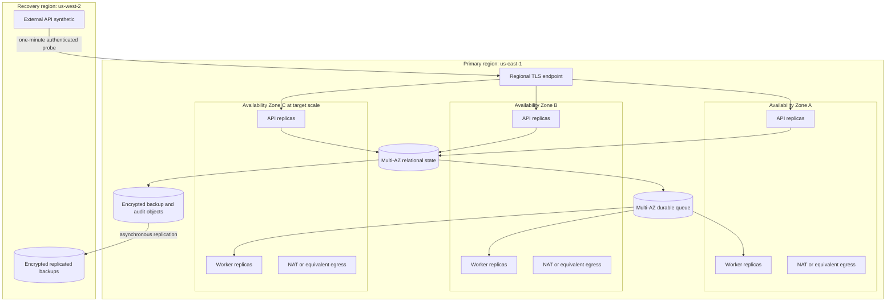

# ADR 0001: Alpha operational bounds

- Status: proposed
- Date: 2026-08-31
- Decision owners: ArdurAI maintainers
- Scope: first operable alpha
- Tracking issue: [#11](https://github.com/ArdurAI/veer/issues/11)

## Decision

Veer's first operable alpha uses a single regional control plane. Production
profiles span multiple Availability Zones inside that region; a second region
holds encrypted recovery data but no continuously running control-plane
compute. The initial reference region is AWS `us-east-1` (US East, N.
Virginia), with `us-west-2` (US West, Oregon) as the recovery region.

The implementation stack selected by issue
[#12](https://github.com/ArdurAI/veer/issues/12) must satisfy the measurable
bounds in this decision. Product runtime, relational store, queue, and migration
tool choices remain deliberately undecided here. Named AWS services in the cost
worksheet are reference price proxies, not an early selection of those
technologies.

This decision applies to the Veer control plane. It does not set availability,
scale, retention, or cost promises for workloads that Veer manages through
provider adapters.

## Why this boundary

The alpha must prove durable intent, reconciliation, recovery, isolation, and
day-two operation before taking on distributed ownership across regions. A
single-region, multi-AZ topology contains the synchronous consistency boundary,
keeps provider operation ownership unambiguous, and limits baseline cost.
Encrypted cross-region backups preserve a viable regional-disaster path without
creating a second active control plane.

The principal trade-off is explicit: a regional outage requires restore and
controlled failover. The alpha does not promise uninterrupted regional
failover, active-active writes, or zero recovery-point loss.

## Deployment profiles

### Topology

- API and worker processes are stateless and replaceable. At least two
  replicas of each role run across two failure zones in the small profile.
- The target profile schedules replicas across three failure zones and must
  tolerate loss of any one zone without manual traffic movement.
- Relational state uses synchronous in-region Multi-AZ durability. A successful
  write response is not sent until the desired state and required outbox/audit
  record are committed atomically.
- The durable queue spans failure zones, provides at-least-once delivery, and
  cannot be the source of record. Workers must be idempotent and fenced.
- Nodes, database endpoints, and queue endpoints are private. Public IPv4 is
  limited to the regional ingress and required egress endpoints.
- Cross-region recovery copies are encrypted under a key in the recovery
  region. Restore never grants provider authority until credentials and policy
  are revalidated.
- Third-party secrets that cannot be reissued are replicated by Secrets Manager
  into `us-west-2` under the recovery-region key and a separately scoped
  resource policy. Cloud credentials are never copied: restored workloads
  obtain new short-lived credentials through workload identity. Recovery drills
  verify secret version, policy, rotation, and reissuance without exporting
  plaintext.

### Capacity profiles

The target profile is the alpha qualification boundary, not a forecast or a
claim of unlimited scale. Limits above it must produce bounded backpressure or
an explicit quota response; they must not cause silent data loss.

| Dimension | Developer | Small production | Target-scale qualification |
| --- | ---: | ---: | ---: |
| Human and workload principals | 5 | 50 | 500 |
| Workspaces | 2 | 25 | 250 |
| Environments | 5 | 100 | 1,000 |
| Applications | 20 | 1,000 | 10,000 |
| Components | 100 | 5,000 | 50,000 |
| Policies | 10 | 250 | 2,500 |
| Provider connections | 2 | 50 | 500 |
| API requests/second, steady | 1 | 5 | 25 |
| API requests/second, 15-minute peak | 2 | 20 | 100 |
| Accepted desired-state mutations/minute, steady | 6 | 30 | 150 |
| Accepted desired-state mutations/minute, 15-minute peak | 12 | 120 | 600 |
| Concurrent non-terminal operations | 10 | 100 | 1,000 |
| Pending reconciliation items | 100 | 10,000 | 100,000 |
| Oldest ready-item admission threshold | 30 min | 15 min | 15 min |
| Durable queue 64 KiB billable request units/month | 0 | 20,000,000 | 100,000,000 |
| Encoded queue message body, maximum | 2 KiB | 2 KiB | 2 KiB |
| Aggregate encoded queue body bytes/month, GB | 0 | 40 | 200 |
| Provider 4 KiB outbound/12 KiB inbound units/minute, all attempts | 20 | 120 | 1,200 |
| Provider observation units/minute, reserved | 2 | 40 | 400 |
| Resources per provider observation page, maximum | 50 | 50 | 50 |
| Provider mutation transfer units/minute, all attempts | 10 | 60 | 600 |
| Cross-AZ directional transfer/month, GB | 0 | 200 | 2,000 |
| Billable database surplus CPU credits/month, vCPU-hours | 0 | 100 | 0 |
| Audit events/month | 100,000 | 7,000,000 | 50,000,000 |
| Archived audit and evidence bytes/30-day month, GB | 0.4 | 16 | 80 |
| Archive objects written/month | 2,000 | 32,000 | 155,000 |
| Archive S3 tier-1 requests/month, both regions | 6,000 | 96,000 | 465,000 |
| Archive KMS requests/month, both regions | 8,000 | 128,000 | 620,000 |
| Relational data, provisioned GiB | 5 | 50 | 500 |
| Database changed blocks/month, GiB | 5 | 50 | 500 |
| Uncompressed platform logs/month, GiB | 5 | 50 | 500 |
| Accepted trace data/month, GiB | 1 | 10 | 100 |
| Secrets Manager API requests/month, primary region | 0 | 45,000 | 450,000 |
| Secrets Manager API requests/month, recovery region | 0 | 5,000 | 50,000 |
| Recovery-region secret replicas | 0 | 10 | 100 |
| Recovery-region synthetic runs/month | 0 | 43,800 | 43,800 |

The developer profile is a single-machine functional environment. Its request
and provider rates are short smoke-test ceilings, not a 730-hour sustained-load
claim; its monthly audit and archive limits still apply. Zero billable queue
units means the local backend creates no cloud request charge, not that it
processes no messages. The developer profile has no availability commitment and
must not be used to claim HA or disaster-recovery evidence.

Pending depth counts ready, delayed, in-flight, retrying, and quarantined work.
Five percent of queue capacity is reserved for cancellation, deletion, and
security remediation. When an affected provider/workspace reaches 95% of its
depth allocation or the oldest ready item reaches the age threshold, Veer
rejects new non-reserved mutations before persistence with `429` and
`Retry-After`; a system-wide threshold returns `503`. Reads and reserved work
continue, accepted work is never discarded, and depth, age, rejection count,
and projected drain time are observable. Qualification holds a provider fake
in throttling until each threshold is crossed and verifies this response.

The monthly schedule produces 3,449,250 small and 17,246,250 target accepted
writes plus operation cancellations. One send, receive, and delete request unit
per accepted action consumes 10,347,750 and 51,738,750 queue units before
retries or empty long polls. The rounded 20 million and 100 million limits leave
the remaining units for those paths; batching does not reduce billable message
units.

Encoded queue bodies contain only identifiers, generations, and integrity
metadata and are rejected above 2 KiB; larger state is stored separately and
referenced by identifier and digest. An independent byte meter expands batches
and sums every encoded body occurrence across sends, receives, redeliveries, and
recovery traffic. It rejects non-reserved work before the aggregate exceeds
40/200 GB per month; the 64 KiB billing-unit counter cannot substitute for this
wire-byte counter.

The 200/2,000 GB cross-AZ envelopes reserve 40/200 GB for queue bodies,
140/1,600 GB for database and internal service traffic, and 20/200 GB for
failure retries and failover. Healthy workload paths use same-zone endpoints.
Every byte crossing a zone is metered directionally at the workload and managed-
service boundaries without netting request and response traffic. Alerts fire at
80%; at 90%, Veer fences non-reserved mutations and throttles non-reserved reads
so recovery, deletion, and security work retain the final 10%. Reaching 100%
fails qualification and blocks production until the selected stack reduces the
traffic or replaces this cost decision. Issue #12 must select a stack that
exposes these per-boundary measurements; an unmeasurable topology cannot
qualify.

Every provider request, response page, observation, retry, and error response
consumes `max(ceil(outbound wire bytes / 4 KiB), ceil(inbound wire bytes / 12
KiB), 1)` transfer units, including protocol and TLS overhead. The 120/1,200
per-minute limits include all attempts. The sum of units consumed by external
mutation attempts, including retries, is capped at 60/600; because every raw
attempt costs at least one unit, its raw attempt count cannot exceed that cap.
At a continuous monthly maximum, outbound volume is 21.53/215.29 GB, inbound
volume is 64.59/645.86 GB, and combined NAT processing is 86.12/861.15 GB. Those
quantities fit the worksheet's rounded egress and 100/1,000 GB NAT limits.
Adapters must paginate, stream, or reject before crossing the selected profile's
unit budget.

The qualification observation set is the profile's Component count. One page
contains resources from only one ProviderConnection and at most 50 compact
observations. Except for the last page of a connection, the harness requires a
full page. Requests remain within 4 KiB and responses within 12 KiB, including
protocol and TLS overhead; each canonical observation entry is at most 192 wire
bytes. With 50/500 connection partitions, a complete small/target sweep needs at
most `ceil(components / 50) + connections`, or 150/1,500 units. The reserved
40/400 units per minute provide 200/2,000 units in five minutes, including
50/500 units for observation retries and errors. The remaining 80/800 units
cover the 60/600 mutation-unit budget plus 20/200 units of other retry and error
headroom. A provider that cannot expose this bounded batch observation cannot
qualify at the selected Component count; a replacement ADR must lower that
profile.

### Load qualification

Qualification uses generated resources with provider adapters operating in a
deterministic test mode, followed by bounded live-provider smoke tests. Small
production and target scale run as independent qualifications against their
exact two-zone/two-node and three-zone/six-node topologies respectively; a
target result cannot substitute for the small profile:

1. Load the selected profile's full object counts, including its Policy and
   ProviderConnection counts. Seed age-distributed operations, plans, policy
   decisions, audit records, tombstones, idempotency rows, and indexes across
   their full online-retention windows until relational occupancy is 40 GiB
   small or 400 GiB target (80% of provisioned storage). Seed both the primary
   and recovery archives to 160 GiB for small or 800 GiB for target. The timed
   run must remain below 90% relational occupancy, leaving 10% for maintenance
   and recovery work.
2. Run that profile's steady traffic for 24 hours, including its stated
   provider mutation-unit rate and one-thirtieth of its monthly audit volume,
   rounded up: 233,334 events small or 1,666,667 target. Every raw provider
   mutation attempt contributes its required per-attempt audit record.
3. Run the selected profile's 15-minute peak once per hour.
4. Inject one process failure, one worker lease expiry, one queue redelivery,
   and one database failover. Run an isolated Availability Zone loss window for
   every active zone, resetting and re-seeding between windows.
5. Inject every enumerated logical-corruption class in an isolated reset and
   verify its integrity check, 15-minute detection, two-hour RTO, and five-
   minute RPO. Pause the deterministic recovery feed through its 20-, 25-, and
   30-minute thresholds and verify warning, critical, and
   qualification-failure behavior.
6. Restore the latest simulated regional checkpoint and apply the acknowledged-
   record completeness oracle defined under recovery objectives.
7. In an isolated accounting test, drive each cross-AZ byte partition through
   its 80%, 90%, and 100% thresholds and verify alert, admission-control, and
   qualification-failure behavior without sending equivalent billable traffic.
8. Report every SLI and bounded capacity/cost dimension for the entire run and
   for each failure window; synthetic accounting results are labeled separately
   from measured wire bytes.

The request generator uses a checked-in seed and a fixed mix at both steady and
peak rates: 70% reads (40% point resource reads, 20% operation/status reads,
and 10% paginated list reads), 10% successful desired-state mutations, 5%
idempotent replays of a prior successful mutation, 5% stale-version conflicts,
and 5% accepted operation-cancellation requests. The remaining 5% is split
equally across invalid, unauthenticated, unauthorized, quota-rejected, and
request-context-canceled calls. Each rejection class therefore has a non-empty
latency denominator. The client-cancellation case cancels after the server
observes the request but before commit and is distinct from an accepted request
to cancel an asynchronous provider operation.

Accepted operation cancellations target operations created earlier in the
seeded run, split equally between an interruptible provider fake and a provider
fake that must finish safely before reporting canceled. Successful mutations
are 20% creates, 60% updates, and 20% deletes, selected across Workspace,
Environment, Application, Component, Policy, and ProviderConnection resources
at 5%, 15%, 20%, 40%, 15%, and 5% respectively. The steady mix therefore
produces the stated 30 and 150 accepted mutations per minute for the small and
target profiles; conflicts, replays, and rejections cannot be reclassified as
cheap reads.

The checked-in seed assigns every generated resource representation, mutation
body, and read response page to fixed serialized-size buckets: 90% at 1 KiB, 8%
at 4 KiB, and 2% at 256 KiB, for an exact 6.34 KiB mean and 256 KiB p99.
Non-read response bodies are receipt, status, or error envelopes capped at 1
KiB. Operations without a request body use zero bytes and are reported
separately; deterministic non-secret padding fills the selected bucket. The
maximum accepted request body, resource, or response page is 256 KiB, and
larger input fails before persistence with a stable client error. The harness
reports bucket counts by operation class so two runs cannot satisfy the same
percentiles with different byte workloads.

For a 730-hour month where each hourly 15-minute peak replaces steady traffic,
the schedule produces exactly 22,995,000 small and 114,975,000 target requests.
At 70% read responses averaging 6.34 KiB, all other response bodies capped at 1
KiB, and a conservative 1 KiB per-request header and TLS allowance, gross
egress is 135.11 GB small and 675.56 GB target. Two synthetic calls per minute
also fit inside the worksheet's rounded 200 GB and 1,000 GB limits. Provider calls
and cost-incurring cloud fixtures are capped and explicitly enabled; public CI
uses deterministic fakes.

## Service indicators and objectives

Small and target production profiles share the alpha objectives. Developer
environments have measurement coverage but no SLO.

| Boundary | Alpha objective | Measurement |
| --- | --- | --- |
| API availability | 99.9% per calendar month | A one-minute recovery-region synthetic performs authenticated read and idempotent no-op write transactions. Missing results, server errors, timeouts, and planned maintenance count as unavailable. |
| API read latency | p95 <= 300 ms; p99 <= 750 ms | Server-side duration from accepted request to complete response under the profile's steady load, excluding client network time. |
| API write acceptance latency | p95 <= 500 ms; p99 <= 1 s | Server-side duration through durable desired-state, outbox, and required audit commit. Provider execution is asynchronous and excluded. |
| Invalid or unauthenticated rejection latency | p99 <= 250 ms | Server receipt of a complete, size-bounded request through the final documented response; no durable write is permitted. |
| Unauthorized or quota rejection latency | p99 <= 500 ms | Server receipt of a complete, authenticated request through the final documented response, including policy and quota evaluation. |
| Client-cancellation cleanup | p99 <= 100 ms | Time from server observation of request-context cancellation to handler termination, with no partial uncommitted state retained. |
| Planning start delay | 99% <= 30 s; 99.9% <= 2 min | Time from successful write commit to a worker acquiring the current generation. |
| Observation freshness | 95% <= 5 min; 99% <= 15 min | Age of the newest successful provider observation for every non-deleted resource that requires observation. Rate-limited and terminally failed resources remain in the denominator; a resource with no successful observation is aged from activation. |
| Recovery-copy freshness | <= 30 min hard bound; warn at 20 min; critical at 25 min | Source-commit age of the newest common database, outbox, audit-manifest, and object checkpoint verified as restorable in `us-west-2`. Missing or unverifiable checkpoints have infinite age. |
| Audit publication delay | 99.9% <= 60 s | Time from security-relevant commit to availability in the append-only audit query/export path. Missing required audit events are a correctness failure, not error-budget consumption. |
| Worker recovery | 99% of abandoned leases reacquired <= 2 min | Time from lease expiry or process loss to fenced ownership by a replacement worker. |
| Cancellation acknowledgment | 99% <= 30 s | Time from accepted cancellation request to a persisted canceled or cancel-pending condition. Provider operations that cannot be interrupted must be identified explicitly. |

At 99.9% monthly API availability, the maximum unavailable time in a 730-hour
month is 43 minutes 48 seconds. Error-budget reporting uses raw probe intervals,
not rounded incident duration.

The production synthetic is a CloudWatch Synthetics API canary in `us-west-2`,
outside the primary failure boundary, and runs 43,800 times per 730-hour month.
Each run is limited to 1 GB of Lambda memory and 20 seconds, 0.00015 GB of logs,
and 0.001 GB of encrypted S3 artifacts retained for 30 days. It publishes only
the three default metrics and one alarm. The least-privilege probe principal
can access only a dedicated fixture, obtains short-lived credentials through
workload identity, and never records tokens, response bodies, or screenshots.
Its read and write calls count against the selected profile's API, load
balancer, and gross internet-egress budgets.
The worksheet prices runs, Lambda requests and duration, logs, artifacts,
metrics, and the alarm without free allowances.

### Correctness invariants

The following are pass/fail properties and cannot be traded against an SLO
error budget:

- every acknowledged desired-state write survives process, node, and
  single-zone failure;
- a generation has at most one unfenced provider-operation owner at a time;
- retry or redelivery never creates a second externally visible resource;
- authorization and workspace isolation are applied both when work is accepted
  and when it executes;
- required security audit events are committed atomically with the state change;
- secrets and provider credentials never appear in resources, plans, logs,
  traces, metrics, or cost reports.

### SLO exclusions

- Invalid and unauthenticated requests are excluded from availability only when
  the documented response completes within 250 ms p99. Unauthorized and
  quota-rejected requests require 500 ms p99. A client-canceled request is
  excluded only when the handler terminates within 100 ms p99 after observing
  cancellation and commits no partial state; a response is not required after
  the client transport is gone.
- Provider API unavailability, provider throttling, and provider-side operation
  duration are excluded from API availability and acceptance latency. They are
  not excluded from observation-freshness reporting and must be surfaced as
  provider conditions.
- Internet or client failures outside Veer's regional endpoint are excluded.
- Simultaneous loss of the primary and recovery regions, compromise of both
  regional key boundaries, and destructive corruption older than retained
  backups are outside the alpha recovery claim and remain residual risks.
- Planned maintenance is not excluded. This prevents maintenance windows from
  hiding an architecture that cannot meet its objective.

## Recovery objectives

| Failure | RTO | RPO | Maximum detection time inside RTO | Required mechanism and evidence |
| --- | ---: | ---: | ---: | --- |
| API or worker process loss | 5 min | 0 | 2 min | Replica replacement, readiness gating, durable state, and expired-lease takeover |
| Compute node loss | 10 min | 0 | 2 min | Rescheduling onto another node and zone, with no duplicate provider resource |
| Single Availability Zone loss | 15 min | 0 for acknowledged state | 2 min | Multi-AZ database and queue failover plus endpoint health routing |
| Bad application release | 30 min | 0 for committed data | 5 min | Version rollback with backward-compatible persisted formats |
| Enumerated detectable logical corruption or operator error | 2 hr | 5 min | 15 min | Named integrity checks plus in-region point-in-time restore into an isolated validation target before cutover |
| Primary-region loss | 4 hr | 30 min | 4 min | Independent regional probes, freshness alarms, encrypted cross-region restore, control-plane deployment, authority revalidation, and endpoint switch |

RTO starts at failure onset, not incident declaration. Fault-injection evidence
uses the injection timestamp. Production evidence uses a provider or deployment
event when it identifies onset; otherwise it conservatively starts at the last
successful one-minute external probe or integrity check before the first failed
signal. Detection and declaration consume the same RTO. The external probe uses
two consecutive failures; platform health signals must open an incident within
the table's detection bound. A regional failure immediately after a successful
probe yields failed results no later than 80 and 140 seconds after onset (one-
minute cadence plus the 20-second timeout); alarm evaluation and paging have a
further 60-second limit, keeping detection below four minutes. Missing the
detection bound or the end-to-end RTO fails the objective.

The logical-corruption objective covers these alpha classes, each checked at
least every 15 minutes: a workspace-scoped desired-state row updated or deleted
outside the accepted API transaction, without a matching generation and digest
in an independently append-only accepted-command ledger protected by a separate
write-only role; missing, duplicate, or out-of-order generation and outbox rows
(foreign-key, uniqueness, monotonic-generation, and state/outbox checksum
checks); cross-workspace references (workspace-closure and ownership checks);
missing or modified required audit records (hash-chain and archive-manifest
checks); partially applied or mismatched schema migration (migration journal,
schema version, and checksum); and accidental required table or index removal
(catalog manifest). An authenticated, authorized request that is recorded
correctly but reflects mistaken human intent is not machine-detectable by this
contract and has no 15-minute detection claim; an operator may still choose a
restore point. Other logical defects are detected best-effort and do not inherit
the two-hour/five-minute alpha claim until a replacement ADR adds a concrete
oracle and drill.

Recovery freshness compares a primary commit watermark with the newest common
checkpoint whose database backup, outbox, audit manifest, and required objects
have all passed integrity verification in `us-west-2`. At 20 minutes an alert
warns operators; at 25 minutes it pages as critical. Reaching 30 minutes fails
qualification, suspends the production regional-RPO claim, and blocks planned
cutover. An emergency restore may still proceed but records an RPO breach.

For an RPO greater than zero, define the recovery cutoff as
`failure onset - stated RPO`. For RPO zero, the expected set instead includes
every write acknowledged before onset and throughout the failure window through
recovery completion or an explicitly recorded quiescence point. If the durable
path cannot preserve that set, Veer must fence write admission before sending
another acknowledgement.

The qualification harness keeps an ordered, hashed ledger of acknowledged
state, outbox, and required audit records. Every ledger entry in the expected
set must exist after restore with matching content and referential-integrity
checks. A recent recovered record cannot hide an older omission, and any
missing or mismatched entry fails the recovery objective. Issue
[#64](https://github.com/ArdurAI/veer/issues/64) must exercise these objectives.
Until those exercises pass, they are design targets rather than demonstrated
service claims.

## Retention and storage assumptions

| Data | Online retention | Recovery/archive retention | Notes |
| --- | --- | --- | --- |
| Current desired and observed state | Resource lifetime | 90-day tombstone after deletion | Stable identifiers remain reserved through tombstone expiry. |
| Operations, plans, and policy decisions | 90 days | 365 days in encrypted object storage | Secret-bearing inputs are prohibited. |
| Security audit events | 90 days queryable | 365 days immutable and encrypted | Shorter retention requires a reviewed security decision. |
| Idempotency records | 24 hours minimum | None | A caller cannot rely on replay safety after expiry. |
| Database point-in-time recovery | 35 days in primary region | 7 days replicated in recovery region | Monthly restore verification is required. |
| Platform logs | 14 days small; 30 days target | None by default | Security events belong in the audit stream, not ordinary logs. |
| Traces | 7 days | None by default | Accepted trace data is capped at 10 GiB/month small and 100 GiB/month target. Sampling must prioritize errors while shedding safely at the cap and redacting sensitive attributes. |
| High-resolution metrics | 15 days | 13 months for SLO rollups | Workspace, resource ID, request ID, and provider object ID are forbidden metric labels. |

Database changed blocks and logs are bounded to one provisioned-dataset
equivalent per 30 days. Conservatively applying no included backup allocation,
the primary copy plus 35 days of changes requires 108.34 GB-month small and
1,083.34 GB-month target. The recovery copy plus seven days of changes requires
61.67 GB-month and 616.67 GB-month. The worksheet prices all four quantities;
actual managed-service incremental backups may consume less.

Every externally attempted provider mutation, including a retry, emits one
required audit record containing the operation and attempt identities, target,
authorization context, and outcome. Since every attempt consumes at least one
mutation unit, the continuous 60/600 unit limits allow at most 2,628,000 small
and 26,280,000 target records in a 730-hour month. These add to the 3,909,150 and
19,545,750 records from the fixed API schedule. After the 43,800 synthetic
writes, the 7 million and 50 million caps leave 419,050 and 4,130,450 records
for bounded system events. Invalid, quota-rejected, replayed, conflicted, and
request-context-canceled attempts produce bounded metrics or ordinary logs
unless issue [#14](https://github.com/ArdurAI/veer/issues/14) classifies one as
a required security audit event.

Canonical audit events are at most 16 KiB before archive compression and must
average no more than 1,000 bytes at the full event count. This allocates at most
7 GB/month small and 50 GB/month target to audit records. After the compact
non-audit records below, 5.32 GB and 11.60 GB remain inside the combined 16 GB
and 80 GB archive-ingress caps for recovery evidence and framing. The archive
writer measures actual stored object bytes, including framing and encryption
overhead. Over 365 days, the
combined cap consumes at most 194.67 GB small and 973.34 GB target, fitting the
worksheet's 200 GB and 1,000 GB primary and recovery copies. Audit records are
never sampled or dropped: exceeding the bound rejects or backpressures new work
and surfaces a capacity condition.

Each successful mutation adds one compact plan, authorization-decision, and
operation record; each accepted operation cancellation adds one authorization
decision and one operation transition. That is 40% of the fixed monthly request
schedule, or 9,198,000 small and 45,990,000 target non-audit records. Their
canonical archive representation is capped at 4 KiB and must average at most
400 bytes, consuming at most 3.68 GB and 18.40 GB inside the non-audit byte
allocations. Larger evidence is chunked and every chunk counts as another
record.

The archive writer fills an object until it contains 1,000 records, the next
record would exceed the 8 MiB compressed-object limit, or the oldest buffered
record reaches 10 minutes; one final accounting-window flush is also allowed.
Process shutdown transfers the durable buffer and does not create an extra
partial object. The timer path, including the final accounting-window flush,
emits no more than 4,320 partial objects per stream in a 30-day window. From the
oldest record, primary write and manifest commit are bounded to two minutes,
cross-region copy to five, and recovery integrity verification to two. Together
with buffering, the archive path completes within 19 minutes, before the
20-minute freshness warning. Missing any stage budget backpressures new work
and fails qualification before the 30-minute hard bound.

At 1,000 records per object plus no more than 4,320 timer flushes per stream,
the fixed non-audit workload requires at most 13,518 and 50,310 objects. Even
ignoring the stricter 1,000-byte average, packing every audit record at the 16
KiB maximum plus its timer flushes requires at most 17,992 and 101,977 objects.
The combined worst cases are therefore 31,510 and 152,287, fitting total caps of
32,000 and 155,000. Each profile budgets three S3 tier-1 requests and four KMS
requests per object across primary write, recovery replication, retries,
manifest/list work, and validation. Exceeding the object or request cap uses the
same non-dropping backpressure path as the byte cap.

Issue [#14](https://github.com/ArdurAI/veer/issues/14) owns data classification
and handling rules. It may reduce retention where privacy or secret exposure
requires it. Any increase requires a security, storage, and monthly-cost review.

## Monthly cost boundary

The reproducible worksheet is in
[`cost-model/`](cost-model/README.md). Its checked-in 2026-08-31 price snapshot
uses 730 hours/month, on-demand public rates, `us-east-1` primary resources, and
`us-west-2` recovery storage.

| Profile | Reference estimate/month | Accepted ceiling/month | Headroom |
| --- | ---: | ---: | ---: |
| Developer | USD 0.00 cloud infrastructure | USD 0.00 | USD 0.00 |
| Small production | USD 724.95 | USD 750.00 | USD 25.05 |
| Target-scale qualification | USD 2,483.29 | USD 2,500.00 | USD 16.71 |

The target reference consumes 99.33% of its ceiling after conservatively
pricing all retained backup data, the external synthetic, and request
allowances. No additional recurring target resource may be added without
reducing another input or
approving a replacement ADR.

These figures cover the Veer control plane only. They exclude taxes, support,
discount programs, CI minutes, developer workstations, domain registration,
temporary compute used during a recovery exercise, and every cloud or
Kubernetes resource created for a user's application. The worksheet
conservatively does not apply account-level free-tier credits. Each recovery
exercise has a separate transient-cost cap of USD 25 for the small profile and
USD 75 for the target profile; exceeding it requires operator approval before
the exercise continues.

### Cost safeguards

- Every billable resource carries owner, environment, profile, and Veer
  component cost-allocation tags.
- Budget alerts fire at 50%, 80%, 90%, and 100% of the selected profile ceiling.
  Daily anomaly detection must identify an expected month-end run rate above
  the ceiling.
- The Kubernetes version is upgraded before extended support. At current EKS
  rates, allowing one cluster to enter extended support adds USD 365 per
  730-hour month; an alert fires 60 days before the transition.
- The small database prices at most 100 surplus vCPU-hours (USD 7.50) per month.
  Alerts fire at 50, 75, and 90 vCPU-hours; at 90, non-reserved write admission
  is fenced so in-flight and recovery work cannot exceed 100. Reopening requires
  a non-burstable capacity change and replacement cost review. The target
  database is non-burstable.
- Compute, worker concurrency, provider request rates, queue depth, logs, traces,
  metric cardinality, backup retention, and object storage all have explicit
  upper bounds.
- Trace admission enforces the 10 GiB/month small and 100 GiB/month target
  ceilings. Dropped spans and projected month-end volume are observable.
- Secret values are fetched through a single-flight, version-aware in-memory
  cache and never once per provider operation. Cache invalidation follows
  rotation events and expiry; primary/recovery request caps are 45,000/5,000
  per month small and 450,000/50,000 target, with cache hits, misses, and
  projected usage observable.
- Recovery-region secret replicas, archive tier-1 requests, and KMS envelope
  operations are priced without free request allowances. Replication lag,
  version mismatch, request volume, and restore-time access are alarmed.
- Backup storage includes the current copy and bounded changed blocks for both
  the 35-day primary and seven-day recovery retention windows.
- High-cardinality identifiers are logs or traces, never metric dimensions.
- Nodes stay private. S3 gateway endpoints avoid NAT processing for backup and
  artifact traffic; interface endpoints require a before/after cost comparison.
- Queue messages carry identifiers, generations, and integrity metadata, not
  resource bodies, and are capped at 2 KiB. The 20/100 million monthly limits
  still count billable 64 KiB request units after sends, receives, deletes,
  retries, batching, and empty long polls rather than only logical messages.
- Directional cross-AZ bytes are measured without netting against the
  200/2,000 GB monthly caps and their queue, database/service, and failure
  reserves. The 80% alert and 90% admission guard preserve recovery headroom.
- The recovery-region synthetic's run count, Lambda duration, output bytes, and
  retention are hard limits. Missing runs page operators and count as failed
  availability intervals so a broken monitor cannot hide a regional outage.
- A production profile uses one NAT path per active Availability Zone to avoid
  a cross-zone egress dependency. Developer deployments use no managed NAT.
- Queue consumers use long polling and batching where correctness permits.
- Capacity and price inputs are reviewed before every release and at least
  quarterly. A changed estimate above the ceiling fails worksheet verification
  and requires a replacement ADR or a capacity change.
- Provider qualification uses a dedicated sandbox, resource quotas, expiry
  tags, and a verified teardown. It is budgeted separately from this
  always-on control-plane estimate.

## Alternatives considered

### Multi-region active-active

Rejected for the alpha. It could reduce regional RTO, but requires distributed
write ownership, global fencing, conflict resolution, replicated queues,
multi-region credentials, and a substantially larger permanent bill. Those
semantics are not yet proven.

### Warm active-passive control plane

Deferred. It reduces restore time but continuously duplicates compute, ingress,
secrets, observability, and operational patching. Backup-and-restore meets the
alpha's four-hour regional RTO at lower cost.

### Single-zone production

Rejected. It cannot meet acknowledged-write or 99.9% API availability targets
during an Availability Zone failure.

### One shared NAT path for production

Rejected as the default. It saves fixed hourly charges, but creates a
cross-zone dependency and adds cross-AZ transfer charges. It remains acceptable
only for non-HA, explicitly disposable environments.

### Self-managed stateful services

Rejected as the reference cost and operations baseline. They can reduce direct
service charges at scale but move backup, failover, patching, and on-call burden
into the alpha. Issue #12 may still select them only if it demonstrates the
same recovery and operability bounds with total cost included.

## Consequences and follow-up

- Issue #12 can now compare stacks against explicit correctness, recovery,
  performance, operations, and cost requirements.
- Issue #14 must turn the retention assumptions and residual risks into owned
  data-handling and threat controls.
- Later provider contracts must bound rate limits and cost independently from
  control-plane capacity.
- Issue #63 must implement the SLIs, budgets, cardinality limits, alerts, and
  cost telemetry defined here.
- Issue #64 must prove each recovery objective and report restore size,
  duration, latest-restorable timestamp, and unrecovered records.
- Exceeding a capacity profile is unsupported until a load report and reviewed
  ADR establish a new boundary.

## Review checklist

- [ ] Architecture reviewers accept the single-region failure boundary.
- [ ] Security reviewers accept the backup, key, credential, and residual-risk
      boundaries.
- [ ] Operators accept the SLO, RTO/RPO, retention, and qualification methods.
- [ ] The cost worksheet verifies from a clean checkout and remains below both
      production ceilings.
- [ ] Pricing sources, regions, dates, quantities, exclusions, and free-tier
      treatment are explicit.
