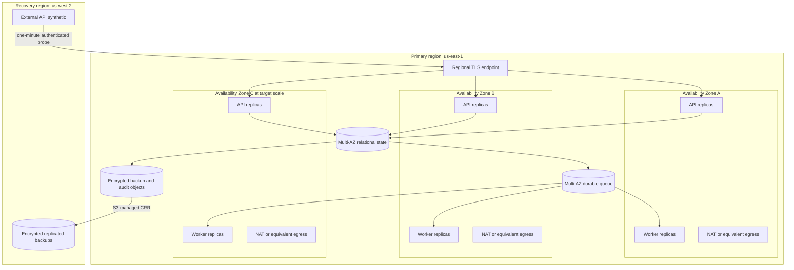

# ADR 0001: Alpha operational bounds

- Status: proposed
- Date: 2026-08-31
- Decision owners: ArdurAI maintainers
- Scope: first operable alpha
- Tracking issue: [#11](https://github.com/ArdurAI/veer/issues/11)

## Decision

Veer's first operable alpha uses a single regional control plane. Production
profiles span multiple Availability Zones inside that region; a second region
holds encrypted recovery data but no continuously running control-plane
compute. The initial reference region is AWS `us-east-1` (US East, N.
Virginia), with `us-west-2` (US West, Oregon) as the recovery region.

The implementation stack selected by issue
[#12](https://github.com/ArdurAI/veer/issues/12) must satisfy the measurable
bounds in this decision. Product runtime, relational store, queue, and migration
tool choices remain deliberately undecided here. Named AWS services in the cost
worksheet are reference price proxies, not an early selection of those
technologies.

This decision applies to the Veer control plane. It does not set availability,
scale, retention, or cost promises for workloads that Veer manages through
provider adapters.

## Why this boundary

The alpha must prove durable intent, reconciliation, recovery, isolation, and
day-two operation before taking on distributed ownership across regions. A
single-region, multi-AZ topology contains the synchronous consistency boundary,
keeps provider operation ownership unambiguous, and limits baseline cost.
Encrypted cross-region backups preserve a viable regional-disaster path without
creating a second active control plane.

The principal trade-off is explicit: a regional outage requires restore and
controlled failover. The alpha does not promise uninterrupted regional
failover, active-active writes, or zero recovery-point loss.

## Deployment profiles

### Topology

- API and worker processes are stateless and replaceable. At least two
  replicas of each role run across two failure zones in the small profile.
- The target profile schedules replicas across three failure zones and must
  tolerate loss of any one zone without manual traffic movement.
- Relational state uses synchronous in-region Multi-AZ durability. A successful
  write response is not sent until the desired state, integrity anchor, and
  required outbox/audit records are committed atomically.
- The durable queue spans failure zones, provides at-least-once delivery, and
  cannot be the source of record. Workers must be idempotent and fenced.
- Nodes, database endpoints, and queue endpoints are private. Public IPv4 is
  limited to the regional ingress and required egress endpoints.
- Source and recovery buckets are versioned, use Bucket owner enforced object
  ownership, have S3 Object Lock enabled with default 365-day governance
  retention, and are connected by Amazon S3 Cross-Region Replication (CRR).
  No Veer runtime, replication, validation, or active-retention role receives
  `s3:BypassGovernanceRetention`, `s3:PutObjectRetention`, or
  `s3:PutObjectLegalHold`. The only exception is the signed recovery-generation
  cleanup role described below, which can bypass retention solely on a tagged,
  non-authoritative candidate or retired bucket. S3 assumes a dedicated
  replication role scoped to read the selected source versions and their
  retention/legal-hold metadata, replicate only the archive prefix, and encrypt
  writes with the recovery-region key. Restore never grants provider authority
  until credentials and policy are revalidated. The bucket and role
  prerequisites follow the [S3 replication requirements](https://docs.aws.amazon.com/AmazonS3/latest/userguide/replication-requirements.html).
- Third-party secrets that cannot be reissued are replicated by Secrets Manager
  into `us-west-2` under the recovery-region key and a separately scoped
  resource policy. Cloud credentials are never copied: restored workloads
  obtain new short-lived credentials through workload identity. Recovery drills
  verify secret version, policy, rotation, and reissuance without exporting
  plaintext.

### Capacity profiles

The target profile is the alpha qualification boundary, not a forecast or a
claim of unlimited scale. Limits above it must produce bounded backpressure or
an explicit quota response; they must not cause silent data loss.

| Dimension | Developer | Small production | Target-scale qualification |
| --- | ---: | ---: | ---: |
| Human and workload principals | 5 | 50 | 500 |
| Workspaces | 2 | 25 | 250 |
| Environments | 5 | 100 | 1,000 |
| Applications | 20 | 1,000 | 10,000 |
| Components | 100 | 5,000 | 50,000 |
| Policies | 10 | 250 | 2,500 |
| Provider connections | 2 | 50 | 500 |
| API requests/second, steady, including synthetic | 1 | 5 | 25 |
| API requests/second, 15-minute peak, including synthetic | 2 | 20 | 100 |
| External synthetic API calls/minute, reserved | 0 | 2 | 2 |
| Accepted desired-state mutations/minute, steady, including synthetic | 6 | 31 | 151 |
| Accepted desired-state mutations/minute, 15-minute peak, including synthetic | 12 | 121 | 601 |
| New TLS connections/second | local | 20 | 100 |
| Encoded server TLS handshake bytes/new connection, maximum | local | 8 KiB | 8 KiB |
| Server TLS handshake bytes/month, GB | 0 | 14 | 70 |
| Active TLS connections, one-minute sample | local | 2,500 | 12,000 |
| Load-balancer processed bytes/hour, GB | local | 0.5 | 4 |
| Billable load-balancer rule evaluations/second | local | 500 | 4,000 |
| Concurrent non-terminal operations | 10 | 100 | 1,000 |
| Pending reconciliation items | 100 | 10,000 | 100,000 |
| Oldest ready-item admission threshold | 30 min | 15 min | 15 min |
| Durable queue 64 KiB billable request units/month | 0 | 20,000,000 | 100,000,000 |
| Queue baseline send/receive/delete units/month | 0 | 10,639,935 | 52,824,735 |
| Queue retry/redelivery reserve units/month | 0 | 5,000,000 | 25,000,000 |
| Queue empty-poll reserve units/month | 0 | 3,000,000 | 15,000,000 |
| Queue critical-work reserve units/month | 0 | 1,360,065 | 7,175,265 |
| Encoded queue message body, maximum | 2 KiB | 2 KiB | 2 KiB |
| Aggregate encoded queue body bytes/month, GB | 0 | 40 | 200 |
| Provider 4 KiB outbound/12 KiB inbound units/minute, steady | 20 | 120 | 1,200 |
| Provider 4 KiB outbound/12 KiB inbound units/minute, 15-minute peak | 40 | 250 | 1,500 |
| Provider observation units/minute, reserved | 2 | 40 | 400 |
| Resources per provider observation page, maximum | 50 | 50 | 50 |
| Provider mutation transfer units/minute, steady, all attempts | 10 | 60 | 600 |
| Provider mutation transfer units/minute, 15-minute peak, all attempts | 20 | 190 | 950 |
| Telemetry upload wire bytes/month, GB | 0 | 81 | 806 |
| Queue service wire bytes/month, GB | 0 | 80 | 400 |
| Other private-node AWS-service wire bytes/month, GB | 0 | 20 | 100 |
| NAT processed data/month, GB | 0 | 300 | 2,250 |
| Cross-AZ directional transfer/month, GB | 0 | 200 | 2,000 |
| Billable database surplus CPU credits/month, vCPU-hours | 0 | 2,976 | 0 |
| Primary-region standard alarm metrics/month | local | 64 | 64 |
| Audit events/month | 100,000 | 9,000,000 | 52,000,000 |
| Compact non-audit archive records/month | 750,000 | 10,056,268 | 49,897,468 |
| Archived audit and evidence bytes/31-day month, GB | 0.4 | 16 | 80 |
| Archive objects written/month | 10,000 | 37,000 | 163,000 |
| Archive S3 tier-1 requests/month, both regions | 30,000 | 111,000 | 489,000 |
| Archive KMS requests/month, both regions | 40,000 | 148,000 | 652,000 |
| Normal archive cross-region transfer/month, GB | 0 | 16 | 80 |
| Retained current archive data versions/region, maximum | local | 481,000 | 2,119,000 |
| Physical archive versions plus delete markers/region, maximum | local | 518,000 | 2,282,000 |
| Retention-cleanup ListObjectVersions requests/month, both regions | 0 | 148,002 | 652,002 |
| Delete-marker cleanup-overlap storage/region, GB-month | 0 | 0.02 | 0.09 |
| Full-reseed source GET and destination PUT attempts | 0 | 530,000 each | 2,331,000 each |
| Full-reseed KMS source-decrypt, destination-encrypt, and validation data-key/decrypt requests | 0 | 2,120,000 | 9,324,000 |
| Full-reseed cross-region transfer, GB | 0 | 229 | 1,144 |
| Full-reseed S3 Batch Operations jobs | 0 | 1 | 1 |
| Full-reseed S3 Batch object operations | 0 | 530,000 | 2,331,000 |
| Full-reseed generated-manifest source objects scanned | 0 | 481,000 | 2,119,000 |
| Full-reseed transient manifest objects | 0 | 1 | 1 |
| Full-reseed transient manifest storage, GB-month | 0 | 0.28 | 0.28 |
| Full-reseed candidate overlap storage, GB-month | 0 | 7.39 | 36.91 |
| Full-reseed destination GET validation attempts | 0 | 530,000 | 2,331,000 |
| Full-reseed cleanup ListObjectVersions requests | 0 | 530,001 | 2,331,001 |
| Relational data, provisioned GiB | 5 | 50 | 500 |
| Database changed blocks/rolling 7 days, GiB | 1.17 | 11.67 | 116.67 |
| Database changed blocks/rolling 30 days, GiB | 5 | 50 | 500 |
| Database changed blocks/rolling 35 days, GiB | 5.84 | 58.34 | 583.34 |
| Uncompressed platform logs/month, GiB | 5 | 50 | 500 |
| Retained platform log storage, GB | 14 | 135 | 1,343 |
| Accepted trace data/month, GiB | 1 | 10 | 100 |
| Billable custom metric identities/billing month | local | 50 | 500 |
| Secrets Manager API requests/month, primary region | 0 | 45,000 | 450,000 |
| Secrets Manager API requests/month, recovery region | 0 | 5,000 | 50,000 |
| Recovery-region secret replicas | 0 | 10 | 100 |
| Recovery-region synthetic runs/month | 0 | 44,640 | 44,640 |
| Recovery-region Scheduler/Lambda delivery attempts/month | 0 | 93,744 | 93,744 |
| Recovery-region duplicate-delivery reserve/month | 0 | 44,640 | 44,640 |
| Recovery-region shutdown-race delivery reserve/month | 0 | 4,464 | 4,464 |
| Recovery-region Lambda duration/month, GB-seconds | 0 | 937,440 | 937,440 |
| Retained recovery-probe identity claims, maximum | 0 | 46,080 | 46,080 |
| Encoded recovery-probe identity claim, maximum | 0 | 256 bytes | 256 bytes |

The developer profile is a single-machine functional environment. Its request
and provider rates are short smoke-test ceilings, not a full-month sustained-
load claim; its monthly audit and archive limits still apply. Zero billable queue
units means the local backend creates no cloud request charge, not that it
processes no messages. The developer profile has no availability commitment and
must not be used to claim HA or disaster-recovery evidence.
Its archive uses the same audit and compact non-audit streams with local request
counters, not S3 or KMS charges.

Pending depth counts ready, delayed, in-flight, retrying, and quarantined work.
Five percent of queue capacity is reserved for cancellation, deletion, and
security remediation. When an affected provider/workspace reaches 95% of its
depth allocation or the oldest ready item reaches the age threshold, Veer
rejects new non-reserved mutations before persistence with `429` and
`Retry-After`; a system-wide threshold returns `503`. Reads and reserved work
continue, accepted work is never discarded, and depth, age, rejection count,
and projected drain time are observable. Qualification holds a provider fake
in throttling until each threshold is crossed and verifies this response.

The 744-hour schedule reserves two synthetic calls per minute inside the
published API rates. The remaining generated request stream produces 3,502,005
small and 17,563,605 target accepted writes plus operation cancellations. The
44,640 synthetic writes also commit outbox work. One send, receive, and delete
unit per accepted action therefore consumes 10,639,935 and 52,824,735 queue
units before retries or empty long polls.

A durable profile-scoped meter expands batches into billable 64 KiB units and
counts every send, receive, delete, retry, redelivery, and empty long poll. It
partitions the 20/100 million hard caps into the baseline above, 5/25 million
retry and redelivery units, 3/15 million empty-poll units, and
1,360,065/7,175,265 units reserved for recovery, deletion, cancellation, and
security work.

At the start of each accounting window, a durable schedule ledger earmarks the
entire 10,639,935/52,824,735-unit baseline for the fixed generated and synthetic
workload. Before persistence, every accepted queue-producing action atomically
claims one send, one receive, and one delete unit from that ledger; the send
consumes its claim immediately, while receive and delete settle their claims as
the work drains. Retry or redelivery never consumes a claimed baseline unit and
must use its separate partition. Only an action holding a token from the
profile's steady/peak generated or synthetic schedule may claim baseline units;
excess bursts are rejected before the ledger and cannot steal a later slot.
Baseline claims that fit the pre-reserved schedule remain admissible through
100% of that partition, including after its 90% threshold, so accepted and
scheduled work can complete.

At 80% of any non-critical partition, Veer alerts and reduces poll frequency.
At 90%, it rejects queue-producing mutations that cannot claim a remaining
baseline slot before persistence and backs off empty polls; already claimed
work continues. Partition exhaustion fences new claims in that class, while
settlement of already claimed receive/delete work and the critical reserve stay
usable. A missing, stale, or non-durable meter fails closed with `503` before a
new claim. Accepted work is never discarded, and the total meter reaching 100%
fails qualification and blocks further admission.

Encoded queue bodies contain only identifiers, generations, and integrity
metadata and are rejected above 2 KiB; larger state is stored separately and
referenced by identifier and digest. An independent byte meter expands batches
and sums every encoded body occurrence across sends, receives, redeliveries, and
recovery traffic. It rejects non-reserved work before the aggregate exceeds
40/200 GB per month; the 64 KiB billing-unit counter cannot substitute for this
wire-byte counter.

The 200/2,000 GB cross-AZ envelopes reserve 40/200 GB for queue bodies,
140/1,600 GB for database and internal service traffic, and 20/200 GB for
failure retries and failover. Healthy workload paths use same-zone endpoints.
Every byte crossing a zone is metered directionally at the workload and managed-
service boundaries without netting request and response traffic. Alerts fire at
80%; at 90%, Veer fences non-reserved mutations and throttles non-reserved reads
so recovery, deletion, and security work retain the final 10%. Reaching 100%
fails qualification and blocks production until the selected stack reduces the
traffic or replaces this cost decision. Issue #12 must select a stack that
exposes these per-boundary measurements; an unmeasurable topology cannot
qualify.

Every provider request, response page, observation, retry, and error response
consumes `max(ceil(outbound wire bytes / 4 KiB), ceil(inbound wire bytes / 12
KiB), 1)` transfer units, including protocol and TLS overhead. Steady total caps
are 120/1,200 units per minute; the 15-minute peak caps are 250/1,500. External
mutation attempts, including retries and external cancels, consume at most
60/600 units steady and 190/950 at peak. The fixed mix accepts 45/225 external
actions per steady minute and 180/900 per peak minute, leaving explicit mutation
retry headroom. Because every raw attempt costs at least one unit, raw attempt
counts cannot exceed these schedules.

For each hour's 45 steady and 15 peak minutes, total provider capacity is
6,807,600/56,916,000 units per 744-hour month. Outbound volume is 27.88/233.13
GB, inbound volume is 83.65/699.38 GB, and combined provider NAT processing is
111.54/932.51 GB. The accepted 60/600 GiB of logs and traces convert to
64.43/644.25 decimal GB. Adding 25% for protocol and TLS overhead and rounding
up sets telemetry wire caps of 81/806 GB. Queue-service wire bytes are capped at
80/400 GB, and other private-node AWS-service traffic—including secret,
registry, and control API calls—is capped at 20/100 GB. The resulting
292.54/2,238.51 GB fit hard NAT-processing caps of 300/2,250 GB. S3 archive and
artifact traffic uses a same-region gateway endpoint and is excluded from NAT.
Veer nodes never use that regional endpoint to reach the other region: S3
performs live CRR and on-demand Batch Replication as managed service operations.
Any Veer-hosted cross-region copy path or interface endpoint must replace the
worksheet with its hourly and data-processing cost before use. Adapters must
paginate, stream, or reject before crossing the selected profile's unit budget.

The qualification observation set is the profile's Component count. One page
contains resources from only one ProviderConnection and at most 50 compact
observations. Except for the last page of a connection, the harness requires a
full page. Requests remain within 4 KiB and responses within 12 KiB, including
protocol and TLS overhead; each canonical observation entry is at most 192 wire
bytes. With 50/500 connection partitions, a complete small/target sweep needs at
most `ceil(components / 50) + connections`, or 150/1,500 units. The reserved
40/400 units per minute provide 200/2,000 units in five minutes, including
50/500 units for observation retries and errors. At steady load, the remaining
80/800 units cover 60/600 mutation units plus 20/200 other units. At peak, the
remaining 210/1,100 cover 190/950 mutation units plus 20/150 other units. A
provider that cannot expose this bounded batch observation cannot qualify at the
selected Component count; a replacement ADR must lower that profile.

### Load qualification

Qualification uses generated resources with provider adapters operating in a
deterministic test mode, followed by bounded live-provider smoke tests. Small
production and target scale run as independent qualifications against their
exact two-zone/two-node and three-zone/six-node topologies respectively; a
target result cannot substitute for the small profile:

1. Load the selected profile's full object counts, including its Policy and
   ProviderConnection counts. Seed age-distributed operations, plans, policy
   decisions, audit records, integrity-anchor rows, tombstones, idempotency
   rows, and indexes across their full online-retention windows until relational
   occupancy is 40 GiB small or 400 GiB target (80% of provisioned storage).
   Seed both the primary and recovery archives to 166.4 GB and 384,800 retained
   objects for small or 832 GB and 1,695,200 retained objects for target,
   distributed across all 13 retention envelopes and every record stream. The
   timed run must remain below 90% relational occupancy, leaving 10% for
   maintenance and recovery work.
2. Run that profile for 24 hours. In each hour, a 15-minute peak replaces steady
   traffic; the generator yields two calls per minute to the external synthetic.
   The deterministic provider fake completes operations within 30 seconds small
   or 60 seconds target, including configured retries, so non-terminal operations
   remain within 100/1,000. The resulting required audit counts are 262,667 small
   and 1,633,547 target, before separately labeled injected-fault events. Every
   raw provider mutation attempt contributes its required per-attempt audit
   record. The 24-hour compact non-audit archive oracle is 324,388 small and
   1,609,588 target records, including 4,320 records from synthetic writes.
3. In an isolated accounting environment, force queue retries and redeliveries,
   then hold an empty queue under long polling. Drive each queue-unit partition
   through 80%, 90%, and 100% with a deterministic fake and verify alert, poll
   backoff, fail-closed admission, critical-reserve isolation, accepted-work
   drain, and hard-cap failure. Reset the durable meter and re-seed from the
   standard preload between exhausted partitions and before continuing.
4. Use isolated, reset windows for each infrastructure failure. Process loss
   must be detected within two minutes and recover within five. Worker-lease
   expiry and queue redelivery must reacquire fenced ownership within two
   minutes without a duplicate provider resource. Compute-node loss must be
   detected within two minutes and reschedule with fenced ownership within 10.
   Database failover and loss of every active Availability Zone must be detected
   within two minutes and recover within 15. Every window must pass the zero-RPO
   acknowledgement oracle before re-seeding.
5. Deploy a signed bad-release fixture that writes an added optional persisted
   field and then fails the external synthetic after activation. From rollout
   onset, verify detection within five minutes, rollback within 30 minutes, and
   that the prior binary reads and processes every acknowledged record written
   by the failed release. The zero-RPO completeness oracle must pass.
6. Inject every enumerated logical-corruption class in an isolated reset and
   verify its integrity check, 15-minute detection, two-hour RTO, and five-
   minute RPO. Pause the deterministic recovery feed through its 20-, 25-, and
   30-minute thresholds and verify warning, critical, and
   qualification-failure behavior.
7. In an isolated regional-loss exercise, make the primary endpoint and data
   plane unavailable at a recorded onset. Verify two failed external probes and
   paging within four minutes; deploy the exact control-plane release from
   immutable configuration in `us-west-2`; restore and integrity-check the
   newest common database, integrity-anchor, outbox, relational audit-manifest
   root, and object checkpoint; revalidate replicated secret versions and
   policies; issue new
   short-lived workload authority; switch the endpoint; and pass both the
   synthetic and acknowledged-record completeness oracle. End-to-end recovery
   must finish within four hours and the recovered cutoff must be no older than
   30 minutes.
8. In an isolated archive-recovery exercise, keep the active recovery bucket,
   replication rule, and newest verified checkpoint restorable. For the attempt,
   create a fresh versioned candidate bucket and temporary exact-archive-prefix
   replication rule, then rebuild the candidate with one S3 Batch Replication
   job. Use one S3-generated manifest in a source-region recovery-control prefix,
   disable the completion report, and expire the manifest within 24 hours. Live
   CRR to the active generation continues while the temporary rule tails new
   versions into the candidate inside the reseed retry reserve. Fetch every exact
   destination object version with checksum mode enabled; verify the returned S3
   checksum; recompute SHA-256 over the exact serialized body; authenticate its
   embedded Veer manifest header, footer, signature, digest, sequence, and size;
   and compare byte/object cardinality, S3 job and replication status, signed
   stream root, and relational checkpoint. Inject bounded GET, PUT, and KMS
   retries, and verify the Batch job, object-operation, manifest-scan,
   source-read, destination-write, destination-validation, KMS, transfer,
   candidate-storage, and cleanup-list counters. Drive each counter through 80%,
   90%, and 100% with synthetic accounting and verify that exhaustion stops the
   attempt before another billable call. Promote the candidate checkpoint
   atomically only after every object and the live tail pass, while both
   replication rules remain live.
   Sign the candidate rule and grants as the new baseline, switch the checkpoint,
   then remove the old rule, grants, versions, and bucket before the 24-hour
   overlap expires. At no point may the active restorable checkpoint become
   unavailable or older than 30 minutes.

   Abort an incomplete attempt after 24 hours or budget exhaustion. On failure,
   enumerate and delete every exact candidate object version and delete marker,
   verify
   [`ListObjectVersions`](https://docs.aws.amazon.com/AmazonS3/latest/API/API_ListObjectVersions.html)
   is empty, remove the temporary rule and bucket,
   remove its temporary replication-role grants, restore the signed baseline
   replication configuration and role policy, and expire the transient manifest.
   Lifecycle expiry is defense in depth, not retry readiness. A retry always
   receives a new candidate bucket and never reuses a partially cleaned
   generation.

   Also seed a complete boundary-concentrated accounting envelope at its
   365-day expiry boundary in both active archive regions. Pause lifecycle only
   for the bounded Batch window, re-enable the signed rules, and run the
   retention sweeper. Verify exact-version deletion of every eligible
   noncurrent version and delete marker, a final empty
   `ListObjectVersions` result for the expired date prefix, preservation of
   every unexpired version, original replica age and Object Lock metadata, the
   518,000/2,282,000 physical entry caps, and the 148,002/652,002 two-region
   LIST-request caps. Attempt exact-version deletion one second before
   `RetainUntilDate` and require S3 to return `403`; repeat at or after expiry
   and require cleanup to succeed without bypass permission. Drive the cleanup
   counters through 80%, 90%, and 100% with synthetic accounting.
   Public CI uses a deterministic S3 service fake. An opt-in live fixture uses
   dedicated buckets, exact-prefix IAM, an exercise cost cap, and verified
   teardown.
9. In an isolated accounting test, drive each cross-AZ byte partition through
   its 80%, 90%, and 100% thresholds and verify alert, admission-control, and
   qualification-failure behavior without sending equivalent billable traffic.
10. In a separate backup-accounting test, include user writes, indexes, engine
   logs, maintenance, and migration amplification. Place permitted bursts on
   both sides of a former calendar boundary, drive each rolling 7-, 30-, and
   35-day changed-block envelope through 80%, 90%, and 100%, and verify alert,
   admission fencing, maintenance deferral, exact reserve accounting, and hard-
   cap failure. Reset and re-seed after the test.
11. Run three load-balancer windows: normal keep-alive reuse; connection churn
    at 20/100 new TLS connections per second; and an idle-connection soak at
    2,500/12,000 active connections. Verify every encoded server handshake is at
    most 8 KiB and drive the 14/70 GB monthly handshake-byte counter through its
    80%, 90%, and 100% paths with synthetic accounting. Verify connection
    admission, processed bytes, billable rule evaluations, and every hourly LCU
    dimension remain inside 1/5 LCUs.
12. In an isolated registry fixture, exercise deterministic metric name-and-
    dimension identities and create/delete churn below 90%, then restore signed
    snapshots at 80%, 90%, and 100% of the 50/500 monthly caps. At each state,
    race concurrent collectors on the final admitted identity and on distinct
    unknown identities. Verify linearizable admission, duplicate idempotency,
    alerting, new-identity freeze, rejection of unknown identities at the
    collector, continued emission of admitted identities, and a stable rejected-
    metric counter without emitting equivalent billable series.
13. Feed deterministic incompressible log batches with fixed serialized sizes
    through 80%, 90%, and 100% of the 50/500 GiB ingestion limits. Race
    concurrent collectors against the final allowance and inject confirmed
    pre-ingestion failures, uncertain outcomes, and missing and stale meter
    state. Verify atomic reservation and settlement, verbosity reduction,
    error-prioritized admission, pre-billable dropping, accepted and dropped
    byte/reason observability, retained-byte accounting against two boundary-
    concentrated 31-day envelopes, 14/30-day expiry, and the 14/135/1,343 GB
    storage caps without sending equivalent billable traffic.
14. Feed deterministic OTLP traces with fixed serialized sizes through 80%, 90%,
    and 100% of the 10/100 GiB accepted-volume caps. Race concurrent collectors
    against the final allowance and inject confirmed pre-ingestion failures,
    uncertain outcomes, and missing and stale meter state. Verify atomic
    reservation and settlement, projected usage, error-prioritized sampling,
    observable accepted and dropped bytes, fail-closed span admission, seven-day
    expiry, and inclusion of accepted trace bytes in the 81/806 GB telemetry
    wire counter without sending equivalent billable traffic.
15. In isolated primary- and recovery-region secret fixtures, race two/six cold
   nodes and rotation/invalidation work against the final request allowance.
   Drive the durable request ledgers through 80%, 90%, and 100%; verify the 90/10
   general/critical partition, single-flight behavior, confirmed pre-dispatch
   release, uncertain-outcome retention, cache expiry, and fail-closed behavior
   for missing or stale ledger state without issuing equivalent billable calls.
16. Exercise the pinned recovery probe for a complete bounded window. Verify
   each admitted identity produces at most one full probe, one encrypted
   artifact-object version, and one non-retried `PutObject` attempt. Inject a
   concurrent duplicate for every identity through synthetic accounting and
   confirm each replay returns the original receipt before the read, result
   metric, or artifact path. Then inject the non-borrowable 4,464-attempt
   shutdown race. Pre-create the deterministic artifact key and verify the
   conditional PUT creates no new version. Inject an identity older than 60
   seconds and verify rejection before any API or artifact call. Count every
   delivery, including a short duplicate, against the 93,744 invocation,
   937,440 GB-second, and 14.0616 GB log ledgers. Fail the profile if any
   quantity is exceeded. Drive intended, duplicate, shutdown, duration,
   log-byte, artifact-byte, and artifact-request partitions through 80%, 90%,
   and 100%; at duplicate-reserve exhaustion verify deletion of only the exact
   schedule while the shutdown reserve absorbs in-flight deliveries. Inject the
   documented 59-second Scheduler delay, prove each full invocation stops
   within ten seconds, and prove the high-resolution alarm evaluates within ten
   seconds and paging completes within forty more. A runtime, schedule, or
   alarm change must repeat this gate.
17. Report every SLI and bounded capacity/cost dimension for the entire run and
   for each failure window; synthetic accounting results are labeled separately
   from measured wire bytes.

The request generator uses a checked-in seed and a fixed mix at both steady and
peak rates: 70% reads (40% point resource reads, 20% operation/status reads,
and 10% paginated list reads), 10% successful desired-state mutations, 5%
idempotent replays of a prior successful mutation, 5% stale-version conflicts,
and 5% accepted operation-cancellation requests. The remaining 5% is split
equally across invalid, unauthenticated, unauthorized, quota-rejected, and
request-context-canceled calls. Each rejection class therefore has a non-empty
latency denominator. The client-cancellation case cancels after the server
observes the request but before commit and is distinct from an accepted request
to cancel an asynchronous provider operation.

The percentages apply to complete 100-request cycles in the generated stream;
the final 20 requests in a 744-hour accounting window are reads. The two audit-
required rejection categories are the 1% unauthenticated and 1% unauthorized
requests. An idempotent replay returns the original receipt and creates neither
a new provider attempt nor another required audit event. An accepted operation
cancellation always creates its API audit event; any resulting external cancel
call is also counted inside the provider mutation-unit and per-attempt audit
budgets.

Accepted operation cancellations target operations created earlier in the
seeded run, split equally between an interruptible provider fake and a provider
fake that must finish safely before reporting canceled. Successful mutations
are 20% creates, 60% updates, and 20% deletes, selected across Workspace,
Environment, Application, Component, Policy, and ProviderConnection resources
at 5%, 15%, 20%, 40%, 15%, and 5% respectively. The steady mix therefore
produces 30 and 150 generated accepted mutations per minute for the small and
target profiles. One synthetic no-op write per minute raises the admission
ceilings to 31/151 steady and 121/601 peak without causing a provider mutation;
conflicts, replays, and rejections cannot be reclassified as cheap reads.

The checked-in seed assigns every generated resource representation, mutation
body, and read response page to fixed serialized-size buckets: 90% at 1 KiB, 8%
at 4 KiB, and 2% at 256 KiB, for an exact 6.34 KiB mean and 256 KiB p99.
Non-read response bodies are receipt, status, or error envelopes capped at 1
KiB. Operations without a request body use zero bytes and are reported
separately; deterministic non-secret padding fills the selected bucket. The
maximum accepted request body, resource, or response page is 256 KiB, and
larger input fails before persistence with a stable client error. The harness
reports bucket counts by operation class so two runs cannot satisfy the same
percentiles with different byte workloads.

For a 744-hour hard billing month where each hourly 15-minute peak replaces
steady traffic, the total API envelope is exactly 23,436,000 small and
117,180,000 target requests. The synthetic supplies 89,280 calls, leaving
23,346,720 and 117,090,720 generated calls for the fixed mix.
At 70% read responses averaging 6.34 KiB, all other response bodies capped at 1
KiB, and a maximum 1 KiB of response headers per request, HTTP response egress is
137.70 GB small and 688.52 GB target. Each encoded server TLS handshake flight,
including its certificate chain, is rejected at configuration time above 8 KiB.
A durable edge meter reserves the encoded flight for each new connection and
caps monthly server-to-client handshake bytes at 14/70 GB. Its 80% threshold
alerts and forces aggressive keep-alive reuse; at 90%, edge admission preserves
existing connections and rejects new handshakes before the server flight; 100%
fails qualification. Instantaneous 20/100-per-second burst buckets remain
separate. A selected ingress that cannot expose and enforce both counters cannot
qualify. Adding handshake and bounded outbound provider traffic yields
179.59/991.64 GB, fitting the worksheet's 200/1,000 GB limits. Provider calls
and cost-incurring cloud fixtures are capped and explicitly enabled; public CI
uses deterministic fakes.

The reference Application Load Balancer terminates ECDSA P-256 or RSA-2048 TLS
and uses container or IP targets without Target Optimizer. Under the
[AWS LCU definition](https://aws.amazon.com/elasticloadbalancing/faqs/), one LCU
supports 25 new connections/second, 3,000 active connections/minute, 1 GB/hour,
or 1,000 billable rule evaluations/second; the maximum dimension is charged.
The small caps consume at most one LCU. Each target cap consumes at most four,
while the worksheet prices five. Qualification reports connection reuse, new
and active connections, processed bytes, rule evaluations, and `ConsumedLCUs`.

## Service indicators and objectives

Small and target production profiles share the alpha objectives. Developer
environments have measurement coverage but no SLO.

| Boundary | Alpha objective | Measurement |
| --- | --- | --- |
| API availability | 99.9% per calendar month | A one-minute recovery-region synthetic performs authenticated read and idempotent no-op write transactions. Missing results, server errors, timeouts, and planned maintenance count as unavailable. |
| API read latency | p95 <= 300 ms; p99 <= 750 ms | Server-side duration from accepted request to complete response under the profile's steady load, excluding client network time. |
| API write acceptance latency | p95 <= 500 ms; p99 <= 1 s | Server-side duration through durable desired-state, integrity-anchor, outbox, and required audit commit. Provider execution is asynchronous and excluded. |
| Invalid or unauthenticated rejection latency | p99 <= 250 ms | Server receipt of a complete, size-bounded request through the final documented response. Invalid input makes no durable write. An unauthenticated rejection may commit only its required append-only security-audit event, which is included in this duration; no request or business state is written. |
| Unauthorized or quota rejection latency | p99 <= 500 ms | Server receipt of a complete, authenticated request through the final documented response, including policy and quota evaluation. An unauthorized rejection may commit only its required audit event; quota rejection writes no business state. |
| Client-cancellation cleanup | p99 <= 100 ms | Time from server observation of request-context cancellation to handler termination, with no partial uncommitted state retained. |
| Planning start delay | 99% <= 30 s; 99.9% <= 2 min | Time from successful write commit to a worker acquiring the current generation. |
| Observation freshness | 95% <= 5 min; 99% <= 15 min | Age of the newest successful provider observation for every non-deleted resource that requires observation. Rate-limited and terminally failed resources remain in the denominator; a resource with no successful observation is aged from activation. |
| Recovery-copy freshness | <= 30 min hard bound; warn at 20 min; critical at 25 min | Source-commit age of the newest common database, outbox, audit-manifest, and object checkpoint verified as restorable in `us-west-2`. Missing or unverifiable checkpoints have infinite age. |
| Audit publication delay | 99.9% <= 60 s | Time from security-relevant commit to availability in the append-only audit query/export path. Missing required audit events are a correctness failure, not error-budget consumption. |
| Worker recovery | 99% of abandoned leases reacquired <= 2 min | Time from lease expiry or process loss to fenced ownership by a replacement worker. |
| Cancellation acknowledgment | 99% <= 30 s | Time from accepted cancellation request to a persisted canceled or cancel-pending condition. Provider operations that cannot be interrupted must be identified explicitly. |

At 99.9% monthly API availability, the maximum unavailable time in a 744-hour
month is 44 minutes 38 seconds. Error-budget reporting uses raw probe intervals,
not rounded incident duration.

The production synthetic is a purpose-built Lambda probe in `us-west-2`, outside
the primary failure boundary. EventBridge Scheduler creates one immutable
schedule identity per minute with flexible windows disabled. Its documented
[60-second invocation precision](https://docs.aws.amazon.com/scheduler/latest/UserGuide/schedule-types.html)
means a minute's target call can occur at any second in that minute. Target
retries are set to zero under the
[`RetryPolicy` API](https://docs.aws.amazon.com/scheduler/latest/APIReference/API_RetryPolicy.html),
with `MaximumEventAgeInSeconds` set to 60, for 44,640 intended dispatches in a
744-hour month; Lambda asynchronous retries are also zero under
[`PutFunctionEventInvokeConfig`](https://docs.aws.amazon.com/lambda/latest/api/API_PutFunctionEventInvokeConfig.html).
Because delivery is at least once, the budget separately reserves 44,640
duplicate attempts—one for every intended identity—and a non-borrowable 4,464
attempt shutdown race. Priced Scheduler target calls and Lambda invocations
therefore each cap at 93,744.

Every invocation emits one bounded attempt log before any API or artifact path
and has a ten-second hard timeout with 1 GB of memory and at most 0.00015 GB of
Embedded Metric Format logs. AWS/Lambda invocation usage and those logs are
reconciled against the regional/profile/window attempt partitions. Invocation
billing precedes function logic, which is why all 93,744 requests, 937,440
GB-seconds, and 14.0616 GB of logs are priced. At 80% of the duplicate reserve
Veer pages on cost pressure. At 100%, a separate circuit-breaker role with only
`scheduler:DeleteSchedule` on the exact probe schedule deletes it; it cannot
create, update, or target any other schedule. The remaining 4,464 attempts are
reserved for usage-metric delay, already in-flight work, and control-plane
propagation. Exhaustion makes every missing interval unavailable and requires
declarative restoration in the next reconciled window; a vendor runaway beyond
the shutdown reserve is an explicit residual cost risk rather than hidden
headroom.

The probe rejects a scheduled timestamp older than 60 seconds, then performs
its authenticated idempotent no-op write with the schedule identity as the
idempotency key. Probe identity claims are retained for the complete fixed
31-day accounting window plus 24 hours. Only the newly committed claim
continues to the read and result path; a replay returns the original receipt
and exits. At most 46,080 claims of 256 encoded bytes coexist across a window
boundary, using 11,796,480 bytes inside the existing relational and
qualification-preload allocations. Each winning identity makes one
non-retried conditional `PutObject` attempt with `If-None-Match: *` to its
deterministic key in a versioned result bucket.
The object contains at most 0.001 GB of encrypted result evidence retained for
30 days. No alternate artifact path exists, so duplicate delivery cannot
multiply artifact writes.
The probe emits only `SuccessPercent`, `Duration`, and `Failed` from the bounded
log event. Its one missing-or-failed-run alarm is high resolution: the second
consecutive scheduled-minute failure emits the alarm signal, evaluation is
bounded to ten seconds, and notification plus pager receipt is bounded to forty
more.

The Scheduler role may invoke only the probe function; the probe role can access
only a dedicated fixture, emit its exact log group, and write its deterministic
schedule-identity key under the result prefix; it has no result-bucket delete or
list permission. It obtains short-lived
credentials through workload identity and never records tokens or response
bodies. Artifact SDK retries are disabled: a failed write makes the interval
unavailable rather than creating another billable attempt. Its read and write
calls count against the selected profile's API, load-balancer, and gross
internet-egress budgets. The worksheet prices intended, duplicate, and shutdown
Scheduler/Lambda attempts, their full timeout and log envelopes, one artifact
write per admitted identity, metrics, and the high-resolution alarm without
free allowances.

### Correctness invariants

The following are pass/fail properties and cannot be traded against an SLO
error budget:

- every acknowledged desired-state write survives process, node, and
  single-zone failure;
- a generation has at most one unfenced provider-operation owner at a time;
- retry or redelivery never creates a second externally visible resource;
- authorization and workspace isolation are applied both when work is accepted
  and when it executes;
- the current-state integrity anchor is updated atomically with accepted state;
- required security audit events are durably committed before their response and
  atomically with any corresponding state change;
- secrets and provider credentials never appear in resources, plans, logs,
  traces, metrics, or cost reports.

### SLO exclusions

- Invalid and unauthenticated requests are excluded from availability only when
  the documented response completes within 250 ms p99. Unauthorized and
  quota-rejected requests require 500 ms p99. A client-canceled request is
  excluded only when the handler terminates within 100 ms p99 after observing
  cancellation and commits no partial state; a response is not required after
  the client transport is gone.
- Provider API unavailability, provider throttling, and provider-side operation
  duration are excluded from API availability and acceptance latency. They are
  not excluded from observation-freshness reporting and must be surfaced as
  provider conditions.
- Internet or client failures outside Veer's regional endpoint are excluded.
- Simultaneous loss of the primary and recovery regions, compromise of both
  regional key boundaries, and destructive corruption older than retained
  backups are outside the alpha recovery claim and remain residual risks.
- Planned maintenance is not excluded. This prevents maintenance windows from
  hiding an architecture that cannot meet its objective.

## Recovery objectives

| Failure | RTO | RPO | Maximum detection time inside RTO | Required mechanism and evidence |
| --- | ---: | ---: | ---: | --- |
| API or worker process loss | 5 min | 0 | 2 min | Replica replacement, readiness gating, durable state, and expired-lease takeover |
| Compute node loss | 10 min | 0 | 2 min | Rescheduling onto another node and zone, with no duplicate provider resource |
| Single Availability Zone loss | 15 min | 0 for acknowledged state | 2 min | Multi-AZ database and queue failover plus endpoint health routing |
| Bad application release | 30 min | 0 for committed data | 5 min | Version rollback with backward-compatible persisted formats |
| Enumerated detectable logical corruption or operator error | 2 hr | 5 min | 15 min | Named integrity checks plus in-region point-in-time restore into an isolated validation target before cutover |
| Primary-region loss | 4 hr | 30 min | 4 min | Independent regional probes, freshness alarms, encrypted cross-region restore, control-plane deployment, authority revalidation, and endpoint switch |

RTO starts at failure onset, not incident declaration. Fault-injection evidence
uses the injection timestamp. Production evidence uses a provider or deployment
event when it identifies onset; otherwise it conservatively starts at the last
successful one-minute external probe or integrity check before the first failed
signal. Detection and declaration consume the same RTO. The external probe uses
two consecutive failures; platform health signals must open an incident within
the table's detection bound. For a regional failure immediately after a
successful probe, the next scheduled minutes begin within 60 and 120 seconds
of onset. Scheduler can delay each target call by at most another 59 seconds,
and the ten-second function timeout therefore yields the two failed results
before 130 and 190 seconds. High-resolution alarm evaluation takes at most ten
seconds and notification plus pager receipt at most forty, keeping incident
opening below 240 seconds. Missing the detection bound or the end-to-end RTO
fails the objective.

The logical-corruption objective covers these alpha classes, each checked at
least every 15 minutes: a workspace-scoped desired-state row updated or deleted
outside the accepted API transaction, without a matching generation and digest
in the independently write-protected current-state integrity anchor; missing,
duplicate, or out-of-order generation and outbox rows (foreign-key, uniqueness,
monotonic-generation, and state/outbox checksum checks); cross-workspace
references (workspace-closure and ownership checks);
missing or modified required audit records (hash-chain and archive-manifest
checks); partially applied or mismatched schema migration (migration journal,
schema version, and checksum); and accidental required table or index removal
(catalog manifest). An authenticated, authorized request that is recorded
correctly but reflects mistaken human intent is not machine-detectable by this
contract and has no 15-minute detection claim; an operator may still choose a
restore point. Other logical defects are detected best-effort and do not inherit
the two-hour/five-minute alpha claim until a replacement ADR adds a concrete
oracle and drill.

Every current or tombstoned resource has exactly one integrity-anchor row keyed
by workspace, resource type, and stable identifier. It stores the latest
accepted generation, digest, and commit identity in at most 256 bytes before
indexes. A narrowly scoped definer routine updates it atomically with desired
state, outbox, and required audit event; the ordinary state-writer role cannot
modify it directly. The anchor remains for the resource lifetime and 90-day
tombstone, so corruption checks do not depend on audit-history retention. The
required audit event also carries the generation and digest for historical
evidence and retains its 90-day online/365-day archive bounds. This is one
bounded current projection per resource, not a second unbounded command ledger;
full-count anchor rows and indexes are included in qualification preload and the
40/400 GiB relational occupancy budgets.

Recovery freshness compares a primary commit watermark with the newest common
checkpoint whose database backup, integrity anchors, outbox, audit manifest,
and required objects have all passed integrity verification in `us-west-2`. At
20 minutes an alert warns operators; at 25 minutes it pages as critical.
Reaching 30 minutes fails qualification, suspends the production regional-RPO
claim, and blocks planned cutover. An emergency restore may still proceed but
records an RPO breach.

For an RPO greater than zero, define the recovery cutoff as
`failure onset - stated RPO`. For RPO zero, the expected set instead includes
every write acknowledged before onset and throughout the failure window through
recovery completion or an explicitly recorded quiescence point. If the durable
path cannot preserve that set, Veer must fence write admission before sending
another acknowledgement.

The qualification harness keeps an ordered, hashed ledger of acknowledged
state, integrity anchors, outbox, and required audit records. Every ledger entry
in the expected set must exist after restore with matching content and
referential-integrity checks. A recent recovered record cannot hide an older
omission, and any missing or mismatched entry fails the recovery objective. Issue
[#64](https://github.com/ArdurAI/veer/issues/64) must exercise these objectives.
Until those exercises pass, they are design targets rather than demonstrated
service claims.

## Retention and storage assumptions

| Data | Online retention | Recovery/archive retention | Notes |
| --- | --- | --- | --- |
| Current desired and observed state | Resource lifetime | 90-day tombstone after deletion | Stable identifiers remain reserved through tombstone expiry. |
| Current-state integrity anchors | Resource lifetime | 90-day tombstone after deletion | One independently write-protected latest-generation proof per resource. |
| Operations, plans, and policy decisions | 90 days | 365 days in encrypted object storage | Secret-bearing inputs are prohibited. |
| Security audit events | 90 days queryable | 365 days immutable and encrypted | Shorter retention requires a reviewed security decision. |
| Idempotency records | 24 hours minimum | None | A caller cannot rely on replay safety after expiry. |
| Recovery-probe identity claims | Fixed 31-day accounting window plus 24 hours | None | At most 46,080 claims of 256 encoded bytes prevent cross-window replay. |
| Database point-in-time recovery | 35 days in primary region | 7 days replicated in recovery region | Monthly restore verification is required. |
| Platform logs | 14 days small; 30 days target | None by default | Security events belong in the audit stream, not ordinary logs. |
| Traces | 7 days | None by default | Accepted trace data is capped at 10 GiB/month small and 100 GiB/month target. Sampling must prioritize errors while shedding safely at the cap and redacting sensitive attributes. |
| High-resolution metrics | 15 days | 13 months for SLO rollups | Workspace, resource ID, request ID, and provider object ID are forbidden metric labels. A durable billing-month registry caps unique name-plus-complete-dimension identities at 50/500; identity churn never reclaims budget. |

Platform log admission uses a durable billing-month meter. Before a collector
sends a batch to any billable ingestion endpoint, one linearizable conditional
update checks and reserves its exact uncompressed serialized bytes. A confirmed
acceptance settles the reservation, a confirmed failure before ingestion
releases it idempotently, and an uncertain outcome retains it conservatively.
The cap applies to settled plus outstanding reservations. At 80% Veer alerts
and reduces verbosity; at 90% only error-prioritized logs can claim remaining
bytes; at 100%, or when the meter is missing or its last confirmed durable read
is older than two minutes, all new platform log batches are dropped before
billable ingestion. Business work continues. Accepted, reserved, and dropped
bytes, drop reason, projected month-end volume, and meter freshness use already
admitted metric identities.

Platform log storage is priced without a compression assumption. Two complete
31-day ingestion envelopes can fall inside the 14/30-day retention windows when
writes concentrate around a boundary. Converting those 10/100/1,000 GiB
developer/small/target maxima to decimal GB, adding 25% for service framing, and
rounding up produces hard retained-storage bounds of 14/135/1,343 GB. Expiry and
the service's stored-byte metric must verify the bounds; compression is only
unpriced headroom.

Metric identity admission is linearizable. Before the first emission of a new
name-plus-complete-dimension identity, a serializable conditional insert and
durable counter increment commit together. Concurrent attempts for the same
identity are idempotent, while distinct identities cannot commit past 50/500.
At 80% the registry alerts; at 90% it freezes new identities; at 100%, or when
registry state is missing or its last confirmed durable read is older than two
minutes, the collector rejects unknown identities while continuing already
admitted series. Deletion, relabeling, or recreation cannot reclaim a billing-
month identity. Rejections increment one pre-admitted low-cardinality counter
and never fail business work.

Trace admission uses the same linearizable check-and-reserve protocol for exact
uncompressed serialized OTLP batch bytes before billable ingestion. Confirmed
acceptance settles a reservation, confirmed pre-ingestion failure releases it
idempotently, and an uncertain result retains it. The cap applies to settled
plus outstanding reservations. At 80% it alerts and reduces non-error sampling;
at 90% only error-prioritized sampling remains; at 100%, or when the meter is
missing or its last confirmed durable read is older than two minutes, all new
spans are dropped before billable ingestion. Accepted, reserved, and dropped
bytes, drop reason, projected month-end volume, meter freshness, and seven-day
expiry are observable without using new metric identities. The reservation
store must provide serializable or equivalent linearizable conditional updates;
an eventually consistent counter cannot qualify for logs, traces, or metric
identities.

Database changed bytes include user data, indexes, engine logs, compaction or
vacuum, maintenance, and schema-migration amplification. A durable meter uses
service-reported physical bytes and a conservative pre-acknowledgement reserve
for the selected stack's maximum single-transaction amplification. It enforces
11.67/116.67 GiB in every rolling seven days, 50/500 GiB in every rolling 30
days, and 58.34/583.34 GiB in every rolling 35 days. The developer equivalents
are 1.17, 5, and 5.84 GiB. Missing or stale measurements fail closed for writes.
At 80% Veer alerts; at 90% it rejects non-reserved mutations and defers optional
maintenance. The final 10% is reserved explicitly for rollback, integrity
repair, deletion, and security work. Reaching any cap fences all new writes and
fails qualification. Background work must reserve its worst-case bytes before
starting; a stack that cannot expose and enforce these bounds cannot qualify.

The rolling bounds prevent calendar-boundary bursts from exceeding retained
backup storage. Conservatively applying no included backup allocation, the
primary copy plus its 35-day changed-block cap requires 108.34 GB-month small and
1,083.34 GB-month target. The recovery copy plus its seven-day cap requires
61.67 GB-month and 616.67 GB-month. The worksheet prices all four quantities;
actual managed-service incremental backups may consume less.

Every externally attempted provider mutation, including a retry, emits one
required audit record containing the operation and attempt identities, target,
authorization context, and outcome. Applying the 45/15-minute steady/peak
mutation schedules allows at most 4,129,200 small and 30,690,000 target provider
records in a 744-hour month. The generated API stream's 17% required-audit share
is exactly 10% successful mutations, 5% accepted cancellations, 1%
unauthenticated requests, and 1% unauthorized requests: 3,968,939 small and
19,905,419 target records over complete 100-request cycles. After 44,640
synthetic writes, the combined totals are 8,142,779 and 50,640,059, leaving
857,221 and 1,359,941 records for bounded system events inside the 9 million and
52 million caps. The provider totals already include every retry, and a provider
cancel attempt is included even though its accepted API cancellation has a
separate audit record. Idempotent replays, invalid requests, stale conflicts,
quota rejections, and request-context cancellations produce no external attempt
and use bounded metrics or ordinary logs unless issue
[#14](https://github.com/ArdurAI/veer/issues/14) classifies one as a required
security audit event.

Canonical audit events are at most 16 KiB before archive compression and must
average no more than 1,000 bytes at the full event count. This allocates at most
9 GB/month small and 52 GB/month target to audit records. After the compact
non-audit records below, 2.98 GB and 8.04 GB remain inside the combined 16 GB and
80 GB archive-ingress caps for framing and unused byte headroom; they do not
authorize another record stream. Per-object recovery evidence is the embedded
manifest already counted as framing. Recovery and qualification summaries are
required system audit events and consume the remaining 857,221/1,359,941-event
allowance above. The archive
writer measures actual stored object bytes, including framing and encryption
overhead. A 365-day retention interval can intersect 13 fixed 31-day accounting
windows when writes are concentrated at their boundaries. Pricing all 13 full
envelopes therefore caps each primary and recovery copy at 208 GB small and
1,040 GB target without relying on smooth arrival times.

Archive keys are immutable, contain a UTC creation-date partition, and are at
most 512 encoded bytes. Both versioned archive buckets use the same signed
lifecycle and Object Lock contract: every data version receives default
365-day governance retention; current versions expire at 365 days,
`NoncurrentVersionExpiration` permanently removes every resulting noncurrent
version after one day, `ExpiredObjectDeleteMarker` removes the final marker, and
incomplete multipart uploads abort after one day. AWS documents both the
[versioned-bucket actions](https://docs.aws.amazon.com/AmazonS3/latest/userguide/intro-lifecycle-rules.html)
and that a
[replica lifecycle honors the source object's original creation time](https://docs.aws.amazon.com/AmazonS3/latest/userguide/replication-requirements.html);
it also documents that
[replication copies Object Lock metadata](https://docs.aws.amazon.com/AmazonS3/latest/userguide/object-lock-managing.html).
Batch Replication therefore resets neither Veer's retention age nor its
storage-enforced deletion boundary. The archive writer's already-required S3
checksum satisfies Object Lock's checksum-header upload prerequisite.

Lifecycle is eventual, so it is defense in depth rather than the hard bound. An
audited daily sweeper uses the signed date-partition retention ledger and exact
version IDs to permanently delete eligible noncurrent versions and markers
within 24 hours, then requires an empty `ListObjectVersions` response for that
date prefix. A separate retention-sweeper role receives only
`s3:ListBucketVersions`, `s3:GetObjectRetention`, and
`s3:DeleteObjectVersion` on the one signed expired date prefix. It has no
governance-bypass, retention-write, legal-hold, object-write, bucket-delete,
replication, or IAM permission; S3 itself rejects deletion of an unexpired data
version. One boundary-concentrated
monthly envelope may be simultaneously noncurrent and covered by delete markers,
so physical data versions plus markers cap at 518,000/2,282,000 per region.
Marker-key storage rounds up to 0.02/0.09 GB-month per region. Conservatively
allowing one LIST response per noncurrent version and marker plus a final empty
proof costs 74,001/326,001 requests per region, or 148,002/652,002 across both.
Each regional sweep commits one bounded signed summary audit event; it does not
create per-version Veer records. Audit records are never sampled or dropped:
exceeding the bound rejects or backpressures new work and surfaces a capacity
condition.

Each successful mutation adds one compact plan, authorization-decision, and
operation record. Every accepted operation cancellation adds one authorization
decision and at least one operation transition. The interruptible half moves
directly to `canceled`; every non-interruptible cancellation is conservatively
budgeted for both `cancel-pending` and terminal `canceled`, with the odd extra
cancellation assigned to that half. The 1,167,335/5,854,535 monthly
cancellations therefore add 583,668/2,927,268 transitions beyond the former
40-record-per-cycle baseline. Each of the 44,640 synthetic writes adds a compact
plan, authorization decision, and operation record. The complete workload
therefore produces 10,056,268 small and 49,897,468 target non-audit records.
Their canonical archive representation is capped at 4 KiB and must average at
most 400 bytes, consuming at most 4.03 GB and 19.96 GB inside the non-audit byte
allocations. There is zero allowance for additional compact non-audit records.
Oversized compact records or evidence that would require another chunk are
rejected or backpressured and require a replacement worksheet before admission.

The archive writer fills an object until it contains 1,000 records, the next
record would exceed the 8 MiB compressed-object limit, or the oldest buffered
record reaches 10 minutes; one final accounting-window flush is also allowed.
Process shutdown transfers the durable buffer and does not create an extra
partial object. The timer path, including the final accounting-window flush,
emits no more than 4,464 partial objects per stream in a 31-day window. From the
oldest record, primary object and relational checkpoint commit are bounded to
two minutes, managed CRR to five, and recovery integrity verification to two.
Together with buffering, the archive path completes within 19 minutes, before
the 20-minute freshness warning. Missing any stage budget backpressures new work
and fails qualification before the 30-minute hard bound.

Every Veer archive data object carries its own signed manifest header and footer
inside the already reserved framing. Its digest, sequence, encoded size, and
signature are duplicated in bounded S3 user metadata for indexing, but metadata
is never accepted as proof of body integrity. The archive writer supplies an S3
checksum supported by its selected single- or multipart-upload path, verifies
the returned checksum metadata, and rejects a commit if S3 does not persist it.
Recovery validation performs an exact-version
[`GetObject` with checksum mode enabled](https://docs.aws.amazon.com/AmazonS3/latest/API/API_GetObject.html),
verifies the returned value according to S3's checksum type, recomputes Veer's
full-body SHA-256 over the returned serialized bytes, and authenticates the
embedded signature and digest. The relational
archive checkpoint stores the prefix, sequence, object
digest, and signed stream root atomically with archive progress. Veer creates
exactly zero standalone persistent manifest objects, so the monthly and retained
archive object caps count every persistent S3 object. An implementation that
needs a separate Veer manifest object must replace the worksheet before
qualification.

At 1,000 records per object plus no more than 4,464 timer flushes per stream,
the fixed non-audit workload requires at most 14,521 and 54,362 objects. Audit
packing reserves 192 KiB of every 8 MiB object for framing, compression
expansion, and encryption, so at most 500 maximum-size 16 KiB records share an
object. Including timer flushes, audit requires at most 22,464 and 108,464
objects. The combined worst cases are therefore 36,985 and 162,826, fitting
monthly caps of 37,000 and 163,000. Each profile budgets three S3 tier-1 requests
and four KMS requests per monthly object across primary write, recovery
replication, retries, manifest/list work, and validation.

The developer profile reserves 0.1 GB and 100,000 records for audit plus 0.3 GB
and 750,000 records for compact non-audit evidence. Dense packing needs at most
200 and 750 objects respectively; adding one 4,464-object timer-flush allowance
for each of the two streams yields 9,878 objects inside its 10,000-object local
cap. Its 30,000 request and 40,000 envelope-operation counters preserve the same
three/four-per-object qualification contract without creating cloud charges.

Thirteen retained envelopes contain at most 481,000/2,119,000 objects per
region. Live CRR handles every new version into the active recovery generation.
A full reseed leaves that generation and its verified checkpoint intact while
one S3 Batch Replication job copies retained versions into a fresh versioned
candidate bucket through a temporary exact-prefix replication rule. The
generated list is exactly one transient manifest object in a source-region
recovery-control prefix, is excluded from the job's own source filter, is capped
at 8 GiB, and expires within 24 hours. The manifest filter admits only unexpired
current data versions from the signed date partitions; delete-marker replication
is disabled on the candidate rule, and noncurrent versions and markers are
excluded. Lifecycle is paused on the source and candidate only for the
maximum-24-hour Batch window, as AWS recommends for parity, then the signed
rules and exact-version sweeper resume. Completion reporting is disabled; Veer
records the job identifier and terminal status in relational audit state and
independently authenticates every destination body as described above.

The reseed reserves at least 10% headroom shared by bounded retries and the live
candidate tail, rounding the small allowance up: 530,000/2,331,000 S3 Batch
object operations, source GETs, destination PUTs, and destination validation
GETs; 2,120,000/9,324,000 KMS operations for source decrypt, destination
encrypt, and validation `GenerateDataKey` plus decrypt; and 229/1,144 GB
cross-region transfer.
Same-region validation reads at most the same 229/1,144 GB through an S3 gateway
endpoint, so they add neither cross-region transfer nor NAT processing.
Manifest generation scans
481,000/2,119,000 source objects, one Batch Operations job is allowed, and its
8 GiB artifact is 8.589934592 decimal GB and, for 24 hours in a 31-day window,
rounds up to 0.28 GB-month plus one tier-one write. The
source and destination GETs use pinned Tier-2 rates; the destination PUT uses
Tier-1. Candidate overlap is capped at the full retry-inclusive transfer
envelope for 24 hours, or 7.39/36.91 GB-month. The active copy remains
authoritative until atomic promotion. Failed candidate versions and delete
markers are enumerated and removed, `ListObjectVersions` must return empty, and
the candidate bucket is deleted; asynchronous lifecycle cleanup is never a
precondition for retry. The LIST-request allowance is one request per possible
retry-inclusive version plus one final empty response—530,001/2,331,001—so cost
correctness does not depend on full 1,000-entry pages. DELETE requests are free
under the dated S3 price contract. Exhausting a job, object-operation,
manifest-scan, request, KMS, byte, storage, or 24-hour allowance stops the
attempt before the next billable action. A second job requires operator approval
inside the exercise's transient-cost cap and a new candidate bucket. Normal
archive and reseed caps use the same non-dropping backpressure path as the byte
cap.

S3 replication configuration exposes one bucket-level
[`Role`](https://docs.aws.amazon.com/AmazonS3/latest/API/API_ReplicationConfiguration.html)
for all rules. That role is trusted only by `s3.amazonaws.com` and normally has
only source version-for-replication reads, active-destination replication
actions, `s3:GetObjectRetention` and `s3:GetObjectLegalHold` on the source
archive prefix, and KMS decrypt/encrypt on the exact archive prefixes and keys.
Before the temporary candidate rule is enabled, declarative infrastructure adds only
the candidate bucket/prefix and candidate-key statements. Abort removes those
changes and verifies the prior signed baseline is restored. Promotion signs the
candidate rule and statements as the new baseline before removing the former
active rule and grants; the final configuration and policy must match that new
baseline. The Batch Operations role is separately trusted only by
`batchoperations.s3.amazonaws.com`. It receives `s3:InitiateReplication` on
source archive versions, replication-configuration and inventory reads, plus
`s3:GetObject`, `s3:GetObjectVersion`, and `s3:PutObject` only on the exact
recovery-control manifest prefix. A separate validator role receives only
`s3:GetObjectVersion` and `s3:GetObjectRetention` on the exact candidate prefix
and `kms:GenerateDataKey` plus `kms:Decrypt` on the candidate key. A cleanup role receives
`s3:ListBucketVersions` with the exact-prefix condition,
`s3:DeleteObjectVersion`, `s3:BypassGovernanceRetention` on that prefix, and
`s3:DeleteBucket` only for the tagged candidate or retired bucket. Its session
requires a signed state token showing either candidate abort or completed
promotion, and every permanent delete explicitly supplies the governance-bypass
header. Bucket policy denies that principal on the signed active-baseline bucket
and prefix; it cannot alter retention or legal holds. The job submitter can
create only tagged recovery jobs and pass only the Batch role. Source and destination
versioning, ownership, replication status, and signed-digest verification are
qualification gates. S3 Replication Time Control is not enabled or priced; the
separate freshness oracle enforces Veer's accepted 30-minute bound. The workflow
and roles follow AWS's contracts for
[Batch Replication IAM](https://docs.aws.amazon.com/AmazonS3/latest/userguide/s3-batch-replication-policies.html)
and
[replicating existing objects with Batch Replication](https://docs.aws.amazon.com/AmazonS3/latest/userguide/s3-batch-replication-batch.html).

Issue [#14](https://github.com/ArdurAI/veer/issues/14) owns data classification
and handling rules. It may reduce retention where privacy or secret exposure
requires it. Any increase requires a security, storage, and monthly-cost review.

## Monthly cost boundary

The reproducible worksheet is in
[`cost-model/`](cost-model/README.md). Its checked-in 2026-08-31 price snapshot
uses a hard 744-hour month, on-demand public rates, `us-east-1` primary
resources, and `us-west-2` recovery storage.

| Profile | Reference estimate/month | Accepted ceiling/month | Headroom |
| --- | ---: | ---: | ---: |
| Developer | USD 0.00 cloud infrastructure | USD 0.00 | USD 0.00 |
| Small production | USD 937.50 | USD 1,000.00 | USD 62.50 |
| Target-scale qualification | USD 2,627.40 | USD 2,650.00 | USD 22.60 |

The target reference leaves only the narrow headroom reported above after
conservatively pricing all retained backup data, the external synthetic, and
request allowances. No additional recurring target resource may be added
without reducing another input or approving a replacement ADR.

These figures cover the Veer control plane only. They exclude taxes, support,
discount programs, CI minutes, developer workstations, domain registration,
temporary compute used during a recovery exercise, and every cloud or
Kubernetes resource created for a user's application. The worksheet
conservatively does not apply account-level free-tier credits. Each recovery
exercise has a separate transient-cost cap of USD 25 for the small profile and
USD 75 for the target profile; exceeding it requires operator approval before
the exercise continues.

### Cost safeguards

- Every billable resource carries owner, environment, profile, and Veer
  component cost-allocation tags.
- Budget alerts fire at 50%, 80%, 90%, and 100% of the selected profile ceiling.
  Daily anomaly detection must identify an expected month-end run rate above
  the ceiling.
- Each production profile prices 64 primary-region standard alarm metrics:
  8 API/SLO, 10 queue/admission, 8 reconciliation/provider, 8 database/backup,
  10 network/ingress, 10 telemetry/archive, 6 recovery/security/secrets, and
  4 EKS/budget/cost. This budget counts every metric evaluation used by a
  standard alarm, including repeated thresholds; the external recovery probe
  alarm is priced separately. A required alert that cannot fit this allocation
  requires a replacement worksheet rather than silent omission.
- The Kubernetes version is upgraded before extended support. At current EKS
  rates, allowing one cluster to enter extended support adds USD 372 per
  744-hour month; an alert fires 60 days before the transition.
- The small database prices the theoretical maximum 2,976 surplus vCPU-hours
  (two Multi-AZ copies times two vCPUs times 744 hours), or USD 223.20. Credit
  alerts at 50%, 75%, and 90% trigger a non-burstable capacity review, but cost
  correctness does not depend on workload throttling. The target database is
  non-burstable.
- Compute, worker concurrency, provider request rates, queue depth, logs, traces,
  metric cardinality, backup retention, and object storage all have explicit
  upper bounds.
- Trace admission enforces the 10 GiB/month small and 100 GiB/month target
  ceilings. Dropped spans and projected month-end volume are observable.
- Retained log storage prices two uncompressed boundary-concentrated ingestion
  envelopes plus 25% framing; compression is not required for cost correctness.
- Secret values are fetched through a single-flight, version-aware in-memory
  cache and never once per provider operation, but the cache is not the cost
  control. Before every Veer-issued Secrets Manager API call, a durable
  region/profile/accounting-window ledger atomically claims one request. A
  confirmed pre-dispatch failure releases the claim idempotently; an uncertain
  outcome retains it. Each regional cap reserves 90% for general reads and 10%
  for rotation, invalidation, and recovery; neither partition can borrow from
  the other. Aggregate use alerts at 80%. Exhausting the general partition
  rejects general calls while unused critical tokens remain available only to
  critical callers; at 100% every call is rejected before dispatch. Missing
  state, or a last confirmed durable read older than two minutes, fails any
  cache miss or refresh closed without calling the service; a still-valid cache
  hit continues until its version-aware expiry or invalidation.
  Cache invalidation follows rotation events and expiry; primary/recovery caps
  remain 45,000/5,000 per month small and 450,000/50,000 target, with claims,
  releases, retained uncertainties, cache hits/misses, and projected usage
  observable.
- Recovery-region secret replicas, managed CRR transfer and requests, and one
  S3 Batch Replication reseed with job, object-operation, generated-manifest,
  candidate-overlap storage, validation GET/KMS, cleanup LIST, byte, and request
  allowances are priced without free allowances. Replication lag, version
  mismatch, request volume, job status, and restore-time access are alarmed.
- Archive retention prices the delete-marker overlap and conservative
  exact-version LIST proof in both regions. Original replica age,
  noncurrent-version expiry, marker removal, and the 24-hour sweeper are
  qualification gates rather than assumptions about eventual lifecycle timing.
- Backup storage includes the current copy and rolling 7/30/35-day changed-byte
  envelopes for recovery retention, transfer, and primary retention. The meter
  includes engine and maintenance amplification, not only accepted payloads.
- High-cardinality identifiers are logs or traces, never metric dimensions.
- Nodes stay private. Same-region S3 gateway endpoints avoid NAT processing for
  backup and artifact traffic; S3 performs managed CRR and Batch Replication
  across regions without a Veer node data path. Provider, telemetry, queue, and
  other AWS-service wire budgets feed the 300/2,250 GB NAT caps; interface
  endpoints require a before/after cost comparison that includes hourly and
  data-processing rates.
- Queue messages carry identifiers, generations, and integrity metadata, not
  resource bodies, and are capped at 2 KiB. The 20/100 million monthly limits
  still count billable 64 KiB request units after sends, receives, deletes,
  retries, batching, and empty long polls rather than only logical messages.
- Directional cross-AZ bytes are measured without netting against the
  200/2,000 GB monthly caps and their queue, database/service, and failure
  reserves. The 80% alert and 90% admission guard preserve recovery headroom.
- The recovery-region synthetic's intended, duplicate, and shutdown delivery
  partitions, Lambda invocations and duration, log/output bytes, single
  artifact attempt, and retention are hard limits. Scheduler and Lambda retries
  are disabled; duplicate immutable schedule identities exit after the
  idempotent write and before read, result metric, or artifact work. Duplicate
  exhaustion deletes only the exact schedule and reserves 10% for shutdown
  races. Missing runs page operators and count as failed availability intervals
  so a broken monitor cannot hide a regional outage.
- A production profile uses one NAT path per active Availability Zone to avoid
  a cross-zone egress dependency. Developer deployments use no managed NAT.
- Queue consumers use long polling and batching where correctness permits.
- Capacity and price inputs are reviewed before every release and at least
  quarterly. A changed estimate above the ceiling fails worksheet verification
  and requires a replacement ADR or a capacity change.
- Provider qualification uses a dedicated sandbox, resource quotas, expiry
  tags, and a verified teardown. It is budgeted separately from this
  always-on control-plane estimate.

## Alternatives considered

### Multi-region active-active

Rejected for the alpha. It could reduce regional RTO, but requires distributed
write ownership, global fencing, conflict resolution, replicated queues,
multi-region credentials, and a substantially larger permanent bill. Those
semantics are not yet proven.

### Warm active-passive control plane

Deferred. It reduces restore time but continuously duplicates compute, ingress,
secrets, observability, and operational patching. Backup-and-restore meets the
alpha's four-hour regional RTO at lower cost.

### Single-zone production

Rejected. It cannot meet acknowledged-write or 99.9% API availability targets
during an Availability Zone failure.

### One shared NAT path for production

Rejected as the default. It saves fixed hourly charges, but creates a
cross-zone dependency and adds cross-AZ transfer charges. It remains acceptable
only for non-HA, explicitly disposable environments.

### Self-managed stateful services

Rejected as the reference cost and operations baseline. They can reduce direct
service charges at scale but move backup, failover, patching, and on-call burden
into the alpha. Issue #12 may still select them only if it demonstrates the
same recovery and operability bounds with total cost included.

## Consequences and follow-up

- Issue #12 can now compare stacks against explicit correctness, recovery,
  performance, operations, and cost requirements.
- Issue #14 must turn the retention assumptions and residual risks into owned
  data-handling and threat controls.
- Later provider contracts must bound rate limits and cost independently from
  control-plane capacity.
- Issue #63 must implement the SLIs, budgets, cardinality limits, alerts, and
  cost telemetry defined here.
- Issue #64 must prove each recovery objective and report restore size,
  duration, latest-restorable timestamp, and unrecovered records.
- Exceeding a capacity profile is unsupported until a load report and reviewed
  ADR establish a new boundary.

## Review checklist

- [ ] Architecture reviewers accept the single-region failure boundary.
- [ ] Security reviewers accept the backup, key, credential, and residual-risk
      boundaries.
- [ ] Operators accept the SLO, RTO/RPO, retention, and qualification methods.
- [ ] The cost worksheet verifies from a clean checkout and remains below both
      production ceilings.
- [ ] Pricing sources, regions, dates, quantities, exclusions, and free-tier
      treatment are explicit.
