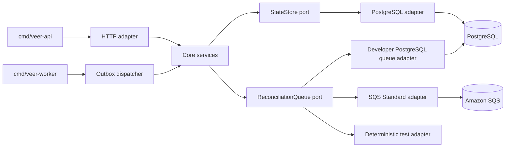

# ADR 0002: Alpha implementation stack

- Status: accepted
- Date: 2026-09-01
- Accepted: 2026-09-01
- Decision owners: ArdurAI maintainers
- Scope: first operable alpha
- Tracking issue: [#12](https://github.com/ArdurAI/veer/issues/12)

## Decision

Veer's alpha is a modular Go control plane backed by PostgreSQL. Production
uses Amazon RDS for PostgreSQL with one synchronous Multi-AZ standby and Amazon
SQS Standard queues. A transactional PostgreSQL outbox connects acknowledged
state changes to queue publication; the queue is never the source of record.

The HTTP API and worker are separate binaries built from one Go module. Core
packages own domain behavior and narrow store and queue ports. PostgreSQL, SQS,
HTTP, configuration, and telemetry remain adapters composed only by the
binaries. The developer profile uses the same PostgreSQL schema with a durable
PostgreSQL queue adapter and has no cloud dependency. Deterministic in-memory
adapters are test doubles, not qualification evidence for persistence.

The selected implementation baseline is:

| Component | Pinned version | Role |
| --- | --- | --- |
| `go` | `1.27.0` | Language, compiler, runtime, and standard-library HTTP server |
| `postgresql` | `18.6` | Authoritative relational state and transactional outbox |
| `pgx` | `5.10.0` | Native PostgreSQL driver and connection pool |
| `sqlc` | `1.31.1` | Typed Go generation from reviewed SQL queries |
| `goose` | `3.27.3` | Ordered SQL migration runner |

The machine-readable copy and its source links are in
[`stack-evaluation/versions.tsv`](stack-evaluation/versions.tsv). The offline
[`stack-evaluation/verify.sh`](stack-evaluation/verify.sh) check prevents that
manifest, this ADR, and the documentation indexes from drifting.

Amazon SQS is a managed API and does not expose a customer-selected engine
version. The AWS SDK, infrastructure provider, base image, linters, and API
generator will be pinned by the issue that first introduces each artifact;
they are not floating dependencies implied by this decision.

## Decision boundary

This ADR implements the choices intentionally left open by
[ADR 0001](0001-alpha-operational-bounds.md). It does not change that ADR's
availability, RTO/RPO, latency, retention, capacity, security, or cost limits.
In particular:

- a successful write requires one atomic commit of desired state, generation,
  idempotency result, integrity anchor, required audit data, and outbox record;
- the durable queue is at-least-once, may duplicate and reorder deliveries, and
  cannot establish resource ownership;
- production state and queue infrastructure span failure zones, while API and
  worker processes remain stateless;
- the developer profile must run locally without private credentials or paid
  cloud services;
- the target profile has only USD 22.60 of monthly headroom, so this decision
  adds no continuously billed service to ADR 0001's worksheet.

## Runtime and process model

### Go with the standard HTTP stack

Go `1.27.0` is the current supported release as of this decision. The
[Go release policy](https://go.dev/doc/devel/release) supports a major release
until two newer major releases exist, and the
[Go 1 compatibility promise](https://go.dev/doc/go1compat) applies to the
selected stable language and standard-library surface.

The API uses `net/http` and `http.ServeMux`. A general-purpose web framework is
not selected. Middleware remains explicit and ordered: request limits,
correlation, authentication, authorization, admission, audit, recovery, and
telemetry. OpenAPI validation and generated transport types may be added by the
API convention decision, but generated transport types may not become domain
types.

The deployment contains two commands:

- `veer-api` accepts, validates, authorizes, and atomically persists intent;
- `veer-worker` dispatches outbox records and performs reconciliation work.

Both binaries expose separate health, readiness, and metrics surfaces. They
handle termination by stopping admission or queue receives, draining bounded
in-flight work, releasing or allowing leases to expire, and closing database
pools. A queue receipt is acknowledged only after its durable outcome commits.

### Dependency direction



Core packages never import an adapter, AWS SDK, HTTP package, generated
transport package, or migration runner. Command packages are composition roots;
they may import both core and adapters but contain no business rules.

## Persistence decision

### PostgreSQL is authoritative

Production pins PostgreSQL `18.6`, which is a supported community minor and is
[available on Amazon RDS](https://docs.aws.amazon.com/AmazonRDS/latest/PostgreSQLReleaseNotes/postgresql-versions.html).
Production uses RDS Multi-AZ with one standby, encrypted storage and backups,
verified TLS, point-in-time recovery, and the primary and recovery copy policy
from ADR 0001. The developer profile runs the same major and minor release
locally.

`pgx` is used through its native `pgxpool` interface. `sqlc` generates typed
query methods from reviewed SQL; generated code stays inside the PostgreSQL
adapter. The core does not expose SQL strings, `pgx.Tx`, database identifiers,
SQLSTATE values, or schema-shaped structs.

PostgreSQL isolation is chosen per operation. Resource mutations use an
optimistic resource-version predicate and an atomic transaction; serialization
or deadlock failures are classified and retried only when the complete domain
operation is safe to replay. No retry loop may outlive its request deadline or
bypass admission accounting.

### Transactional outbox

The mutation transaction inserts an immutable outbox record containing only a
work identifier, resource identifier, committed generation, intent digest,
priority class, and availability time. The outbox dispatcher:

1. claims ready rows with a bounded lease and deterministic order;
2. publishes the compact work reference through the queue port;
3. records the publish receipt or retry classification durably;
4. reclaims expired claims after process loss; and
5. retains enough state to prove whether every acknowledged generation was
   published or superseded.

A crash between queue publication and recording the receipt can publish twice.
That is expected. Workers re-read authoritative state, compare the delivered
generation and digest, acquire fenced resource ownership, and treat stale or
duplicate work as a no-op with bounded evidence. Queue deduplication is never a
correctness dependency.

### Store port

`internal/core/ports.StateStore` owns the following capability contract:

| Capability | Contract |
| --- | --- |
| Read snapshot | Load a workspace-scoped resource, desired generation, observed generation, resource version, conditions, and integrity metadata from one consistent snapshot. |
| Atomic mutation | Run one bounded transaction that conditionally writes desired state, generation, idempotency result, integrity anchor, required audit data, and outbox work, or writes none of them. |
| Fenced operation | Acquire, renew, and complete operation ownership using a monotonically increasing fence; a stale holder cannot commit provider results. |
| Observation | Persist observed state and conditions only for the generation and fence that produced them. |
| Outbox | Claim, settle, retry, and recover publication records without deleting unproved work. |
| Audit query | Read append-only audit records through bounded, deterministic pagination; mutation is not exposed. |
| Health | Report connectivity, pool saturation, migration compatibility, replica role, and recovery-lag inputs without exposing credentials. |

The port expresses domain errors such as not found, conflict, quota exhausted,
retryable unavailable, and integrity failure. Adapter-specific errors are
wrapped with safe metadata and remain available for classification without
being returned to clients or logged with query parameters.

## Queue decision

### SQS Standard in production

SQS Standard explicitly provides
[at-least-once delivery and best-effort ordering](https://docs.aws.amazon.com/AWSSimpleQueueService/latest/SQSDeveloperGuide/sqs-queue-types.html),
which matches the failure model Veer must already prove. Each message is at
most 2 KiB and contains references and integrity metadata, never desired state,
credentials, policy inputs, or other secret-bearing payloads.

The adapter uses long polling, bounded batches, visibility leases with bounded
heartbeat extension, explicit deletion after commit, and a same-region dead
letter queue. Visibility expiry is a lease loss, not proof that the first worker
stopped. A worker that loses its database fence must stop external mutation even
if it still holds a queue receipt.

The source queue and dead-letter queue use SQS-managed server-side encryption
(`SSE-SQS`) at rest, TLS in transit, restrictive queue policies, and separate
least-privilege roles. Customer-managed `SSE-KMS` is not selected because its
key and request costs are absent from ADR 0001's queue envelope; adopting it
requires a priced security decision. The roles are separated as follows:

- the outbox publisher can send and read the minimum queue attributes needed
  for accounting;
- workers can receive, change visibility, delete, and read the minimum queue
  attributes;
- an operator-only role can inspect and redrive quarantined work;
- no runtime role can change queue policy, encryption, retention, or redrive
  configuration.

Redrive is rate-limited and revalidates current store generation, authorization,
and cost admission before work becomes executable again. Queue names, message
attributes, logs, and metrics contain no user content or secrets.

### Queue port

`internal/core/ports.ReconciliationQueue` owns the following capability
contract:

| Capability | Contract |
| --- | --- |
| Publish | Send a bounded immutable work reference with priority and earliest-delivery time; an uncertain outcome is retryable and may duplicate. |
| Receive | Return zero or more deliveries with opaque receipts, receive counts, sent time, and current visibility deadline; no order or uniqueness is promised. |
| Extend | Extend a live delivery lease to a bounded deadline; failure causes the worker to surrender its store fence. |
| Acknowledge | Delete a receipt only after the durable result commits; repeated acknowledgement is safe. |
| Release | Make retryable work available with bounded backoff without converting a terminal failure into a retry. |
| Health | Report oldest ready age, ready and in-flight depth, receive and redelivery rate, DLQ depth, and cost-ledger state. |

The port's opaque receipt and delivery identity are distinct from a Veer
operation identity. This prevents an adapter from making SQS receipt handles or
PostgreSQL row identifiers part of domain state.

The developer PostgreSQL adapter uses `FOR UPDATE SKIP LOCKED` only for its
queue table. PostgreSQL documents that `SKIP LOCKED` produces an inconsistent
view suitable for queue-like consumers, not general reads. The adapter must
inject duplicate, reordered, delayed, and lease-expired deliveries in tests so
local success cannot imply stronger production semantics. The in-memory adapter
is deterministic and fault-scriptable; it is used for unit and public-CI
failure tests only.

## Migration decision

`goose` `3.27.3` runs sequential, SQL-only migrations. Timestamped development
names are not used in the committed history; globally increasing sequence
numbers make order explicit and turn concurrent additions into visible merge
conflicts. Environment substitution is disabled so a reviewed migration has one
meaning in every environment.

The migration contract is:

- a dedicated migrator identity owns DDL; API and worker identities do not;
- one migration job runs before new binaries become ready and holds an explicit
  PostgreSQL advisory lock for the complete migration session;
- statements are transactional by default; a `NO TRANSACTION` exception needs
  a reason, bounded lock and statement timeouts, an interruption recovery plan,
  and isolated evidence;
- merged migration files are immutable and checksummed in release provenance;
- production rollback is binary rollback over an expand/migrate/contract schema,
  not an automatic destructive down migration;
- destructive contract steps require proof that the old binary is no longer
  live, the rollback window has closed, and a verified backup exists; and
- migration duration, lock wait, changed blocks, errors, and schema version are
  observed without including SQL parameters or secret values.

`goose` executes statements in a migration transaction by default and supports
an explicit non-transaction annotation for PostgreSQL operations that cannot
run in a transaction. Veer treats that annotation as a reviewed exception, not
an escape from the migration contract.

## Repository layout

The repository remains one Go module, initially
`github.com/ArdurAI/veer`. Directories are introduced only when their first
owned artifact exists; empty architecture scaffolding is not committed.

```text
api/openapi/                         versioned transport contract
cmd/veer-api/                        API composition root
cmd/veer-worker/                     worker and outbox composition root
internal/core/domain/                identifiers, resources, operations, rules
internal/core/ports/                 store, queue, clock, identity, provider ports
internal/core/service/               use cases and transaction orchestration
internal/adapters/store/postgres/    pgx/sqlc persistence implementation
internal/adapters/queue/sqs/         production queue implementation
internal/adapters/queue/postgres/    developer durable queue implementation
internal/adapters/queue/memory/      deterministic fault-scriptable test adapter
internal/transport/http/             HTTP parsing, middleware, and representation
internal/platform/config/            validated environment-to-config boundary
internal/platform/telemetry/         logs, metrics, traces, and health wiring
migrations/                          immutable sequential PostgreSQL migrations
deploy/helm/veer/                    Kubernetes deployment contract
test/contract/                       adapter-independent port conformance
test/integration/                    real local PostgreSQL process boundaries
test/qualification/                  profile load, fault, recovery, and cost gates
tools/                               pinned development-tool declarations
docs/                                decisions, operations, security, and evidence
```

No root `pkg/` directory is created for internal code. A package becomes public
only when an external consumer contract requires it. Tests beside packages own
unit behavior; top-level test directories are reserved for cross-package and
deployed-system evidence.

## Evaluation method

Alternatives were evaluated in the order established for Veer: correctness,
recovery, security, performance, operability, then cost. A candidate that misses
a hard correctness or recovery boundary is rejected even if it is cheaper or
faster. Cost figures use ADR 0001's 744-hour, on-demand, no-free-tier worksheet;
they are architecture comparisons, not vendor quotes or forecasts.

### Runtime and framework alternatives

| Candidate | Correctness | Recovery | Security | Performance | Operability | Monthly baseline cost | Outcome |
| --- | --- | --- | --- | --- | --- | --- | --- |
| Go 1.27.0 plus `net/http` | Explicit transactions, cancellation, and typed domain ports without framework lifecycle rules. | Small stateless binaries restart independently; recovery remains store- and fence-driven. | Memory-safe runtime, standard-library HTTP/TLS surface, and a small dependency graph; unsafe code remains possible and is gated. | Must pass Veer's 100-RPS peak and latency harness; no third-party benchmark is treated as proof. | One module, fast builds, single binaries, native profiling, and familiar Kubernetes shutdown behavior. | USD 0 license; no added node is assumed beyond ADR 0001. | Selected. |
| Rust 1.98.0 plus Axum 0.8.9/Tokio | Strong static guarantees, but async cancellation and transaction ownership still require the same application protocol. | Stateless recovery is viable; compilation and incident debugging add a second operational learning curve for this repository. | Memory safety is strong; macro and crate supply-chain surfaces remain material. | Likely capable, but Veer's low request ceiling does not justify selecting on speculative throughput. | More complex build, cross-compilation, profiling, and contributor bootstrap for the initial team. | USD 0 license; the same no-extra-node assumption is unproved. | Rejected for alpha operability, not capability. |
| Node.js 24.20.0 LTS plus Fastify 5.12.1/TypeScript | Transactions and fencing are feasible, but runtime validation must carry guarantees erased from TypeScript types. | Stateless recovery is viable; event-loop blocking becomes another failure mode to detect. | Memory-safe managed runtime, but a larger transitive package and install-script surface requires more supply-chain controls. | Likely capable at the accepted rate if blocking work is excluded; still requires the same harness. | Rapid API development, offset by runtime, package-manager, and dependency-tree operations. | USD 0 license; the same no-extra-node assumption is unproved. | Rejected for alpha dependency and runtime surface. |

### Relational-store alternatives

| Candidate | Correctness | Recovery | Security | Performance | Operability | Monthly baseline cost | Outcome |
| --- | --- | --- | --- | --- | --- | --- | --- |
| RDS PostgreSQL 18.6 Multi-AZ | Native transactions atomically cover state, audit, integrity anchor, idempotency, and outbox. | Managed synchronous standby, PITR, and snapshot workflows fit the zero-RPO AZ and documented regional-restore exercises. | Private endpoint, KMS encryption, verified TLS, engine patching, and separated runtime/migrator roles. | Must pass 40/400-GiB occupancy, failover, query-latency, and write-amplification qualification. | One familiar relational engine locally and in production; AWS owns host and standby operations. | USD 347.83 small and USD 642.13 target for compute, storage, backup, transfer, and modeled small-profile credits. | Selected. |
| Aurora PostgreSQL 18.4 with one cross-AZ reader | PostgreSQL-compatible transactions fit, but Aurora-specific behavior becomes part of the adapter and test matrix. | Fast managed failover is attractive; regional recovery and exact-version restore still require separate proof. | Comparable managed controls, with a separate engine patch schedule; Aurora 18.4 lagged the selected community/RDS 18.6 baseline on the decision date. | Storage architecture may help some workloads, while I/O charging makes the unmeasured access pattern material. | Adds Aurora-specific capacity, version, I/O, and failover operations. | Two db.r7g.large instances alone are USD 410.69/month at the checked price, before storage, I/O, backup, and transfer; target headroom is USD 22.60. | Rejected until a measured Aurora worksheet beats the selected total. |
| Self-managed PostgreSQL on EKS | Same SQL semantics are possible, but correctness now depends on operator-built replication, fencing, backup, and failover. | The alpha would have to prove database orchestration itself while also proving Veer recovery. | Veer would own host hardening, patching, replication credentials, certificates, and backup isolation. | Can be tuned, but competes with API/worker capacity and creates noisy-neighbor risk. | Highest on-call and upgrade burden; ADR 0001 rejects self-managed state as the reference baseline. | Reusing nodes hides capacity cost; three dedicated modeled m7g.xlarge nodes cost USD 364.26/month before volumes, backup, transfer, and operations. | Rejected for alpha recovery and operability. |
| DynamoDB on-demand | Regional transactions exist but are limited to 100 distinct items and 4 MiB; the selected boundary explicitly requires relational state and relational qualification. | Managed AZ durability is strong, but relational PITR, query, migration, and integrity evidence would need redesign. | Strong managed controls; access-pattern-specific IAM and indexes expand the policy surface. | Can scale well for designed keys, but Veer's evolving relational access patterns are not yet stable enough to prove. | Removes SQL operations but shifts schema, indexes, joins, migrations, and local parity into application code. | Not priced because it fails the relational-store contract; accepting it requires a replacement of ADR 0001 and a complete request/storage worksheet. | Rejected on a hard contract, not price. |

The RDS figures are the exact stack-sensitive rows in ADR 0001's checked-in
worksheet. The Aurora lower bound uses the same AWS price snapshot: two
`db.r7g.large` Aurora PostgreSQL Standard instances at USD 0.276 per hour for
744 hours. The self-managed lower bound uses three existing worksheet
`m7g.xlarge` rates and deliberately excludes costs that can only make it larger.

### Queue alternatives

| Candidate | Correctness | Recovery | Security | Performance | Operability | Monthly baseline cost | Outcome |
| --- | --- | --- | --- | --- | --- | --- | --- |
| SQS Standard plus transactional outbox | Deliberate duplicate and reordering semantics force generation checks, idempotency, and fencing at the source of truth. | Multi-AZ managed queue and visibility expiry replace failed consumers; outbox replay repairs uncertain publication. | SQS-managed encryption, compact non-secret messages, scoped producer/consumer/redrive roles, TLS enforcement, and restrictive policies. | Managed throughput is far above the accepted envelope; the hard gates are age, depth, wire bytes, redelivery, and cost units. | No brokers to patch; visibility, DLQ, redrive, and CloudWatch behavior still require runbooks and drills. | USD 8.00 small and USD 40.00 target, already included in ADR 0001. | Selected for production. |
| SQS FIFO | Broker deduplication and per-group ordering do not remove the need for store fencing, especially after visibility expiry and outside the deduplication window. | Managed recovery fits, but a poisoned or slow message can block its resource group. | Same managed controls plus deduplication/group identifiers that must not expose sensitive data. | Accepted throughput fits, but ordering supplies no required correctness property and adds head-of-line behavior. | More grouping and redrive semantics for no reduction in Veer's mandatory recovery tests. | USD 10.00 small and USD 50.00 target at the accepted request envelopes, USD 2.00/10.00 above Standard. | Rejected because ordering is unnecessary for correctness, not because it is unaffordable. |
| PostgreSQL `SKIP LOCKED` queue | Can be durable and at-least-once when leases and fences are implemented; shares the authoritative transaction boundary. | A database failure removes both record and delivery paths, reducing failure independence. | Reuses database controls but broadens database permissions and contention surface. | Avoids network sends but adds hot-table churn, vacuum, lock, WAL, backup, and cross-AZ load to the narrow database envelope. | Excellent local parity and debugging; poor production fault isolation. | USD 0 separate service only if it causes no database uplift, which is unproved with just USD 22.60 target headroom. | Selected only for developer and contract-test profiles. |
| MSK Serverless/Kafka | Durable replay and partition order are stronger than required, but exactly-once provider effects still need Veer fencing. | Adds broker, partition, consumer-offset, and retention recovery to the store/outbox recovery path. | Private connectivity and IAM are available; topic ACL, connector, and data-retention surfaces expand blast radius. | Far beyond the accepted 100-RPS/100-million-unit envelope and introduces partition planning. | Adds Kafka-specific monitoring, clients, lag, retention, and incident skills. | The published cluster-hour charge alone is USD 558 per 744-hour month, before partitions, traffic, and storage. | Rejected for cost and operability. |

### Migration-tool alternatives

| Candidate | Correctness | Recovery | Security | Performance | Operability | Monthly baseline cost | Outcome |
| --- | --- | --- | --- | --- | --- | --- | --- |
| goose 3.27.3, SQL-only | Ordered reviewed SQL, transactional by default, with explicit exceptions for non-transactional DDL. | Works with expand/migrate/contract and binary rollback; Veer supplies lock, timeout, checksum, and backup policy. | Runs locally with a dedicated least-privilege migrator and no SaaS or environment substitution. | Direct SQL exposes lock and scan cost for review and qualification. | Small CLI/library surface, PostgreSQL support, and clear sequential files. | USD 0 recurring service cost. | Selected. |
| golang-migrate 4.19.1 | Ordered up/down files are capable, but do not provide an advantage over the selected SQL workflow. | Dirty-version recovery is explicit; the same Veer rollback and locking policy is still required. | Local open-source execution is acceptable and can use a scoped identity. | Comparable direct-SQL behavior. | Broad database/source-driver support is unused surface for one PostgreSQL target. | USD 0 recurring service cost. | Rejected to avoid redundant tooling. |
| Atlas 1.3.0 | Declarative diff and lint can catch classes of schema error, but generated plans introduce another artifact requiring deterministic review. | Supports planned migrations; Veer would still own online-change and rollback proof. | Local execution is possible, while cloud features would add an external trust and credential boundary. | Planning may improve complex changes but does not change runtime DDL costs. | More schema-language, workflow, and optional service surface than the alpha needs. | USD 0 for a local-only workflow; any hosted plan would require a separate security and cost decision. | Deferred until schema complexity justifies it. |

### Module-boundary alternatives

| Candidate | Correctness | Recovery | Security | Performance | Operability | Monthly baseline cost | Outcome |
| --- | --- | --- | --- | --- | --- | --- | --- |
| One module, two binaries, core-owned ports | One domain transaction model is shared while API and worker lifecycles remain independent. | Either process can restart or scale without splitting the state protocol. | Go `internal` boundaries prevent accidental external imports; adapters isolate credentials and generated code. | In-process core calls avoid an unnecessary service hop. | One build graph and release, with separate deployment and telemetry. | Fits the existing API/worker node envelope with no added service. | Selected. |
| Service per architectural box | Network protocols would split the atomic domain boundary before those protocols are stable. | More partial-failure and deployment-order cases during the alpha. | More identities, certificates, endpoints, and policies. | Adds serialization and network latency to a 100-RPS control plane. | Independent scaling is possible but not needed; on-call and release coordination increase. | Any new load balancer, service mesh, or nodes consume the USD 22.60 target headroom. | Rejected for alpha; extraction requires measured pressure and an ADR. |
| Flat packages shared by commands | Easy initially, but transport, SQL, and AWS types can become de facto domain contracts. | Recovery logic becomes coupled to adapter details and harder to fault-test. | Credential-bearing clients and user-facing data have weak structural separation. | No meaningful advantage over explicit internal packages at this scale. | Import cycles and ownership ambiguity grow with each provider. | No direct service cost, but maintenance cost is unbounded. | Rejected. |

## Benchmark and qualification assumptions

No public language, framework, database, or queue microbenchmark is accepted as
Veer evidence. All candidates can plausibly serve the request rate; the
qualification burden is the end-to-end Veer protocol under its own data shape
and failures.

The selected stack must pass ADR 0001's checked-in workload without changing
its seed or denominator:

- independent small and target runs use the exact two-zone/two-node and
  three-zone/six-node topologies for 24 hours;
- steady/peak API rates are 5/20 and 25/100 requests per second, with the fixed
  read, mutation, replay, conflict, cancellation, and rejection mix;
- request and response bodies follow the exact 90% 1-KiB, 8% 4-KiB, and 2%
  256-KiB distribution;
- relational state is preloaded to 40/400 GiB, with all indexes, retention-age
  distributions, idempotency records, integrity anchors, audit data, and outbox
  rows present;
- acknowledged mutations peak at 121/601 per minute and must commit through
  outbox and required audit data within the write-latency SLO;
- queue tests cover 20/100 million 64-KiB request units per month, 2-KiB
  messages, 10,000/100,000 pending items, duplicate and reordered deliveries,
  lease expiry, long-poll empties, and each cost-reserve threshold;
- read latency must remain p95 at most 300 ms and p99 at most 750 ms; write
  acceptance must remain p95 at most 500 ms and p99 at most one second;
- worker, node, Availability Zone, database, queue, and uncertain-publication
  faults must meet the exact zero-RPO and RTO or reacquisition bounds;
- database CPU, connections, lock waits, WAL, changed blocks, storage, backup,
  cross-AZ bytes, and queue request/body counters are measured, not inferred;
  and
- Go is assumed to fit the already priced EKS node envelope. A need for another
  node, database tier, proxy, cache, or service is a failed cost qualification,
  not permission to consume unmodeled headroom.

Before qualification exists, these are benchmark assumptions, not performance
claims. Issue #13 establishes reproducible local commands; later resource,
store, queue, and qualification issues implement the fixtures and publish raw
results with tool versions, topology, seed, duration, errors, and cost counters.

## Security, observability, and cost controls

### Security

- Configuration is parsed once into typed values, rejects unknown or unsafe
  production defaults, and redacts secrets from formatting and errors.
- Database TLS verifies hostname and trust roots. Credentials arrive through
  workload identity or a secret reference, never source, image, migration,
  command line, queue body, or test fixture.
- Database roles separate migration ownership, runtime mutation, read-only
  operations, backup/recovery, and integrity verification. Runtime roles cannot
  grant privileges or alter schema.
- SQL is parameterized. Dynamic identifiers use closed enumerations and safe
  quoting inside the adapter; user input never becomes SQL syntax.
- Queue roles and resource policies use exact queue ARNs and actions. Operator
  redrive is separate, audited, rate-limited, and unavailable to runtime pods.
- Dependency and tool artifacts are version-pinned and checksum- or
  digest-verified by the bootstrap and supply-chain work. A floating `latest`
  tag is not an implementation of this ADR.

### Observability

- HTTP metrics use route templates, method, status class, and bounded outcome;
  they do not label workspace, resource, request, provider object, or actor IDs.
- Store telemetry reports static query name, transaction outcome, isolation,
  retry reason, pool state, lock wait, migration version, outbox age, and
  integrity failure. SQL arguments and connection strings are never recorded.
- Queue telemetry reports publish and receive outcomes, ready/in-flight/DLQ
  depth, oldest age, visibility extensions, receive count, redelivery, payload
  bytes, and each durable cost-ledger partition.
- Logs correlate through opaque request, operation, work, and delivery IDs;
  those values are log fields, not metric dimensions, and are covered by the
  retention and byte budgets in ADR 0001.
- Readiness fails for incompatible schema or inability to reach required state;
  it does not fail merely because one external provider is degraded. Health
  output never includes endpoints containing credentials.

### Cost

The selected store and queue consume exactly the already modeled amounts:

| Profile | PostgreSQL envelope | SQS Standard | Combined | Whole control plane | Remaining headroom |
| --- | ---: | ---: | ---: | ---: | ---: |
| Developer | USD 0.00 cloud infrastructure | USD 0.00 | USD 0.00 | USD 0.00 | USD 0.00 |
| Small production | USD 347.83 | USD 8.00 | USD 355.83 | USD 937.50 | USD 62.50 |
| Target qualification | USD 642.13 | USD 40.00 | USD 682.13 | USD 2,627.40 | USD 22.60 |

The PostgreSQL envelope includes the worksheet's compute, provisioned storage,
primary and recovery backup storage, recovery transfer, and small-profile CPU
credit reserve. It does not imply that those costs may be spent twice. The SQS
amount includes the full fixed request-unit partitions.

Runtime CPU/memory requests, database pool limits, SQL plans, queue batching,
long polling, empty receives, payload bytes, retries, and telemetry volume must
be observable against the existing envelopes. A performance workaround that
adds recurring infrastructure requires a replacement cost worksheet and ADR.

## Version and upgrade policy

- Exact versions are reviewed in `versions.tsv`; builds and setup never resolve
  `latest`.
- Go stays on a release supported by the Go team. PostgreSQL stays on a
  community- and RDS-supported major and on a current approved minor.
- Security patch updates are assessed immediately and targeted for seven days;
  routine patch updates are tested within 30 days. An active exploit or vendor
  deadline can require a shorter incident change.
- Patch updates change the manifest, ADR pin table, lock/checksum evidence, and
  compatibility tests in one PR. A Go or PostgreSQL major change, queue type,
  store engine, migration model, or module-boundary change requires an ADR
  amendment or replacement.
- PostgreSQL upgrades rehearse snapshot restore, migration compatibility,
  failover, old/new binary compatibility, and rollback before production.
- Dependency automation may open updates, but no automation merges a toolchain,
  database, driver, query generator, or migration runner change without the
  clean-checkout and affected contract gates.

## Primary evidence

Sources were read directly and verified on 2026-09-01. Release and
compatibility links for every selected pin are also recorded in
`stack-evaluation/versions.tsv`.

- Runtime references: the official
  [Go release history](https://go.dev/doc/devel/release),
  [Go 1.27 release notes](https://go.dev/doc/go1.27),
  [Node.js release schedule](https://nodejs.org/en/about/previous-releases),
  [Rust 1.98 announcement](https://blog.rust-lang.org/2026/08/20/Rust-1.98.0/),
  [Axum 0.8.9 release](https://github.com/tokio-rs/axum/releases/tag/axum-v0.8.9),
  and [Fastify 5.12.1 release](https://github.com/fastify/fastify/releases/tag/v5.12.1).
- Store references: the PostgreSQL
  [version policy](https://www.postgresql.org/support/versioning/),
  [18.6 release](https://www.postgresql.org/docs/release/18.6/),
  [RDS 18.6 release record](https://docs.aws.amazon.com/AmazonRDS/latest/PostgreSQLReleaseNotes/postgresql-versions.html),
  [Aurora PostgreSQL release record](https://docs.aws.amazon.com/AmazonRDS/latest/AuroraPostgreSQLReleaseNotes/AuroraPostgreSQL.Updates.html),
  [Aurora availability behavior](https://docs.aws.amazon.com/AmazonRDS/latest/AuroraUserGuide/Concepts.AuroraHighAvailability.html),
  and PostgreSQL's documented
  [`SKIP LOCKED` semantics](https://www.postgresql.org/docs/18/sql-select.html#SQL-FOR-UPDATE-SHARE).
- Queue references: the official SQS
  [queue-type contract](https://docs.aws.amazon.com/AWSSimpleQueueService/latest/SQSDeveloperGuide/sqs-queue-types.html),
  [visibility behavior](https://docs.aws.amazon.com/AWSSimpleQueueService/latest/SQSDeveloperGuide/sqs-visibility-timeout.html),
  [SQS-managed encryption](https://docs.aws.amazon.com/AWSSimpleQueueService/latest/SQSDeveloperGuide/sqs-configure-sqs-sse-queue.html),
  [dead-letter redrive controls](https://docs.aws.amazon.com/AWSSimpleQueueService/latest/SQSDeveloperGuide/sqs-configure-dead-letter-queue-redrive.html),
  and [MSK pricing](https://aws.amazon.com/msk/pricing/).
- Tool references: the tagged
  [pgx 5.10.0 README](https://github.com/jackc/pgx/blob/v5.10.0/README.md),
  [goose transaction annotations](https://pressly.github.io/goose/documentation/annotations/),
  and exact sqlc and goose release links in the version manifest.
- Cost rates: the immutable AWS public offer snapshots for
  [RDS](https://pricing.us-east-1.amazonaws.com/offers/v1.0/aws/AmazonRDS/20260831092223/us-east-1/index.json)
  and
  [SQS](https://pricing.us-east-1.amazonaws.com/offers/v1.0/aws/AWSQueueService/20250828200713/us-east-1/index.json),
  plus ADR 0001's checked-in worksheet. The SQS snapshot prices first-tier
  Standard and FIFO requests at USD 0.40 and USD 0.50 per million,
  respectively.

## Consequences and follow-up

The decision favors explicit failure semantics and small operational surface
over framework features or theoretical throughput. It accepts PostgreSQL and
AWS coupling inside adapters while protecting core behavior with ports and
contract tests. It also accepts that local queue infrastructure differs from
production; the shared weak delivery contract and fault suite are mandatory to
keep that difference honest.

- Issue [#13](https://github.com/ArdurAI/veer/issues/13) must turn these pins
  into a checksum-verified, credential-free bootstrap and local check command.
- Issue [#14](https://github.com/ArdurAI/veer/issues/14) must threat-model the
  database, outbox, queue, migration, credential, and redrive boundaries.
- Issue [#16](https://github.com/ArdurAI/veer/issues/16) may select an OpenAPI
  generator but cannot leak generated transport types into the core.
- Persistence and reconciliation issues must implement contract suites that
  run unchanged against every store or queue adapter except capability-specific
  fault controls.
- Qualification evidence must report a version-manifest digest so a result is
  attributable to this stack rather than a floating environment.

## Review checklist

- [x] Runtime, framework, store, queue, migration, and module alternatives are
      assessed across correctness, recovery, security, performance,
      operability, and monthly baseline cost.
- [x] Store and queue ports identify the replaceable capability and failure
      contracts without leaking adapter-specific types.
- [x] Supported implementation versions and their primary sources are pinned
      in the ADR and a machine-readable manifest.
- [x] Benchmark inputs and pass/fail boundaries trace to ADR 0001 rather than
      third-party microbenchmarks.
- [x] The selected recurring resources fit the accepted worksheet without
      consuming unmodeled target headroom.
