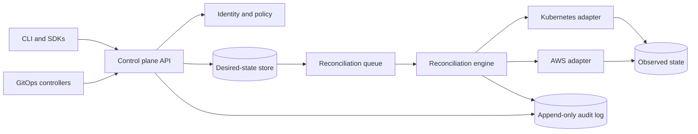

# Architecture overview

## System intent

Veer separates application intent from provider execution. Clients submit
versioned desired-state resources; policy evaluates the request; reconcilers
produce and execute plans through narrow provider adapters; observed state and
audit events make the result inspectable.



## Domain model

The initial hierarchy is intentionally small:

```text
Workspace
├── Policy
└── Environment
    ├── ProviderConnection
    └── Application
        └── Component
```

- A **Workspace** owns membership, policy defaults, and quotas.
- An **Environment** is an isolation boundary with network, identity, region,
  and lifecycle policy.
- An **Application** groups components that ship and operate together.
- A **Component** declares a workload or managed-service dependency.
- A **Policy** is a Workspace-owned control resource whose authorization
  desired state contains bounded role bindings to opaque member IDs and exact
  Workspace or Environment scopes.
- A **ProviderConnection** is an Environment-owned, reference-only boundary
  for provider authority, capabilities, and quota observations.

Resources use stable identifiers and explicit API versions. Every resource
retains an immutable, server-derived Workspace ID; children also retain their
immediate parent's stable ID. Display names are mutable, need not be unique,
and must never serve as authorization keys.

The identity, generation, resource-version, transition, and deterministic
serialization rules are fixed by
[ADR 0004](0004-common-resource-envelope.md). The six-kind registry,
server-derived ownership, graph validation, immutable placement, and RESTRICT
deletion rules are fixed by
[ADR 0005](0005-resource-hierarchy-and-ownership.md). OpenAPI validates each
document; the domain hierarchy validates complete cross-resource graphs.
The provider-neutral control resources, explicit unknown evidence states,
operation phases, and condition transitions are fixed by
[ADR 0006](0006-control-execution-and-evidence.md).
The pure six-stage request pipeline, sparse-write defaulting, stable admission
errors, and internal versionless conversion hub are fixed by
[ADR 0007](0007-deterministic-admission-and-version-conversion.md). Admission
validates shape and domain meaning before side effects; authentication,
authorization, policy, quota, idempotency, and persistence remain separate
service boundaries.
[ADR 0008](0008-oidc-authentication-and-principals.md) fixes strict
header-only bearer extraction, explicit provider-neutral OIDC trust anchors,
Human and Workload principal modeling, bounded JWT/JWKS validation, safe
authentication outcomes, and token/claim redaction. It adds no route or server.
[ADR 0009](0009-deterministic-hierarchical-authorization.md) fixes the closed
action and role registries, star-only Viewer inheritance, canonical Policy
bindings, sealed Workspace/Environment targets, default-deny evaluation, and
bounded decision representation. Its OpenAPI projection is a pure reference
contract; no API route or worker enforcement is implemented by that document.
[ADR 0010](0010-provider-neutral-credential-broker.md) fixes a provider-neutral,
process-local credential broker with separate secret-resolution and
session-issuance ports, immutable operation/target/recipient bindings, exact
generation-based rotation, bounded material and lifetimes, version-aware
single-flight, local epochs and tombstones, and forbidden credential
serialization. It adds no public API, production backend, provider destination
verification, distributed revocation, or runtime enforcement.
[ADR 0012](0012-reconciliation-reliability-and-fencing.md) fixes the provider-
free reliability model around asynchronous execution: immutable plans and
logical effects, prepared physical attempts, fixed-window HTTP idempotency,
signed lineage fences, duplicate delivery, cancellation, unknown outcomes,
bounded observation, quarantine, compensation, and evidence retention. Its
root OpenAPI projection and process-local domain package add no store, queue,
worker, provider adapter, or exactly-once execution claim.

## Reconciliation contract

Every future runtime reconciler follows the same authority flow:

1. Load authoritative desired state, observed state, generation, and prior
   provider-effect evidence.
2. Revalidate schema, authorization, policy, quota, cost, credential binding,
   and dependencies.
3. Calculate or safely supersede an immutable deterministic plan without side
   effects, using resolved physical-attempt history plus definitive current
   logical-effect projections.
4. Acquire or qualify replacement of the stable resource-lineage lease, then
   atomically mint and consume preparation authority over cancellation, retry,
   prior-generation effects, and any deadline-bound observation budget.
5. Prepare one exact physical attempt with its Operation, plan, effect, fence,
   and audit evidence; recheck live retry evidence, lease, and deadline margin
   at dispatch, then call the provider outside the database transaction.
6. Atomically record the definitive or indeterminate result, observed state,
   integrity anchor, audit evidence, and at most one successor outbox record.
7. Retry only with proof, reserve each unknown-outcome observation before its
   attempt, compare its result against the exact current logical effect, and
   quarantine or run a qualified forward compensation plan when required.

A successful API write means the desired state was durably accepted. It does
not imply that asynchronous provider work has already completed.

## Component boundaries

### Control plane API

- Versioned HTTP resources and schemas.
- Optimistic concurrency for updates.
- Idempotency keys for retry-safe writes.
- Pagination and filtering with deterministic ordering.
- Structured conditions for progress and failure.

### Identity and policy

- Exact configured HTTPS issuer, audience, JWKS URI, type, algorithm, lifetime,
  clock-skew, and cache bounds; issuer discovery is not a trust source.
- One bounded `Authorization` Bearer value for JWT access tokens; query, cookie,
  and form token carriers are unsupported. Authorization is always removed;
  rejected query and cookie carriers are scrubbed from downstream request and
  access-log surfaces.
- Explicit Human and Workload principals with exact issuer-and-subject logical
  identity, canonical bounded audiences/groups, and a Workload-only identity
  claim.
- Closed token-free invalid/unavailable outcomes, no anonymous principal, and
  no generic credential or personal-claim serialization.
- Closed Viewer, Developer, Operator, and WorkspaceAdministrator roles with
  explicit direct grants and Viewer-only inheritance.
- Workspace grants descend into their Environments; Environment grants remain
  inside the resolved Environment. Every cross-Workspace target denies.
- Canonical decisions retain only contract/policy/input versions, effect, and
  reason. Raw principal claims and target identifiers are not serialized in a
  decision.
- Tenant roles cannot grant worker, controller, provider-adapter, approval,
  export, or redrive actions. Workspace creation/bootstrap remains default
  denied until a platform provisioning decision exists.
- The current authorization package and OpenAPI manifest are reference
  contracts; production API and worker wiring remains deferred.
- Short-lived provider credentials wherever the provider supports them.

### Desired-state store

- Transactional persistence for resources and generations.
- Separation between desired state, observed state, and operation history.
- Encryption at rest and recoverable backups.

### Reconciliation engine

- Durable at-least-once work queue whose messages grant no execution authority.
- Stable Workspace/resource-lineage leases with signed monotonic fences,
  60-second store and visibility intervals, and 15-to-20-second renewal.
- Strict provider-call deadline margin and exact generation/Operation/plan/
  owner/fence predicates before dispatch and result commit.
- Separate HTTP replay, logical provider-effect, and physical attempt identity.
- Explicit cancel-pending, indeterminate observation, quarantine, deletion, and
  forward-compensation semantics projected through the existing Operation
  phases.

### Provider adapters

- Typed, narrow interfaces owned by the control plane.
- No provider credentials in resource payloads or logs.
- The implemented process-local broker resolves one exact versioned source and
  issues one operation-, action-, target-, and recipient-bound session through
  separate core-owned ports. It accepts at most 500 source entries, 1,000 shared
  session cells, 1,000 live leases, 32 active resolver leaders, and 16 exact
  issuer registrations. Source reuse ends exactly one hour after resolver
  material returns. With no background timer, ordinary TTL cleanup occurs on
  the next cleanup-capable acquisition, rotation, lifecycle entry, or explicit
  sweep and may wait for an existing borrow; explicit lineage invalidation or
  broker close destroys affected master sources before cancellation becomes
  observable. Operation termination preserves a shared current-lineage source
  while destroying any matching pending rotation's private source.
- It tracks at most 500 connection lineages and 10,000 Operations. Generation
  high-water state and terminal Operation tombstones are not evicted; a new
  identity fails closed at capacity rather than forgetting stale or terminal
  authority.
- Broker sessions request at most 15 minutes, require at least five minutes when
  issued and two minutes plus 30 seconds of skew for a new use, refresh three
  minutes before expiry, and give each backend context at most ten seconds.
- Rotation pre-reserves one lease per waiter and commit wins a late cancellation.
  Unpublished valid sessions are revoked once before destruction; lifecycle
  callers join cleanup or receive an honest pending result while broker-owned
  work continues. A broker-wide queue permits at most 16 upstream revocations.
- Broker state is a reference-library boundary. No real secret manager, AWS or
  Kubernetes session issuer, adapter wiring, destination verification, or
  cross-process revocation exists yet.
- Rate-limit awareness, retry classification, and request correlation.
- Capability discovery so unsupported features fail before execution.

## Deployment topology

The first deployment should use a single regional control plane with stateless
API and worker replicas, a highly available relational database, and a durable
queue. Multi-region active-active operation is deferred until resource
ownership, conflict resolution, and recovery objectives are proven.

This keeps the first failure model understandable and avoids paying for
cross-region data transfer and duplicated stateful infrastructure prematurely.

The numeric availability, scale, recovery, retention, and cost boundaries for
the first operable alpha are defined in
[ADR 0001](0001-alpha-operational-bounds.md). Later implementation decisions
must either fit those bounds or replace them with a reviewed ADR.

The alpha runtime, relational store, queue, migration tooling, replaceable
ports, and repository boundaries are selected in
[ADR 0002](0002-alpha-implementation-stack.md). Implementations must preserve
its weak queue-delivery contract and atomic store boundary.

## Audit and privileged administration reference

[ADR 0011](0011-tamper-evident-audit-and-privileged-administration.md)
fixes bounded canonical audit events, separate Workspace and Platform streams,
contiguous sequence and hash-chain verification, trusted-terminal-checkpoint
export verification, fixed 90-day online and 365-day archive retention
decisions, and strong-authenticated one-use grants for exactly `audit.export`,
`operation.quarantine`, and `work.redrive`. Its audit and administration
packages and root OpenAPI manifest are pure reference contracts. They add no
route, persistence, cross-node ledger, archive, signer, verifier adapter,
worker action, or runtime enforcement. A valid hash-chain prefix cannot prove
that its tail is complete without an independently trusted terminal
checkpoint.
