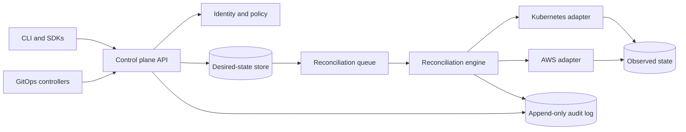

# Architecture overview

## System intent

Veer separates application intent from provider execution. Clients submit
versioned desired-state resources; policy evaluates the request; reconcilers
produce and execute plans through narrow provider adapters; observed state and
audit events make the result inspectable.



## Domain model

The initial hierarchy is intentionally small:

```text
Workspace
├── Policy
└── Environment
    ├── ProviderConnection
    └── Application
        └── Component
```

- A **Workspace** owns membership, policy defaults, quotas, and provider
  connections.
- An **Environment** is an isolation boundary with network, identity, region,
  and lifecycle policy.
- An **Application** groups components that ship and operate together.
- A **Component** declares a workload or managed-service dependency.
- A **Policy** is a Workspace-owned control resource whose authorization
  language is defined separately.
- A **ProviderConnection** is an Environment-owned, reference-only boundary
  for provider authority, capabilities, and quota observations.

Resources use stable identifiers and explicit API versions. Every resource
retains an immutable, server-derived Workspace ID; children also retain their
immediate parent's stable ID. Display names are mutable, need not be unique,
and must never serve as authorization keys.

The identity, generation, resource-version, transition, and deterministic
serialization rules are fixed by
[ADR 0004](0004-common-resource-envelope.md). The six-kind registry,
server-derived ownership, graph validation, immutable placement, and RESTRICT
deletion rules are fixed by
[ADR 0005](0005-resource-hierarchy-and-ownership.md). OpenAPI validates each
document; the domain hierarchy validates complete cross-resource graphs.
The provider-neutral control resources, explicit unknown evidence states,
operation phases, and condition transitions are fixed by
[ADR 0006](0006-control-execution-and-evidence.md).

## Reconciliation contract

Every reconciler follows the same state machine:

1. Load desired state and the last known observed state.
2. Validate schema, authorization, policy, quota, and dependencies.
3. Calculate a deterministic plan without side effects.
4. Persist the plan and its authorization decision.
5. Execute idempotent provider operations.
6. Record observed state, conditions, external identifiers, and audit events.
7. Retry transient failures with bounded backoff; surface terminal failures.

A successful API write means the desired state was durably accepted. It does
not imply that asynchronous provider work has already completed.

## Component boundaries

### Control plane API

- Versioned HTTP resources and schemas.
- Optimistic concurrency for updates.
- Idempotency keys for retry-safe writes.
- Pagination and filtering with deterministic ordering.
- Structured conditions for progress and failure.

### Identity and policy

- OIDC authentication for people and workloads.
- Workspace- and environment-scoped authorization.
- Policy decisions captured with actor, action, resource, inputs, and outcome.
- Short-lived provider credentials wherever the provider supports them.

### Desired-state store

- Transactional persistence for resources and generations.
- Separation between desired state, observed state, and operation history.
- Encryption at rest and recoverable backups.

### Reconciliation engine

- Durable work queue with deduplication.
- Per-resource serialization and bounded global concurrency.
- Lease-based ownership so failed workers can be replaced safely.
- Explicit cancellation and deletion semantics.

### Provider adapters

- Typed, narrow interfaces owned by the control plane.
- No provider credentials in resource payloads or logs.
- Rate-limit awareness, retry classification, and request correlation.
- Capability discovery so unsupported features fail before execution.

## Deployment topology

The first deployment should use a single regional control plane with stateless
API and worker replicas, a highly available relational database, and a durable
queue. Multi-region active-active operation is deferred until resource
ownership, conflict resolution, and recovery objectives are proven.

This keeps the first failure model understandable and avoids paying for
cross-region data transfer and duplicated stateful infrastructure prematurely.

The numeric availability, scale, recovery, retention, and cost boundaries for
the first operable alpha are defined in
[ADR 0001](0001-alpha-operational-bounds.md). Later implementation decisions
must either fit those bounds or replace them with a reviewed ADR.

The alpha runtime, relational store, queue, migration tooling, replaceable
ports, and repository boundaries are selected in
[ADR 0002](0002-alpha-implementation-stack.md). Implementations must preserve
its weak queue-delivery contract and atomic store boundary.
