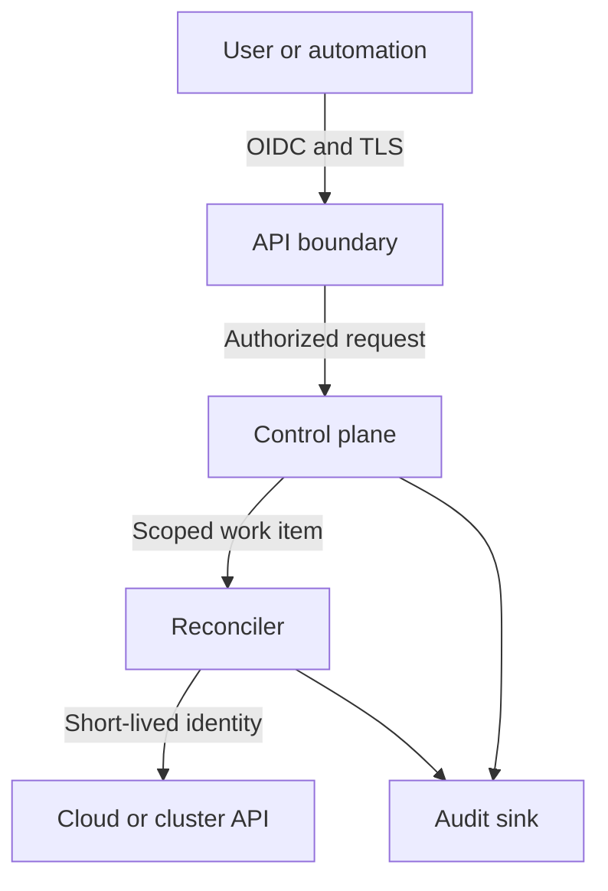

# Security model

## Objectives

Veer must prevent one workspace, environment, application, or provider
connection from gaining authority over another. Every privileged operation must
be attributable, authorized, bounded, and auditable.

## Security invariants

1. Default-deny access unless an explicit policy or the closed exact self-membership rule allows it.
2. Authenticate people and workloads with short-lived credentials.
3. Keep provider credentials outside API resources, plans, logs, and events.
4. Bind every provider operation to one workspace and environment.
5. Separate request acceptance from provider execution and authorize both.
6. Encrypt control-plane traffic and persistent state.
7. Record immutable security-relevant audit events.
8. Treat provider responses, manifests, webhooks, and user input as untrusted.

## Trust boundaries

Each transition requires authentication, authorization, input validation, and
correlation metadata. Internal network location is not an identity signal.

## Authorization

Authorization evaluates the actor, action, resource hierarchy, current policy,
and relevant request attributes. Provider adapters receive a scoped execution
context rather than the caller's credential.

The accepted reference contract uses four intentionally small roles:

- **Viewer:** read resources, plans, status, and permitted audit events.
- **Developer:** manage applications and components within assigned
  environments.
- **Operator:** manage environments, provider connections, and operational
  recovery.
- **Workspace administrator:** manage membership and policy within one
  workspace.

Developer, Operator, and Workspace administrator each inherit Viewer only;
they do not inherit one another. Policy bindings contain opaque member IDs and
exact Workspace or Environment scopes. Workspace grants descend into that
Workspace's Environments, while Environment grants do not cross their resolved
Environment. Stable hierarchy IDs, rather than display names or identity
claims, select the target.

The default effect is `Deny`. Cross-Workspace targets, missing membership,
missing role bindings, insufficient scope, and ungranted actions all deny with
closed reasons. Controller, worker, provider-adapter, approval, redrive, audit
export, and credential-broker actions are reserved from tenant roles.
Workspace creation/bootstrap is also reserved; platform provisioning remains a
separate governance decision. Workspace administrators never become platform
administrators implicitly.

A canonical decision contains only its contract version, policy version, input
digest, effect, and reason. The exact contract and complete action matrix are in
[ADR 0009](../architecture/0009-deterministic-hierarchical-authorization.md).
The domain evaluator and OpenAPI projection are reference contracts. Until API
and worker integration is implemented and tested, they are not evidence of
runtime request or provider-effect enforcement.

## Secrets and provider credentials

- Prefer workload identity, role assumption, and short-lived tokens.
- Store unavoidable secrets in an external secret manager.
- Persist references and versions, never plaintext secret values.
- Parent each ProviderConnection to one Environment and retain its derived
  Workspace owner; provider-bound operations carry both scopes.
- Redact authorization headers, cookies, tokens, and provider credential fields
  before logging.
- Prevent secret values from entering plans, diffs, metrics, traces, and error
  messages.
- Rotate provider identities independently per workspace and environment.

## Audit requirements

Audit events include actor, authentication method, action, resource, decision,
request identifier, timestamp, source, resulting operation, and outcome. Events
must be tamper evident, access controlled, retention managed, and exportable to
an operator-owned security system.

## Formal threat model

The [formal threat model and data classification](threat-model.md) defines the
alpha actors, assets, trust boundaries, abuse cases, credential blast radius,
workspace isolation assumptions, handling rules, owners, residual risks, and
unsupported deployment modes. Its machine-checked ledgers are
[summary-invariants.tsv](summary-invariants.tsv),
[security-objectives.tsv](security-objectives.tsv),
[model-inventory.tsv](model-inventory.tsv), [threats.tsv](threats.tsv), and
[data-classes.tsv](data-classes.tsv).

Security claims require tests or operational evidence. A configuration being
intended as secure is not evidence that the effective system is secure. Runtime
controls remain requirements until their linked verification work passes.
