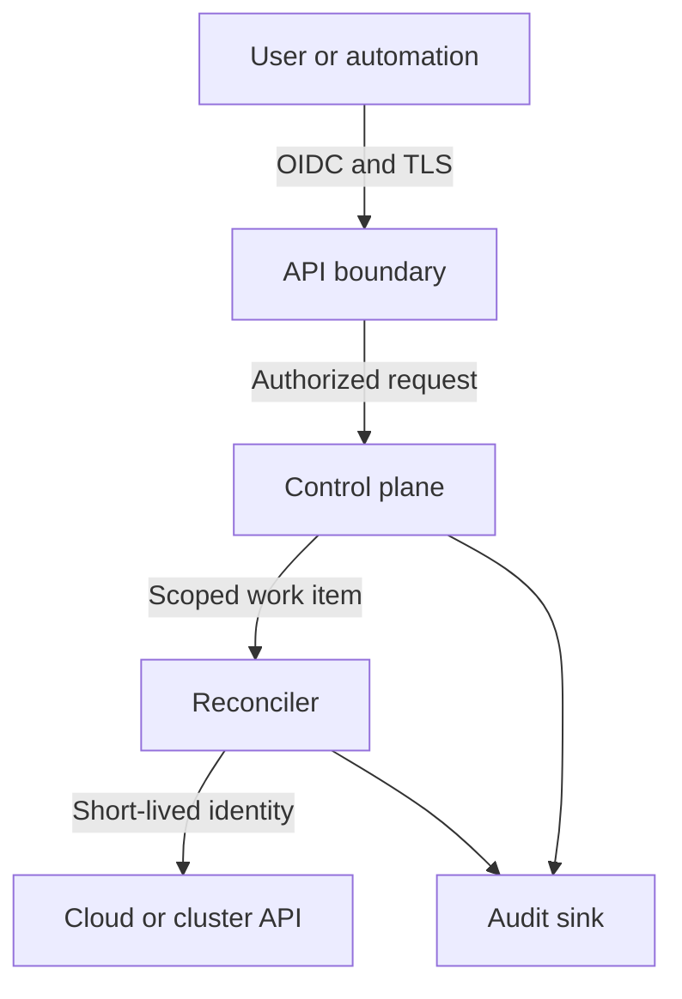

# Security model

## Objectives

Veer must prevent one workspace, environment, application, or provider
connection from gaining authority over another. Every privileged operation must
be attributable, authorized, bounded, and auditable.

## Security invariants

1. Default-deny access unless an explicit policy or the closed exact self-membership rule allows it.
2. Authenticate people and workloads with short-lived credentials.
3. Keep provider credentials outside API resources, plans, logs, and events.
4. Bind every provider operation to one workspace and environment.
5. Separate request acceptance from provider execution and authorize both.
6. Encrypt control-plane traffic and persistent state.
7. Record immutable security-relevant audit events.
8. Treat provider responses, manifests, webhooks, and user input as untrusted.

## Trust boundaries

Each transition requires authentication, authorization, input validation, and
correlation metadata. Internal network location is not an identity signal.

## Authorization

Authorization evaluates the actor, action, resource hierarchy, current policy,
and relevant request attributes. Provider adapters receive a scoped execution
context rather than the caller's credential.

The accepted reference contract uses four intentionally small roles:

- **Viewer:** read resources, plans, status, and permitted audit events.
- **Developer:** manage applications and components within assigned
  environments.
- **Operator:** manage environments, provider connections, and operational
  recovery.
- **Workspace administrator:** manage membership and policy within one
  workspace.

Developer, Operator, and Workspace administrator each inherit Viewer only;
they do not inherit one another. Policy bindings contain opaque member IDs and
exact Workspace or Environment scopes. Workspace grants descend into that
Workspace's Environments, while Environment grants do not cross their resolved
Environment. Stable hierarchy IDs, rather than display names or identity
claims, select the target.

The default effect is `Deny`. Cross-Workspace targets, missing membership,
missing role bindings, insufficient scope, and ungranted actions all deny with
closed reasons. Controller, worker, provider-adapter, approval, redrive, audit
export, and credential-broker actions are reserved from tenant roles.
Workspace creation/bootstrap is also reserved; platform provisioning remains a
separate governance decision. Workspace administrators never become platform
administrators implicitly.

A canonical decision contains only its contract version, policy version, input
digest, effect, and reason. The exact contract and complete action matrix are in
[ADR 0009](../architecture/0009-deterministic-hierarchical-authorization.md).
The domain evaluator and OpenAPI projection are reference contracts. Until API
and worker integration is implemented and tested, they are not evidence of
runtime request or provider-effect enforcement.

## Secrets and provider credentials

- Prefer workload identity, role assumption, and short-lived tokens.
- Store unavoidable secrets in an external secret manager.
- Persist references and versions, never plaintext secret values.
- Parent each ProviderConnection to one Environment and retain its derived
  Workspace owner; provider-bound operations carry both scopes.
- Redact authorization headers, cookies, tokens, and provider credential fields
  before logging.
- Prevent secret values from entering plans, diffs, metrics, traces, and error
  messages.
- Rotate provider identities independently per workspace and environment.

The implemented reference broker is provider neutral and process local. It
constructs private requests from a complete hierarchy snapshot, a typed
ProviderConnection envelope, a validated provider-bound Operation, a target
view, one registered action, and one exact recipient. The snapshot proves
retained identity and ancestry, not connection or target generation; a future
runtime caller must reload current state. A resolver returns bounded source
material only to the broker; a recipient-specific issuer turns it into a
short-lived session. The caller's OIDC or Bearer credential is not part of
either port. Raw material is private, synchronously borrowed, redacted from
formatting, and cleared from owned buffers on terminal paths as best-effort
exposure reduction. Constructed non-nil values reject JSON, text, binary, and
Gob serialization; a typed nil has no material and may encode only as JSON
`null` under Go's standard encoder. The direct diagnostic/encoding method
contract is limited to constructed non-nil values; generic `fmt` and `slog`
handling of typed nil remains no-panic and no-secret.

The broker requests 15-minute sessions, rejects issuer output shorter than five
or longer than 15 minutes, refreshes three minutes before expiry, requires two
minutes of new-use lifetime plus 30 seconds of skew, and gives each backend call
a context of at most ten seconds. Ordered clock observations clamp an older
overlapping valid sample to the accepted high-water. A fresh zero, rollback, or
sequence saturation fails closed, while later non-regressed time can recover;
the source TTL remains anchored to the raw sample after resolver return. It bounds
source/session material at 64/16 KiB, source entries at 500 with reuse eligible
for at most one hour from resolver
return, shared session cells and live leases at 1,000 each, tracked connections
at 500, tracked Operations at 10,000, active resolver leaders at 32, exact issuer
registrations at 16, and concurrent revocations at 16. There is no background
reclamation timer: an idle broker may retain an ineligible source entry after
one hour until a cleanup-capable, time-observing acquisition, rotation, or
lifecycle entry, or `SweepExpired`; `Stats`, registration, and lease operations
do not sweep. Ordinary TTL retirement waits for an existing borrow and keeps
capacity charged; explicit lineage invalidation or broker `Close` destroys the
master immediately, leaving only any callback scratch until return. Connection-
generation high-water marks, lineage and Operation epochs, terminal tombstones,
and digest-keyed single-flight suppress stale completion within one broker
lifetime. High-water and terminal state are never evicted; new identities fail
closed when their tracking table is full. Source, session, rotation, and
out-of-lock disposal capacity remain charged until rejected or
retired material is destroyed. Rotation reserves its first waiter's lease
before dispatch and every later waiter's before joining; commit atomically
materializes those leases and wins a late cancellation. Copies of a constructed
`Broker` or `Lease` share the same private synchronized state rather than
creating new ownership.

Each source-resolution and rotation leader has a private source holder registered
before dispatch. After `Resolve` returns, the broker snapshots its tuple and
backend-context result, then transfers any material into that holder before
clock observation, budget settlement, and publication. Connection revocation,
rotation cutover, and broker close detach affected state, destroy cached and
flight-owned master sources outside the broker lock, and only then publish
cancellation; concurrent invalidators join an in-progress holder destruction
before doing so. A last-waiter source or rotation abandonment uses the same
destroy-before-cancel order and retains its reservation until worker cleanup.
Operation termination destroys a matching pending rotation source but preserves
the shared current-lineage source for other Operations. A provider tuple that
was validly consumed remains a consumed budget read even if deadline or
lifecycle state later prevents local publication; the material is destroyed
rather than cached or issued.

Connection revocation, Operation cancellation, and Operation close invalidate
local state before bounded upstream `SessionIssuer.Revoke` attempts. Every valid
session returned by `Issue` but not published is likewise revoked exactly once
before local destruction and waiter completion. Lifecycle and rotation callers
join relevant old-flight cleanup or report pending while broker-owned cleanup
continues. A broker-wide queue admits at most 16 upstream calls; only after
admission does each call receive a fresh baggage-free ten-second context, while
the caller's wait is separately bounded and cancellable. The closed result
distinguishes no attempt required, provider-confirmed revocation, expiry-bounded
authority, and pending revocation. Failed or unconfirmed revocation records only
the provider expiry, returns pending with `ErrUnavailable`, and lets exact
repeats return expiry-bounded until that instant and not-required at expiry.
The broker captures that expiry before destruction and retains it before
publishing completion. Pending broker-owned cleanup may carry no error; a caller
that stops waiting receives its context error. Backend failure never rolls back
local invalidation. A current-generation connection revoke that cancels an
uncommitted higher-generation rotation advances `revokedThrough` through the
target; current- and target-generation repeats remain pending during cleanup,
and the exact target repeat is idempotent afterward. A lease close releases only
its caller-owned handle. Secret cache misses and rotations additionally cross the
`SecretReadBudget`
claim/settlement port; its general/critical split projects the durable 90/10
ledger requirement but does not implement that ledger.

This is not a production credential path. It provides no secret-manager or
provider call, runtime authorization, plan or worker integration, provider
destination verification, distributed revocation, durable tombstone, or hard
memory-zeroization guarantee. Those controls remain requirements of their
linked runtime and provider issues.

## Reconciliation reliability

[ADR 0012](../architecture/0012-reconciliation-reliability-and-fencing.md)
separates transport replay, provider-effect identity, and physical attempts.
Plans bind bounded digests of desired intent, authoritative observation,
authorization, provider and credential versions, capability, quota, cost, and
completed effects; they exclude credentials and provider-native bodies. Every
actual or conservatively possibly dispatched provider call has one prepared
attempt, unique attempt ID and ordinal, exact Operation/plan/effect/generation/
owner/fence binding, and one audit event. Missing definitive evidence after
owner loss is `Indeterminate`, never implicit success or retry permission.

Queue receipt possession grants no provider authority. The future worker must
reload authoritative state, reauthorize, acquire one stable Workspace/resource-
lineage lease with a positive signed non-reused fence, and revalidate the exact
generation, Operation, plan, owner, fence, ProviderConnection, credential,
quota, and cost authority immediately before dispatch. Process-local authority
and permit copies share one-use state and bind the exact prepared attempt.
Attempt preparation additionally consumes a one-use capability over the
authoritative cancellation, retry, older-generation, compensation, and
observation-budget snapshot. A time-bounded retry proof must remain live at the
exact dispatch sample. An observation's finite deadline is sealed through its
permit, admission, attempt, and dispatch identity, and equality is not
dispatchable. Dispatch consumption atomically rechecks the live lease row so a
prior permit cannot survive surrender, takeover, or replacement; durable
compare-and-swap remains a StateStore obligation. The 60-second store
and visibility intervals renew from 15 through 20 seconds. A call starts only
with strictly more remaining lease time than its bounded RPC timeout plus ten
seconds. Failed or unknown renewal stops new dispatch; higher fences cannot
undo an unresolved external effect from an older generation.

The reference lease table never lets an expired old binding replace a newer
one implicitly. Generation or plan-revision movement uses an exact expected-
binding compare-and-swap plus a one-use capability minted by the qualified plan
lineage transition, with revision one for a new generation and exactly the next
revision for a replan. A forward-to-compensation replacement additionally
binds the complete validated qualified inverse schedule before authority is
minted. New-generation replacement additionally requires the
exact first mutation admission to have passed older-effect and safe-
supersession checks, preserving the old observation path when it has not. Each
durable work key retains the plan digest that its
claiming and completing lease token must match. Dispatch authority cannot
predate attempt preparation, and recovery cannot resolve before the latest
dispatch boundary.

Bounded HTTP-idempotency capacity may reclaim only completed response rows at
exact expiry. Unresolved reservations remain charged. Ordered ledger-wide time
and a capacity-derived active-call registry prevent an unrelated later call from
reclaiming a row needed by an older live call. Safe reclamation deletes both the
response and compact key state, while full immutable-tuple matching prevents a
delayed completion from gaining fresh authority after an epoch restart.

Cancellation is compare-and-swap ordered against attempt preparation. After
preparation, `CancelPending` forbids new forward work and blind retry while the
public Operation remains `Running` or `Waiting`; `Canceled` is allowed only once
every dispatched result and required cleanup or quarantine disposition is
durable. A provider-cancel attempt has a distinct effect key and separately
binds the unresolved forward or compensation effect it targets. Retrying the
cancellation effect itself requires `NoEffect` or exact live adapter-
idempotency evidence.
Persisted `Indeterminate` outcomes reserve a finite observation slot before
attempt preparation and then reach exactly-once quarantine at count or time
exhaustion. Observation completion must atomically compare the admission-captured
target with the authoritative current logical effect and commit the budget plus
returned projection. Every current projection carries the unique source attempt
ID that established its truth. Only a dispatched definitive result against that
exact source-versioned target updates effect truth; a concurrent retry result,
including one in the same normalized millisecond, or undispatched recovery is
preserved rather than overwritten. Replanning separately requires resolved
physical history and a definitive, non-stale current projection for every
attempted logical effect, and admission rejects effects already carried in the
selected plan's completed set. A failed or abandoned pre-preparation observation uses
an exact one-use release transition: the slot stays charged, but no stale permit
can later prepare an attempt and the budget remains able to advance or expire.
Compensation is a new immutable forward plan over proved `Applied`, Veer-owned,
qualified inverse effects in reverse dependency order. Each prepared
compensation attempt carries the opaque next-step capability derived from the
complete proof schedule and exact applied prefix; it never acts on an
indeterminate, arbitrary, or out-of-order effect.

The implemented reconciliation package is a provider-free, process-local
reference model. It bounds untrusted evidence, rejects generic serialization of
opaque authority values, redacts diagnostics, models fixed-window idempotency,
duplicate delivery, fencing, cancellation, retention, queue accounting, and all
eight crash boundaries, but persists and executes nothing. Durable PostgreSQL
transactions, SQS policy and heartbeat behavior, execution-time authorization,
provider adapters, cross-node enforcement, and operational evidence remain the
responsibility of issues #24 and #30 through #37. Exactly-once provider
execution is not claimed.

## Audit requirements

The accepted reference contract in
[ADR 0011](../architecture/0011-tamper-evident-audit-and-privileged-administration.md)
defines bounded canonical events containing a pseudonymous actor,
authentication method, registered action, hierarchy-sealed target, canonical
policy decision, request, Operation, provider attempt, elevation lifecycle,
timestamp and clock state, source, and closed outcome. It excludes raw tokens,
issuer and subject claims, request and response bodies, provider payloads,
arbitrary attributes, Operation messages, cost estimates, and error text.

Workspace and Platform histories are separate streams ordered by positive
contiguous sequence, never by timestamp. Domain-separated length-framed
SHA-256 chaining detects mutation, deletion within a presented range,
insertion, reordering, and stream substitution from a known predecessor. A
valid prefix cannot prove that no suffix was deleted; tail completeness
requires comparison with an independently trusted terminal checkpoint.
Canonical decoding and chain verification also cannot prove that the original
producer assertion was true or authorized, or re-derive historical hierarchy
state. Those require the future reauthorization and atomic durable producer
boundaries.

The export reference binds its canonical body, predecessor, range, record
count, terminal checkpoint, generated time, key identifier, and external
`Ed25519` signature descriptor. Verification requires an explicit trusted
terminal checkpoint and a caller-supplied verifier. The package supplies no
signer, public-key parser, key store, archive, or transport.

Retention decisions are fixed at 90 days online and 365 days in archive, with
Legal, Incident, and Security holds. Only a valid expired decision is eligible
for deletion. The pure evaluator neither persists nor moves, locks, archives,
or deletes an event. Its one clock-state input may be synchronized only when
the original recorded timestamp and current evaluation observation were both
synchronized; a later good clock cannot upgrade uncertain recorded time.

Platform administrators are configured separately from Workspace Policy and
must be exact Human identities. The process-local ledger owns one
strong-authentication verifier port and trusted clock; a future composition
root must install both because no verifier adapter, middleware wiring, or
runtime endpoint exists. `Issue` passes the exact bearer credential and
immutable elevation request to the verifier once, then uses only the returned
proof ID and authenticated-at time with its own clock to issue a grant. Callers
cannot construct a verification receipt or supply the issuance time. One-use
elevation is limited to `audit.export`, `operation.quarantine`, and
`work.redrive`, one sealed target, a required bounded reason, an optional
bounded case reference, a proof no more than five minutes old, and a grant no
longer than 15 minutes. A Workspace administrator never becomes a platform
administrator implicitly.

The audit and administration packages are process-local reference contracts.
They implement no route, durable or cross-node ledger, database or outbox
transaction, worker action, immutable object archive, KMS boundary, signing
adapter, or runtime enforcement. Deployed audit completeness, atomicity,
access control, archive retention, checkpoint trust, and privileged recovery
remain requirements until their linked implementation and exercise work
passes.

## Formal threat model

The [formal threat model and data classification](threat-model.md) defines the
alpha actors, assets, trust boundaries, abuse cases, credential blast radius,
workspace isolation assumptions, handling rules, owners, residual risks, and
unsupported deployment modes. Its machine-checked ledgers are
[summary-invariants.tsv](summary-invariants.tsv),
[security-objectives.tsv](security-objectives.tsv),
[model-inventory.tsv](model-inventory.tsv), [threats.tsv](threats.tsv), and
[data-classes.tsv](data-classes.tsv).

Security claims require tests or operational evidence. A configuration being
intended as secure is not evidence that the effective system is secure. Runtime
controls remain requirements until their linked verification work passes.
