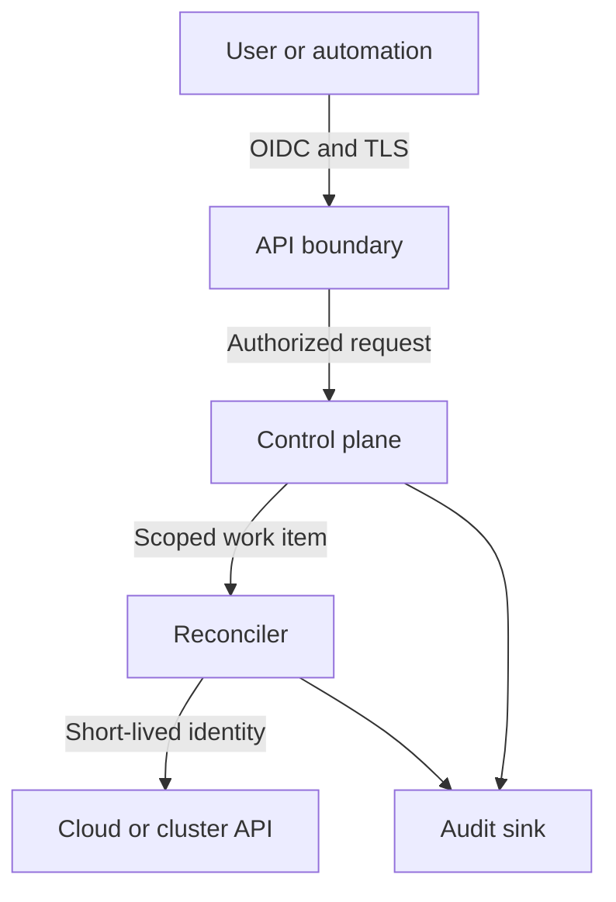

# Security model

## Objectives

Veer must prevent one workspace, environment, application, or provider
connection from gaining authority over another. Every privileged operation must
be attributable, authorized, bounded, and auditable.

## Security invariants

1. Deny access unless an explicit policy allows it.
2. Authenticate people and workloads with short-lived credentials.
3. Keep provider credentials outside API resources, plans, logs, and events.
4. Bind every provider operation to one workspace and environment.
5. Separate request acceptance from provider execution and authorize both.
6. Encrypt control-plane traffic and persistent state.
7. Record immutable security-relevant audit events.
8. Treat provider responses, manifests, webhooks, and user input as untrusted.

## Trust boundaries

Each transition requires authentication, authorization, input validation, and
correlation metadata. Internal network location is not an identity signal.

## Authorization

Authorization evaluates the actor, action, resource hierarchy, current policy,
and relevant request attributes. Provider adapters receive a scoped execution
context rather than the caller's credential.

Initial roles should remain intentionally small:

- **Viewer:** read resources, plans, status, and permitted audit events.
- **Developer:** manage applications and components within assigned
  environments.
- **Operator:** manage environments, provider connections, and operational
  recovery.
- **Workspace administrator:** manage membership and policy within one
  workspace.

Platform administration is separate from workspace administration and must use
strong authentication plus dedicated audit controls.

## Secrets and provider credentials

- Prefer workload identity, role assumption, and short-lived tokens.
- Store unavoidable secrets in an external secret manager.
- Persist references and versions, never plaintext secret values.
- Redact authorization headers, cookies, tokens, and provider credential fields
  before logging.
- Prevent secret values from entering plans, diffs, metrics, traces, and error
  messages.
- Rotate provider identities independently per workspace and environment.

## Audit requirements

Audit events include actor, authentication method, action, resource, decision,
request identifier, timestamp, source, resulting operation, and outcome. Events
must be tamper evident, access controlled, retention managed, and exportable to
an operator-owned security system.

## Threat-model priorities

The first formal threat model must cover:

- cross-workspace authorization bypass;
- confused-deputy attacks through provider adapters;
- privilege escalation through policy or role assignment;
- credential leakage through logs, plans, status, and support bundles;
- malicious manifests and provider responses;
- replayed requests and duplicate reconciliation;
- queue poisoning and worker impersonation;
- deletion races, orphaned resources, and incomplete rollback;
- software-supply-chain compromise.

Security claims require tests or operational evidence. A configuration being
intended as secure is not evidence that the effective system is secure.
