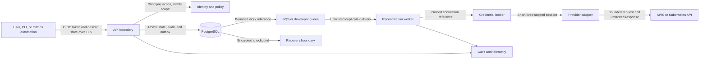

# Formal threat model and data classification

Status: accepted design baseline for the first operable alpha. Veer is still in
the pre-alpha foundation phase, so this document distinguishes implemented
repository controls from runtime requirements that have linked verification
work. Threat scenarios are design hypotheses, not confirmed vulnerabilities.

## Overview

### Use and method

This model answers the four OWASP threat-modeling questions: what Veer is
building, what can go wrong, what Veer will do about it, and how the controls
will be verified. STRIDE is used as an enumeration prompt, while risk is based
on realistic capability gain, impact, reachability, and remaining controls.

The architecture input was resolved from `main` at
`108f8e846710f19e156797346fe4a16db6331c34`. This document becomes authoritative
at its own merge commit. The machine-readable scenario and handling contracts
are [`threats.tsv`](threats.tsv) and
[`data-classes.tsv`](data-classes.tsv); [`verify.sh`](verify.sh) fails when their
required coverage, ownership, or links drift.

### Supported deployment and workflow boundary

| Deployment or workflow | Supported alpha boundary | Security status |
| --- | --- | --- |
| Production control plane | One regional, multi-Availability-Zone API/worker deployment with RDS PostgreSQL, SQS Standard, encrypted audit/recovery objects, and AWS and Kubernetes adapters | Accepted design target; runtime controls are not implemented yet |
| Developer and contract-test profile | One trusted developer host, local PostgreSQL with the same schema, PostgreSQL queue adapter, fake provider, and no cloud credentials or paid service | Bootstrap and local quality controls are implemented; tenant isolation is not claimed against a hostile host owner |
| Recovery workflow | Restore into an isolated validation target, verify integrity and freshness, revalidate authority, and only then cut over | Conditional privileged workflow; qualification belongs to issue #64 |
| Administration and redrive | Strong-authenticated, reasoned, time-bounded, scoped, audited inspect/retry/cancel/quarantine operations | Conditional privileged workflow; implementation belongs to issues #27, #34, and #64 |
| Release publication | Protected CI produces immutable, signed artifacts with SBOM and provenance | Not implemented; issues #15 and #66 own the control |

The selected topology and its deferred active-active mode are documented in
`docs/architecture/overview.md:99-117`. The atomic store, weak queue, process,
and cost boundaries are fixed by `docs/architecture/0002-alpha-implementation-stack.md:44-60`.

### Components and source evidence

| Component | Security-relevant responsibility | Source evidence |
| --- | --- | --- |
| API and GitOps edge | Bound request size and destination, authenticate, authorize, validate, admit, and atomically record accepted intent | `docs/architecture/overview.md:5-24`; `docs/architecture/0002-alpha-implementation-stack.md:72-87` |
| Identity and policy | Normalize OIDC principals; default deny by stable workspace/environment identity; persist policy version and decision | `docs/security/model.md:11-18`; `docs/architecture/overview.md:72-77` |
| PostgreSQL state store | Authoritative desired/observed state, generation, idempotency, integrity anchor, audit data, and outbox in one transaction | `docs/architecture/0002-alpha-implementation-stack.md:128-165` |
| Reconciliation queue and worker | Treat deliveries as duplicate and unordered; reload authoritative state; acquire a fence; reauthorize; commit before acknowledgement | `docs/architecture/0002-alpha-implementation-stack.md:136-151`; `docs/architecture/0002-alpha-implementation-stack.md:174-204` |
| Credential broker and provider adapters | Resolve an owned connection into a short-lived, scoped session; verify destination identity; expose no caller or provider credential | `docs/security/model.md:35-63`; `docs/architecture/overview.md:92-97` |
| Audit, telemetry, and archive | Commit required audit data with state; redact and bound operational signals; make audit loss or alteration detectable | `docs/security/model.md:65-70`; `docs/architecture/0001-alpha-operational-bounds.md:665-680` |
| Migration, backup, and recovery tooling | Separate privileged roles, verify schema and backup integrity, and prevent runtime identities from changing control structures | `docs/architecture/0002-alpha-implementation-stack.md:395-409`; `docs/architecture/0001-alpha-operational-bounds.md:727-738` |
| Build and release path | Pin and verify inputs, restrict automation authority, and produce consumer-verifiable outputs | `docs/development.md:82-114`; issue #15 and issue #66 |

### Trust-zone flow

### Effective resources and capabilities

| Deployment or workflow | Resource or capability | Configuration and precedence | Safe effective value or location | Readers, writers, or recipients | Enforcing control | Evidence or unknowns |
| --- | --- | --- | --- | --- | --- | --- |
| Production API and worker | PostgreSQL endpoint and credential | Typed deployment configuration resolves a secret reference or workload identity; command-line and image values are forbidden | Verified-TLS RDS endpoint; distinct runtime, migration, backup, and integrity roles | API/worker runtime gets only runtime role; migrator and recovery tooling use separate identities | Unknown until issues #30 and #65 implement config, roles, row isolation, and tests | `docs/architecture/0002-alpha-implementation-stack.md:114-132`; `docs/architecture/0002-alpha-implementation-stack.md:395-404` |
| Developer profile | PostgreSQL endpoint and queue | Local configuration on one trusted host; no cloud credential fallback | Local PostgreSQL 18.6 and PostgreSQL queue adapter | Developer and local Veer processes | Host file permissions and local database roles; no hostile-host isolation claim | `docs/architecture/0002-alpha-implementation-stack.md:116-121`; `docs/architecture/0002-alpha-implementation-stack.md:206-215` |
| Production dispatch | Queue message and receipt authority | Outbox produces a maximum 2 KiB reference; SQS resource policy and separate roles override no repository setting | Exact queue ARN; message contains IDs, generation, digest, priority, and timing but no desired state or secrets | Publisher sends; worker receives/extends/deletes; operator alone redrives | SQS policy, TLS, SSE-SQS, store fence, and execution-time authorization | Design target in `docs/architecture/0002-alpha-implementation-stack.md:174-204`; issues #32 and #34 must prove it |
| AWS provider execution | Assumed-role session | ProviderConnection ownership, current policy, destination identity, role trust, session policy, source identity, and expiry all apply | Dedicated workspace/environment role; session can only reduce, never exceed, provider-granted authority | Credential broker and one adapter operation; never API caller or queue | AWS STS plus Veer binding and reauthorization; broad role or resource policy expands residual blast radius | Issues #25, #39, and #52; no runtime implementation exists |
| Kubernetes provider execution | Service-account session | ProviderConnection ownership, cluster identity, namespace scope, RBAC, token audience/expiry, and cluster policy all apply | Dedicated service account and bounded namespace set; dedicated cluster or separately approved isolation for hostile tenants | Credential broker and Kubernetes adapter | Kubernetes authentication, RBAC, network/storage policy, ownership checks, and Veer scope binding | Namespace alone is not a hard boundary; issues #44, #45, and #50 must qualify the mode |
| Audit query/export | Actor, decision, operation, integrity, and outcome data | Canonical event schema and retention policy; ordinary runtime has append-only capability | Encrypted relational stream plus immutable encrypted archive; no secret values | Workspace-authorized readers and separately audited security/platform operators | Atomic write, sequence/integrity method, access control, export verification, retention | Issues #27 and #64; retention target at `docs/architecture/0001-alpha-operational-bounds.md:783-794` |
| Telemetry export | Logs, metrics, traces, and cost signals | Typed redaction precedes bounded exporters; missing/stale budget meter fails signal admission, not business work | Low-cardinality metrics; redacted logs/traces with accepted byte and retention caps | Operators and configured exporter backends | Redaction, field allowlists, cardinality registry, byte meter, TLS | Design target at `docs/architecture/0002-alpha-implementation-stack.md:411-426`; issue #63 verifies it |
| Backup and regional restore | Encrypted database, integrity, audit, and object checkpoints | Recovery role and signed checkpoint select an isolated target; credentials are reissued, not copied | Latest common verified checkpoint within the accepted RPO | Backup/recovery and integrity-verifier roles only | Encryption, role separation, integrity ledger, isolated restore, authority revalidation | Issues #27 and #64; simultaneous key-boundary compromise remains residual risk |
| Archive retention and recovery-generation cleanup | Signed retention ledger or signed abort/promotion state selects one exact versioned-object prefix | Ordinary lifecycle/sweeper authority cannot bypass governance; a separate cleanup session resolves only a tagged candidate or retired generation | Active archive baseline is never a valid cleanup target; cleanup has no retention, legal-hold, object-write, replication, or IAM authority | Retention sweeper sees expired version metadata; cleanup role may permanently delete only the selected non-authoritative generation | Exact-prefix and tag conditions, signed state token, active-baseline bucket-policy deny, explicit bypass header, immutable audit, and final empty-version proof | Conditional design at `docs/architecture/0001-alpha-operational-bounds.md:911-929` and `docs/architecture/0001-alpha-operational-bounds.md:1038-1064`; issue #64 must qualify it |
| Bootstrap and release | Tool and release artifact authority | Repository manifest pins local tools; protected release CI must later bind source revision and identity | `.tools/` is ignored and checksum-verified; release artifact location is not yet selected | Developers/CI for tools; consumers for future releases | Issue #13 controls bootstrap; issues #15 and #66 own review, signature, SBOM, and provenance | Bootstrap is implemented; release publication is not |

## Threat model, trust boundaries, and assumptions

### Protected assets

| ID | Asset | Required property | Evidence |
| --- | --- | --- | --- |
| A-01 | Workspace-scoped desired state, observed state, stable identities, and hierarchy | Confidentiality, integrity, availability, and no cross-workspace reference | `docs/architecture/overview.md:26-45` |
| A-02 | Principals, policies, decisions, plans, digests, approvals, and generations | Authenticity, deterministic authorization, freshness, and non-substitution | `docs/architecture/overview.md:47-60`; `docs/security/model.md:35-52` |
| A-03 | ProviderConnection references, external secrets, tokens, role sessions, kubeconfigs, and private keys | Confidentiality, minimum scope and lifetime, revocability, and non-serialization | `docs/security/model.md:54-63` |
| A-04 | Provider resources, account/cluster identity, external identifiers, ownership evidence, quota, and cost authority | Correct destination, ownership, integrity, bounded mutation, and safe deletion | `docs/architecture/overview.md:92-97` |
| A-05 | Audit events, integrity anchors, manifests, exports, and recovery evidence | Completeness, ordering, tamper evidence, attribution, confidentiality, and retained availability | `docs/security/model.md:65-70`; `docs/architecture/0001-alpha-operational-bounds.md:727-738` |
| A-06 | Outbox records, queue messages, receipts, idempotency records, leases, fences, and operation state | Integrity, freshness, bounded replay, single current owner, and recoverability | `docs/architecture/0002-alpha-implementation-stack.md:134-151` |
| A-07 | OIDC tokens and normalized personal/workload identity claims | Authenticity, confidentiality, audience binding, minimum disclosure, expiry, and redaction | `docs/architecture/overview.md:72-77`; issue #22 |
| A-08 | Service availability, quotas, rate limits, concurrency, telemetry cardinality, and cost budgets | Fairness, bounded consumption, measurable saturation, and fail-safe shedding | `docs/architecture/0001-alpha-operational-bounds.md:665-699` |
| A-09 | Source, dependencies, CI identities, binaries, images, SBOMs, signatures, and provenance | Integrity, authenticity, reproducibility, least privilege, and consumer verification | `docs/architecture/0002-alpha-implementation-stack.md:395-409`; issues #15 and #66 |

### Security objectives

1. Default-deny every actor, action, resource, workspace, and environment unless
   an explicit current policy permits it.
2. Bind admission, plan, approval, queue work, execution, provider identity,
   observation, and audit to stable workspace, environment, resource,
   generation, and operation identifiers.
3. Reauthorize before provider effects; a stale plan, revoked actor, expired
   credential, lost fence, or changed generation cannot execute.
4. Never persist or emit raw user or provider credentials in resources, plans,
   queues, state, fixtures, logs, traces, metrics, errors, or support output.
5. Treat every external request, desired-state document, queue delivery,
   provider response, webhook, restore input, and artifact as untrusted and
   size-bound.
6. Commit accepted state, integrity evidence, required audit data, and outbox
   work atomically; duplicate delivery never becomes duplicate logical effect.
7. Separate runtime, migration, read-only, audit, backup, integrity,
   administration, redrive, build, and release authority.
8. Encrypt control-plane and provider traffic, persistent state, backups, and
   retained audit data; verify the peer and intended destination.
9. Bound per-workspace consumption, global concurrency, provider calls,
   telemetry volume/cardinality, retained bytes, and external cost.
10. Require retained test or operational evidence before changing a design
    requirement into an implemented security claim.

These objectives specialize the accepted invariants in
`docs/security/model.md:9-18` and
`docs/architecture/0001-alpha-operational-bounds.md:665-680`.

### Actors and realistic starting capabilities

| ID | Actor and starting capability | Capability not assumed |
| --- | --- | --- |
| ACT-NET | Anonymous network client that can create arbitrary requests, endpoints, timing, and malformed payloads | Valid Veer principal, internal network identity, database access, provider credential, or CI authority |
| ACT-MEMBER | Authenticated human or automation authorized only for named actions inside one workspace/environment | Another workspace, workspace-administrator, platform-administrator, provider-administrator, or release authority |
| ACT-TENANT | Workload controlled inside an environment that can originate network traffic and manipulate its own provider resources | Kubernetes cluster-admin, AWS account administrator, Veer runtime identity, or another environment |
| ACT-WORKLOAD | Compromised API, worker, queue producer/consumer, or runtime pod with only its assigned workload identity | Database owner/migrator, redrive operator, provider administrator, platform break-glass, or release signer unless a control failure grants it |
| ACT-PROVIDER | Provider API, webhook, or managed resource state that can return malformed, stale, reordered, oversized, or adversarial data | Veer policy/store mutation, credential broker control, or ownership of unrelated provider resources |
| ACT-PLATFORM | Authorized but fallible or malicious platform operator using a documented administrative, migration, backup, or recovery workflow | Provider root, KMS/key compromise, protected release signer, or an unaudited direct database mutation as normal behavior |
| ACT-SUPPLY | Contributor, compromised dependency publisher, action/tag owner, registry input, or build-input attacker | Protected branch override, release identity, signing key, or consumer environment unless the supply-chain control fails |

An already-compromised provider administrator, identity provider, database
superuser, regional key boundary, or protected release signer is not treated as
an ordinary tenant capability. Those compromises remain important residual or
recovery scenarios, but assuming them at every boundary would hide the new
authority each Veer control must prevent.

### Trust boundaries

| ID | Crossing and transferred authority | Required enforcement | Verification owner |
| --- | --- | --- | --- |
| TB-01 | External clients and GitOps automation to API: token, request, desired state, source revision, and idempotency key | TLS, peer/destination rules, body/time limits, schema validation, OIDC validation, correlation, and unauthenticated fail-closed behavior | OWN-IDENTITY |
| TB-02 | API/core to identity and policy: normalized principal, action, resource hierarchy, attributes, and policy version | Stable IDs, default deny, deterministic matrix, no name-based authorization, explicit cross-boundary denial | OWN-IDENTITY |
| TB-03 | API/worker/core to PostgreSQL: scoped queries, mutations, transactions, and health | Verified TLS, parameterized SQL, composite tenant constraints, non-owner runtime role, forced row policy defense-in-depth, atomicity, and safe errors | OWN-DATA |
| TB-04 | PostgreSQL outbox to queue: work identity, scope, generation, digest, priority, and availability | Bounded non-secret reference, restrictive publisher role, TLS/encryption, durable publish status, and duplicate-safe semantics | OWN-RECONCILIATION |
| TB-05 | Queue to worker/core: untrusted receipt and duplicate/reordered delivery | Restrictive consumer identity, schema/size checks, authoritative reload, current authorization, idempotency, lease/fence, and commit-before-ack | OWN-RECONCILIATION |
| TB-06 | Core/credential broker to provider adapter: owned connection reference, operation scope, and short-lived session | Connection ownership, recipient binding, minimum duration/scope, no caller credential, memory-only handling, refresh/revocation, and canary tests | OWN-CREDENTIALS |
| TB-07 | Provider adapter to AWS/Kubernetes: provider request, identity, capability, external state, and response | Account/partition/region/cluster verification, TLS, deadlines, allowlisted capability, response validation, ownership proof, and bounded retries | OWN-PROVIDERS |
| TB-08 | API/worker/store to audit and telemetry: actor, decision, outcome, errors, and correlation | Atomic required audit, canonical schema, redaction, integrity/sequence proof, scoped query/export, low cardinality, byte/retention limits | OWN-SECURITY |
| TB-09 | Operator/admin to redrive, recovery, policy, migration, and break-glass capabilities | Separate identity, strong authentication, explicit action/scope/reason, approval where required, time limit, dry run, and complete audit | OWN-OPERATIONS |
| TB-10 | Source/dependencies/CI to release and deployment: code, generated artifacts, identity, metadata, and provenance | Protected review, immutable inputs, secret/dependency/static/IaC scans, least-privilege ephemeral identity, SBOM, signature, provenance, and consumer verification | OWN-SUPPLY-CHAIN |
| TB-11 | Primary state to backup/archive/recovery: checkpoint, integrity ledger, keys, and restore authority | Encryption, separately scoped roles and keys, immutable retention, freshness/integrity proof, isolated restore, and authority revalidation | OWN-DATA |
| TB-12 | Configuration and migration input to runtime/store: typed settings, schema version, and privileged DDL | Closed configuration schema, secret references, checksummed immutable migration, dedicated migrator, transaction by default, and rollback boundary | OWN-DATA |
| TB-13 | Signed retention or recovery state to archive sweeper/cleanup: exact prefix, version IDs, candidate/retired status, and permanent-delete authority | Separate roles, exact-prefix/tag constraints, signed state verification, active-baseline deny, no retention/legal-hold mutation, explicit bypass, immutable audit, and final empty-version proof | OWN-DATA |

### Control owners

Owners are accountable repository roles, not claims that an implementation
already exists.

| ID | Accountable surface | Live verification work |
| --- | --- | --- |
| OWN-SECURITY | Threat model, cross-cutting security invariants, data handling, and security regression coverage | Issues #14 and #28 |
| OWN-IDENTITY | OIDC, principal normalization, roles, policy, admission, reauthorization, and approvals | Issues #22, #23, #24, and #61 |
| OWN-CREDENTIALS | ProviderConnection ownership, credential broker, short-lived sessions, refresh, and revocation | Issues #25, #39, #45, and #52 |
| OWN-DATA | Workspace storage isolation, PostgreSQL roles/constraints, audit integrity, backup, and recovery | Issues #26, #27, #30, #31, and #64 |
| OWN-RECONCILIATION | Outbox, queue, lease, fence, retry, redrive, cancellation, deletion, and recovery | Issues #29 through #37 |
| OWN-PROVIDERS | Adapter capability, destination identity, ownership, drift, failure normalization, and conformance | Issues #38 through #57 |
| OWN-OPERATIONS | Deployment hardening, telemetry, privileged administration, capacity, and recovery operation | Issues #63, #64, and #65 |
| OWN-SUPPLY-CHAIN | CI review, dependency/tool inputs, release artifacts, SBOM, signature, and provenance | Issues #15 and #66 |

### Workspace isolation assumptions

- Production workspaces are mutually distrustful at the Veer API, data, queue,
  worker, audit-query, and provider-adapter layers. A stable workspace ID is
  mandatory in every persisted ownership path; display names never authorize.
- Admission authorization and execution-time authorization are separate gates.
  A queue message cannot confer authority, and provider execution reloads
  current state, policy, generation, connection ownership, and fence.
- PostgreSQL application queries must require workspace scope structurally and
  use composite ownership constraints. Row-level security is defense in depth,
  not the sole boundary: the runtime role must not own tenant tables or have
  `BYPASSRLS`, and tenant tables require `FORCE ROW LEVEL SECURITY`. Migration,
  backup, and integrity roles are separate privileged platform identities.
- SQS messages carry stable scope and integrity metadata but no desired state,
  policy input, user content, or credentials. Producer, consumer, and redrive
  authority are distinct.
- A platform administrator, database recovery role, or regional key operator
  can necessarily cross workspace storage boundaries. Those identities are
  outside ordinary tenant authority and require strong authentication,
  reasoned/time-bounded elevation, and immutable audit.
- Kubernetes namespaces are not claimed as hard isolation by themselves.
  Hostile tenants require a dedicated cluster or a separately reviewed
  combination of control-plane, network, storage, admission, node, and workload
  isolation. Cluster-scoped resources remain outside namespace containment.
- The developer profile assumes one trusted host owner and is not a production
  multi-tenant security boundary.

The domain hierarchy and stable-ID rule are established at
`docs/architecture/overview.md:26-45`. PostgreSQL 18 documents that table
owners, superusers, and `BYPASSRLS` roles bypass ordinary row policies; the
database owner model above prevents Veer from treating RLS configuration as
self-proving isolation.

### Provider credential flow and blast radius

1. A ProviderConnection is owned by exactly one workspace and environment and
   persists only an external secret/identity reference, version, provider
   destination, and non-secret capability metadata.
2. Admission verifies the caller can select that connection. The immutable plan
   binds the connection ID, workspace, environment, generation, actor, policy
   version, requested capabilities, quota/cost inputs, and digest.
3. Before an effect, the worker reauthorizes and asks the credential broker for
   a short-lived session bound to that operation, adapter, provider destination,
   and current connection version. Caller credentials never reach the adapter.
4. The adapter verifies the effective AWS account/partition/region or
   Kubernetes cluster identity and required capabilities before mutation.
5. Credential material remains in process memory only for the bounded session,
   is never serialized, and is discarded on completion, expiry, revocation,
   cancellation, or lost ownership. Rotation is independent per connection.

For AWS, a dedicated role per workspace/environment is the supported baseline.
The trust policy, external ID where a third-party confused-deputy relationship
exists, source identity, session duration, and session policy all participate.
An STS session policy intersects with the role policy and cannot grant more
authority, but Veer cannot shrink an overbroad resource policy or compensate
for a provider administrator. If the effective role can mutate an entire
account, compromise of one Veer session has that same effective blast radius;
the connection must fail qualification rather than relabeling the role as
scoped.

For Kubernetes, a dedicated service account with a bound, audience-restricted,
time-limited token and least-privilege RBAC is the supported shared-cluster
baseline. The credential's maximum blast radius is its effective cluster and
RBAC authority, including cluster-scoped permissions. Hard isolation for
mutually hostile tenants requires a dedicated or separately qualified cluster
boundary, not a namespace label alone.

Issues #25, #39, #45, and #52 own the implementation and negative blast-radius
evidence. Until they pass, this flow is a requirement, not a security claim.

### Data classification

The complete handling contract is in
[`data-classes.tsv`](data-classes.tsv). A value inherits the most restrictive
applicable class. Derived data, copies, exports, backups, and error text retain
the source classification; encoding, hashing, or moving data does not lower it.

| ID | Class | Central rule | Retention boundary | Owner and verification |
| --- | --- | --- | --- | --- |
| DC-CREDENTIAL | Credential | Raw tokens, keys, passwords, session material, kubeconfigs, and secret values are memory-only or external-secret-manager data; Veer persists references, never values | Raw session material only until completion/expiry/revocation; references follow their owning connection | OWN-CREDENTIALS; issues #25, #28, and #39 |
| DC-AUDIT | Audit | Canonical, append-only, integrity-protected, encrypted, scoped, and secret-free security events | 90 days queryable and 365 days immutable encrypted archive | OWN-DATA; issues #27 and #64 |
| DC-PERSONAL | Personal | Minimize identity/network attributes, use stable opaque principal IDs, and never use personal values as metric labels | No independent copy; follows the enclosing resource, audit, log, or trace boundary | OWN-IDENTITY; issues #22, #27, #28, and #63 |
| DC-CONFIGURATION | Configuration | Validate and encrypt desired state, policy, manifests, endpoints, plans, and secret references; send providers only the required subset | Resource lifetime plus 90-day tombstone; operations/plans/decisions 90 days online and 365 days encrypted archive | OWN-DATA; issues #20, #26, #30, and #33 |
| DC-OPERATIONAL | Operational | Redacted status, health, errors, telemetry, cost, quota, correlation, and external IDs use bounded detail and cardinality | Logs 14/30 days, traces 7 days, metrics 15 days plus 13-month SLO rollups; subtype rules may be shorter | OWN-OPERATIONS; issues #28, #35, #42, and #63 |

Security events cannot exist only in ordinary logs. Audit retention is not a
license to retain secret values. Personal data inside an audit event follows
the audit integrity/retention boundary but remains access-controlled and
minimized. Any retention increase requires security, privacy, storage, and cost
review; a reduction must preserve legal, recovery, and audit evidence.

### Unsupported deployment modes

- Multi-region active-active control planes, globally writable stores,
  multi-writer queues, and cross-region provider-operation ownership.
- Production on the developer PostgreSQL queue, an unencrypted or
  hostname-unverified database connection, a public SQS queue, or runtime roles
  able to alter schema, queue policy, encryption, retention, or redrive policy.
- Long-lived AWS access keys, legacy non-expiring Kubernetes service-account
  tokens, plaintext kubeconfigs, or caller credentials passed to adapters.
- Reuse of one ProviderConnection or provider credential across workspaces or
  environments without a replacement threat model and qualification evidence.
- Namespace-only hard isolation for mutually hostile Kubernetes tenants,
  shared cluster-admin credentials, or automatic mutation of cluster-scoped
  resources without separately approved ownership and isolation controls.
- Customer-supplied plugins, scripts, templates that execute code in the
  control plane, arbitrary provider endpoints, or dynamic adapter loading.
- Anonymous mutation APIs, identity inferred from internal network location,
  display-name authorization, or a queue delivery treated as proof of current
  authority.
- Direct operator database edits, unaudited redrive or break-glass actions,
  restores performed in place before validation, or recovery that copies cloud
  credentials into the restored environment.
- Capacity above an accepted ADR 0001 profile, weaker retention/integrity,
  self-managed production state, another provider, or another deployment shape
  without a reviewed replacement decision and updated threat model.

### Assumptions and unresolved evidence

- The production API/worker, store schema, OIDC, policy engine, credential
  broker, provider adapters, audit pipeline, and deployment manifests do not yet
  exist. Their controls are design requirements linked to live issues.
- The external identity provider, AWS account administrator, Kubernetes cluster
  administrator, DNS/PKI roots, and regional KMS boundaries are operated
  correctly. Compromise is handled as residual/recovery risk, not assumed
  tenant authority.
- Exact OIDC issuers, audiences, client flows, token lifetimes, provider role
  names/policies, Kubernetes topology, secret manager, audit integrity scheme,
  and export destination remain unresolved until their owning issues decide and
  test them.
- No external webhook or browser-hosted UI is part of the accepted alpha scope.
  Adding either introduces origin, CSRF, replay, destination, and signature
  boundaries that require model revision.
- Simultaneous loss or compromise of primary and recovery key boundaries and
  corruption older than retained backups remains outside the alpha recovery
  claim (`docs/architecture/0001-alpha-operational-bounds.md:695-697`).

## Attack surface, mitigations, and attacker stories

The authoritative row contract is [`threats.tsv`](threats.tsv). Every row is a
hypothesis to drive a control and verification issue; no row is a claim that
the current repository contains an exploitable implementation.

| Priority | Scenario and capability gain | Prerequisites | Impact | Existing controls | Mitigation | Evidence |
| --- | --- | --- | --- | --- | --- | --- |
| High | **TM-001 — Forged, replayed, or misbound OIDC identity.** ACT-NET gains a valid Veer principal or another audience's authority. | Public API and incorrect issuer, audience, signature, algorithm, expiry, JWKS, or replay handling | Unauthorized workspace read or mutation | OIDC, short lifetime, and token exclusion are accepted requirements only | Strict issuer/audience/algorithm/signature/time/JWKS validation, human/workload separation, raw-token canaries, and negative corpus | Issues #22 and #28 |
| High | **TM-002 — Cross-workspace authorization or role escalation.** ACT-MEMBER turns one workspace action into another workspace or administrator action. | Missing stable scope, name-based lookup, incomplete action matrix, or self-grant path | Tenant data disclosure, mutation, and provider authority | Default deny and stable IDs are accepted invariants | Deterministic role/action matrix, explicit parent scope, non-self-escalation, dual admission/execution checks, and isolation matrix | Issues #23, #24, #26, and #28 |
| High | **TM-003 — Stale authority executes an accepted plan.** ACT-MEMBER retains effects after revocation, policy change, generation change, or approval expiry. | Asynchronous work and no execution-time freshness binding | Unauthorized provider change despite correct initial admission | Plans persist decision context by design | Bind actor/policy/generation/connection/digest; reauthorize immediately before effects; invalidate stale approvals and plans | Issues #24, #33, and #61 |
| High | **TM-004 — ProviderConnection substitution creates a confused deputy.** ACT-MEMBER selects another workspace's connection or changes destination after approval. | Weak connection ownership or mutable execution context | Cross-account/cluster mutation using Veer's broker | Adapters are intended to receive scoped context, not caller credentials | Immutable owned connection ID in plan and operation, current scope check, destination identity verification, and recipient-bound session | Issues #25, #26, and #39 |
| High | **TM-005 — Credential material escapes the broker or adapter.** ACT-WORKLOAD or output reader gains a reusable provider/user credential. | Serialization, verbose errors, telemetry, fixtures, support bundles, crash output, or overlong cache | Provider compromise for credential lifetime and scope | Secret references and redaction are accepted requirements | Memory-only short sessions, field denylist plus allowlist, no `String`/marshal surface, secret canaries, revocation, and independent rotation | Issues #25, #28, and #39 |
| High | **TM-006 — Effective provider identity is broader than Veer's declared scope.** ACT-TENANT or a stolen session reaches unrelated account, cluster, namespace, or resources. | Broad IAM/resource policy, cluster role, legacy token, shared credential, or unverified destination | Destructive effects outside the owning workspace/environment | Dedicated identity and short-lived sessions are requirements, not proof | Dedicated role/service account, restrictive trust/RBAC/resource policy, STS session restriction/source identity, bound K8s token, live policy analysis, and fail-closed identity preflight | Issues #25, #45, #52, #50, and #57 |
| High | **TM-007 — Storage query or migration bypasses workspace scope.** ACT-WORKLOAD reads/writes another workspace through an omitted predicate, RLS bypass, owner role, or unsafe DDL. | Shared database and insufficient structural scope/role separation | Cross-workspace disclosure, corruption, or authorization bypass | Stable workspace keys and separated roles are accepted design rules | Composite ownership constraints, scope-requiring query API, non-owner `NOBYPASSRLS` runtime, forced RLS defense-in-depth, parameterized SQL, and migration tests | Issues #26, #30, and #31 |
| High | **TM-008 — Poisoned, duplicated, reordered, or replayed queue work gains execution authority.** ACT-WORKLOAD injects or replays a plausible message. | Queue access or uncertain publish/ack and a worker trusting the delivery | Unauthorized, stale, or repeated provider effects | Messages are compact references and delivery is explicitly weak | Exact producer/consumer policies, bounded schema, authoritative reload, current authorization, generation/digest check, fence, idempotency, bounded DLQ, and audited redrive | Issues #28, #32, and #34 |
| High | **TM-009 — A stale worker commits after lease/fence loss.** ACT-WORKLOAD continues provider or state mutation after replacement. | Process pause, visibility expiry, network partition, duplicate worker, or missing fence at commit | Duplicate resources or stale observation overwriting current state | Store-port design requires monotonic fencing | Fence every external attempt and result commit, stop on lease extension failure, idempotency/ownership keys, and fault injection | Issues #29, #31, #32, #34, and #37 |
| High | **TM-010 — Malicious provider response or manifest crosses a parser/request boundary.** ACT-PROVIDER gains request redirection, injection, resource exhaustion, secret reflection, or unowned mutation. | Unbounded parsing, dynamic identifiers, attacker-selected endpoint, unsafe error or drift logic | Control-plane compromise, data leak, DoS, or provider mutation | External data is declared untrusted; typed adapters are required | Closed schemas, byte/depth/count limits, verified endpoints, parameterized operations, safe errors, ownership proofs, fuzz corpus, and fake-provider conformance | Issues #28, #38, #41, and #43 |
| High | **TM-011 — Audit data is omitted, altered, deleted, reordered, or exported incompletely.** ACT-PLATFORM can repudiate privileged activity. | Non-atomic event write, mutable storage, weak sequence, exporter gaps, or shared delete authority | Loss of attribution, undetected cross-workspace abuse, and invalid recovery evidence | Required audit data is an accepted atomic invariant | Canonical event, state-atomic insert, integrity chain/manifest, immutable archive, role separation, gap detection, scoped query, and export verification | Issues #27, #31, and #64 |
| High | **TM-012 — Break-glass, redrive, migration, or recovery authority is abused.** ACT-PLATFORM bypasses ordinary policy without durable accountability. | Broad console/database access, reusable admin credential, missing reason/expiry, or direct edits | Multi-workspace data/provider mutation and audit bypass | Platform/workspace administration separation is required | Strong authentication, separate role, action/scope/reason, time-bound elevation, dry-run, approval where required, immutable audit, and no routine direct edits | Issues #27, #34, and #64 |
| High | **TM-013 — A migration or configuration change removes security invariants.** ACT-PLATFORM or ACT-SUPPLY bypasses tenant constraints, role separation, redaction, or audit atomicity. | Privileged DDL/config and missing checksum, validation, transaction, or rollback boundary | Persistent cross-workspace or credential exposure across deployments | SQL-only immutable migrations and typed config are selected | Checksummed ordered migration, dedicated migrator, transactional default, closed config schema, schema manifest, rollback test, and post-change invariant scan | Issues #30, #64, #65, and #66 |
| High | **TM-014 — Deletion race, false ownership, or failed compensation damages unrelated resources.** ACT-MEMBER or ACT-PROVIDER causes an unowned delete or concealed orphan. | Concurrent update/delete, stale external ID, partial provider result, or rollback assumption | Irrecoverable provider loss, orphaned cost, or cross-workspace deletion | Cancellation/finalization and ownership evidence are required | Generation/fence-bound ownership proof, dependency-aware finalizers, retry-safe delete, compensation distinct from rollback, orphan inventory, quarantine, and audit | Issues #36, #37, #41, #49, and #57 |
| High | **TM-015 — Backup or restore crosses scope, uses tampered data, or revives stale authority.** ACT-PLATFORM restores the wrong checkpoint or copies credentials. | Privileged recovery flow and missing integrity/freshness/identity validation | Multi-workspace disclosure, corruption, unauthorized execution, or RPO failure | Encrypted isolated restore and authority revalidation are accepted targets | Signed common checkpoint, separate roles/keys, immutable audit, isolated restore, complete ledger comparison, new workload credentials, policy revalidation, and cutover gate | Issues #27 and #64 |
| High | **TM-016 — Build or release supply chain publishes attacker-controlled code.** ACT-SUPPLY gains consumer or production execution. | Mutable action/tag/dependency, overprivileged CI, leaked signer, local release, or unverifiable artifact | All-workspace control-plane compromise and credential access | Bootstrap tools are pinned and checksum-verified; release controls are absent | Protected required checks, immutable actions/dependencies, secret/dependency/static/IaC scans, ephemeral least privilege, reproducible release, SBOM, signature, provenance, and consumer verify | Issues #15 and #66 |
| Medium | **TM-017 — One workspace exhausts shared capacity or spend.** ACT-MEMBER starves others through requests, queue work, provider calls, telemetry, or high-cardinality identities. | Shared control plane and missing quota/fairness/admission | Availability loss, provider throttling, paging, or unbounded bill | ADR 0001 defines capacity and cost ceilings | Request/size/rate quotas, fair scheduling, bounded concurrency/backoff, provider-call budgets, telemetry meters/cardinality registry, and workspace-attributed cost | Issues #34, #40, #42, and #63 |
| Medium | **TM-018 — Personal, configuration, or operational data leaks through observability or support output.** ACT-MEMBER or operator sees data beyond need. | Raw payload/error capture, identifier labels, broad export, or retention drift | Privacy breach, topology disclosure, or cross-workspace metadata leak | Redaction and low-cardinality telemetry are accepted requirements | Enforce data classes before emission, allowlisted fields, opaque correlation, scoped export, deletion/retention rules, canaries, and cardinality tests | Issues #22, #27, #28, and #63 |
| High | **TM-019 — Approval digest substitution or post-approval drift authorizes a different plan.** ACT-MEMBER turns one review into broader effects. | Mutable plan, weak digest binding, stale policy/capability/cost, self-approval, or no execution check | Unauthorized or unreviewed provider change | Immutable deterministic plans are required | Bind approval to canonical digest, actor, scope, policy/capability/cost versions and expiry; re-plan on drift; enforce separation and reauthorization | Issues #24, #33, and #61 |
| High | **TM-020 — Provider destination identity is spoofed or misconfigured.** ACT-PROVIDER makes the adapter operate in an unintended AWS account/partition/region or Kubernetes cluster. | Unverified endpoint/credential identity, DNS/CA failure, stale kubeconfig, or copied connection | Effects and disclosure outside approved destination | Capability discovery is required before execution | Verified TLS, AWS caller/account/partition/region checks, Kubernetes server/CA/cluster identity and namespace preflight, exact connection binding, and mismatch fail-closed tests | Issues #39, #45, and #52 |
| High | **TM-021 — Archive cleanup authority targets the active baseline or bypasses retention without valid recovery state.** ACT-PLATFORM permanently deletes authoritative audit/recovery evidence. | Reusable cleanup credential, forged/stale state token, target substitution, broad prefix, missing active-bucket deny, or retention mutation | Irrecoverable audit/recovery loss, hidden privileged activity, and failed disaster recovery | ADR 0001 defines separate sweeper, validator, and cleanup roles, but none is implemented | Require exact candidate/retired tag and prefix, signed abort/promotion state, short cleanup session, active-baseline bucket-policy deny, no retention/legal-hold mutation, explicit bypass header, immutable audit, and final empty-version proof | Issues #27, #64, and #65 |

### Residual risk that cannot be relabeled as mitigation

- Provider permissions are enforced by the provider. A broad AWS role,
  resource-based policy, Kubernetes ClusterRole, or cluster-admin credential
  remains broad even when Veer's database label says otherwise.
- A compromised runtime can use a valid in-memory session until it expires or
  is revoked. Short lifetime and provider-side scope reduce, but do not erase,
  that window.
- Privileged platform, database recovery, KMS, identity-provider, and release
  identities remain high-impact trust anchors. Separation and audit improve
  prevention/detection; they do not make compromise impossible.
- At-least-once queues and uncertain provider outcomes cannot provide
  exactly-once effects. Fencing, ownership, idempotency, observation, and
  operator-visible terminal unknown states are the required control.
- Shared Kubernetes nodes and control planes retain kernel, cluster-scoped,
  admission, network, and noisy-neighbor risks. Dedicated clusters increase
  isolation and cost; the selected mode must be explicit per connection.
- Simultaneous compromise of both regional encryption/integrity boundaries and
  corruption older than retention remain outside the alpha recovery claim.

### Review and maintenance

OWN-SECURITY reviews this model whenever a PR adds or changes an actor, external
input, data class, credential, provider, privileged workflow, trust boundary,
deployment mode, retention rule, or security invariant. Review is also required
before each release qualification and after a material security incident.

The review must:

1. update the architecture/effective-resource facts and source citations;
2. add, change, or retire ledger rows without deleting historical Git evidence;
3. link each high/critical scenario to an owned mitigation and live verification;
4. update data handling for every derived copy, export, backup, log, and error;
5. run `./hack/dev docs`, including
   `./docs/security/verify_test.sh`, and the implementation tests owned by each
   follow-up; and
6. record unresolved prerequisites as assumptions, not passing controls.

## Severity calibration

Severity describes the capability gained if a scenario succeeds. Confidence
describes evidence quality; an unimplemented control does not lower impact, and
an unknown does not prove a vulnerability.

| Severity | Veer-specific example | Counterexample or downgrade condition |
| --- | --- | --- |
| Critical | An unauthenticated or ordinary workspace actor obtains reliable platform-administrator/release authority or destructive authority across many workspaces and provider accounts with no material prerequisite | Requires prior compromise of a protected signer, provider root, database superuser, or both regional key boundaries with no Veer-controlled escalation path |
| High | Cross-workspace access, provider credential disclosure, unowned destructive provider effects, audit-integrity defeat, stale-authority execution, privileged-workflow bypass, or production supply-chain execution | Effective provider policy and one-workspace scope reduce the blast radius to a reversible, non-sensitive single-resource effect |
| Medium | Bounded single-workspace availability/cost exhaustion, non-secret operational/configuration disclosure, or a recoverable integrity failure detected before external effect | Existing quotas, redaction, or isolated fixture requirements prevent meaningful authority gain and bound recovery inside the workspace |
| Low | Self-only metadata inconsistency or safe error detail with no sensitive value, policy bypass, provider effect, durable corruption, or material resource consumption | Any cross-workspace identifier, credential, authorization decision, provider ownership, or retained audit impact raises the level |

The current ledger has no Critical row because no scenario establishes that
reachability from Veer's accepted ordinary actors. A future implementation
finding can still be Critical if source/runtime evidence supplies the missing
path.

### Primary references

- [OWASP Threat Modeling Cheat Sheet](https://cheatsheetseries.owasp.org/cheatsheets/Threat_Modeling_Cheat_Sheet.html)
- [IETF OAuth 2.0 Security Best Current Practice, RFC 9700](https://datatracker.ietf.org/doc/html/rfc9700)
- [AWS STS AssumeRole API](https://docs.aws.amazon.com/STS/latest/APIReference/API_AssumeRole.html)
- [AWS confused-deputy guidance](https://docs.aws.amazon.com/IAM/latest/UserGuide/confused-deputy.html)
- [AWS source identity guidance](https://docs.aws.amazon.com/IAM/latest/UserGuide/id_credentials_temp_control-access_monitor.html)
- [Amazon SQS security best practices](https://docs.aws.amazon.com/AWSSimpleQueueService/latest/SQSDeveloperGuide/sqs-security-best-practices.html)
- [Kubernetes multi-tenancy guidance](https://kubernetes.io/docs/concepts/security/multi-tenancy/)
- [Kubernetes Service Accounts](https://kubernetes.io/docs/concepts/security/service-accounts/)
- [PostgreSQL 18 row security policies](https://www.postgresql.org/docs/18/ddl-rowsecurity.html)
